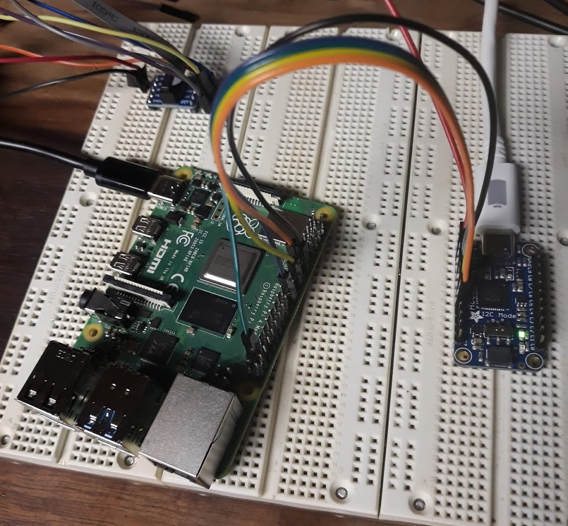

## Overview

Myself and some friends of mine are developing a course for embedded systems development and analysis. We thought that going with a Raspberry Pi 4 as the target might be a useful thing to do because when the students are done with the course material and labs, they'll end up with an insanely powerful and useful platform to continue experimentation/application with.

Since the RPi 4 has been out for about a year, I thought it would be pretty straight forward to just find a bunch of tutorials ready to go on how to JTAG to it. Turns out that isn't the case and what is available is a hodgepodge of out dated information or partial up to date information found in forum threads.

Another bit of misinformation I continually ran into, in regards to the RPi 4, is that it is now common to use a RPi as the programmer itself. Therefore, you'll find lots of documentation on the internet about OpenOCD running on the RPi and using the RPi as an OpenOCD adapter. But there is precious little on using the RPi as an OpenOCD bare metal target.

Hopefully this article can serve as a quick (but complete) getting started guide for accessing the JTAG on the Raspberry Pi 4 as a target.

## Pre-Requisites

**The following pre-requisites should run you roughly $110 + shipping. (Total estimated budget is ~$150 per setup.) Note: This does not include solder or solder iron for assembling FT\*232H PCB pins.**

- Get OpenOCD [[Windows](https://github.com/xpack-dev-tools/openocd-xpack/releases)] [[GitHub](https://github.com/ntfreak/openocd)] _Free_ - For primary JTAG control and communicating between GDB and JTAG port.

[//]: # "Moving all toolchain related content to other articles. This article should stop with OpenOCD working."

- Get [Zadig](https://zadig.akeo.ie/) _Free_ - Required only for Windows Setups

- Get [Adafruit FT232H Breakout - General Purpose USB to GPIO, SPI, I2C - USB C & Stemma QT](https://www.adafruit.com/product/2264) - \$15 - For communicating between OpenOCD host and the Raspberry Pi JTAG port.

- Get [6" F-F Jumper Wires](https://www.adafruit.com/product/1950) ~\$2 - For connecting FT232H to Raspberry Pi 4 JTAG port.

- Get [USB-C to USB-C](https://www.adafruit.com/product/4199) ~\$10 - For connecting FT232H to OpenOCD host.

- Get [USB-C to USB-A](https://www.adafruit.com/product/4175) ~\$3 - Only required if you have no USB-C on host.

- Get [Raspberry Pi 4 (w/ Storage & Power)](https://www.canakit.com/raspberry-pi-4-starter-kit.html) ~\$80 - This is the primary target.

## Hardware Setup

### Documentation

- [Raspberry Pi 4 Pin Outs](https://www.raspberrypi.org/documentation/hardware/raspberrypi/schematics/rpi_SCH_4b_4p0_reduced.pdf) - For mapping pins to BCM2711-GPIO.
- [Broadcom BCM2711 Peripherals Datasheet](https://datasheets.raspberrypi.org/bcm2711/bcm2711-peripherals.pdf) - For mapping BCM2711-GPIO to function.
- [Raspberry Pi 4 BCM2711 Datasheet](https://www.raspberrypi.org/documentation/hardware/raspberrypi/bcm2711/rpi_DATA_2711_1p0.pdf) - Alternative of _BCM2711 Peripheral Datasheet_.
- [FT232HQ Datasheet](https://www.ftdichip.com/Support/Documents/DataSheets/ICs/DS_FT232H.pdf) - For mapping function to Serial-Converter-GPIO.
- [Adafruit FT232H Rev D Schematic](https://learn.adafruit.com/assets/88382) - For mapping Serial-Converter-GPIO to PCB pin out.

- _Non-Authoritative_ [Raspberry Pi 4 JTAG Pinout](https://pinout.xyz/pinout/jtag) - **Double check this!** This is not specific to Raspberry Pi 4, but at the time of this writing seemed to match up with the authoritative documentation provided above.



## Target Setup

Unfortunately, the Raspberry Pi 4 doesn't have dedicated JTAG pins. Instead, you must configure the GPIO pins (GPIO22-GPIO27) to activate the JTAG functionality. The RPi 4 documentation refers to this as Alt4 functions of those pins.

The one big gotcha that caught me off guard when attempting to test everything was the fact that, **at reset**, the BCM2711 has a default pull down on all GPIO pins. Therefore, there is an additional bit of configuration you have to do for the RPi4 (that was not required for any previous RPi). You must disable the pull down resistors for GPIO22 - GPIO27 to allow the TDI/TDO data to flow freely.

**Note:** My guess about the default pull down is that it makes a commonly exposed board a bit safer. What I mean by this is that when you have pins that aren't actively driven by some controller, they are in a floating state. In this state, something as simple as bumping into the pins with the skin of your finger can make a short. These shorts can theoretically be bad or cause other unanticipated interrupts in a running system. All of this degrades the perception of stability in the system and therefore I'm sure this is why Broadcom/RPi have these default pull downs on all GPIO pins on reset.

To configure the RPi 4 for JTAG access, mount the boot partition from the RPi SDCard and add the following to `/boot/config.txt`:

```text
# Disable pull downs
gpio=22-27=np

# Enable jtag pins (i.e. GPIO22-GPIO27)
enable_jtag_gpio=1
```

[//]: # "TODO: Determine if tap is enabled by explicitly setting pins to alt4."

## OpenOCD Setup

### OpenOCD Documentation

[OpenOCD User's Guide](http://openocd.org/doc/pdf/openocd.pdf) - Official OpenOCD User's Guide

### OpenOCD Configuration

For the sake of brevity, treat these configurations as black boxes. Some of the command and values can be explained by OpenOCD and its documentation, but many of the interface specific values or target specific values require delving deep into the hardware technical specifications or discovering undocumented values. This far exceeds the intention of this article.

By convention, this ft232hq configuration file should go into your OpenOCD `interface` directory, although it really can go anywhere.

**[adafruit-ft232h.cfg](https://github.com/unprovable/FTDI-Oh-My/blob/master/FT232H-openOCD.cfg):**

```text
# config file for generic FT232H based USB-serial adaptor
# TCK:  D0
# TDI:  D1
# TDO:  D2
# TMS:  D3
# TRST: D4
# SRST: D5

adapter driver ftdi
ftdi_vid_pid 0x0403 0x6014
ftdi_layout_init 0x0078 0x017b
#adapter_khz 1000
ftdi_layout_signal nTRST -ndata 0x0010 -noe 0x0040
ftdi_layout_signal nSRST -ndata 0x0020 -noe 0x0040
# change this to 'transport select swd' if required
#transport select jtag

# references
# http://sourceforge.net/p/openocd/mailman/message/31617382/
# http://www.baremetaldesign.com/index.php?section=hardware&hw=jtag
```

By convention, this file should go into your OpenOCD `target` directory, although it really can go anywhere.

**[raspi4.cfg](https://gist.github.com/tnishinaga/46a3380e1f47f5e892bbb74e55b3cf3e):**

```text
set _CHIPNAME bcm2711
set _DAP_TAPID 0x4ba00477

adapter speed 1000

transport select jtag
reset_config trst_and_srst

telnet_port 4444

# create tap
jtag newtap auto0 tap -irlen 4 -expected-id $_DAP_TAPID

# create dap
dap create auto0.dap -chain-position auto0.tap

set CTIBASE {0x80420000 0x80520000 0x80620000 0x80720000}
set DBGBASE {0x80410000 0x80510000 0x80610000 0x80710000}

set _cores 4

set _TARGETNAME $_CHIPNAME.a72
set _CTINAME $_CHIPNAME.cti
set _smp_command ""

for {set _core 0} {$_core < $_cores} { incr _core} {
    cti create $_CTINAME.$_core -dap auto0.dap -ap-num 0 -ctibase [lindex $CTIBASE $_core]

    set _command "target create ${_TARGETNAME}.$_core aarch64 \
                    -dap auto0.dap  -dbgbase [lindex $DBGBASE $_core] \
                    -coreid $_core -cti $_CTINAME.$_core"
    if {$_core != 0} {
        set _smp_command "$_smp_command $_TARGETNAME.$_core"
    } else {
        set _smp_command "target smp $_TARGETNAME.$_core"
    }

    eval $_command
}

eval $_smp_command
targets $_TARGETNAME.0
```

## Testing OpenOCD

### Invoke OpenOCD

Once you have the configuration files saved and know their locations, its time to invoke OpenOCD. Here are the locations of my configuration files:

- **adafruit-ft232hq.cfg** - C:\bin\openocd\scripts\interface\ftdi\adafruit-ft232hq.cfg
- **raspi4.cfg** - C:\bin\openocd\scripts\target\raspi4.cfg

With these paths, we can now run the OpenOCD command:

```cmd
openocd.exe -f C:\bin\openocd\scripts\interface\ftdi\adafruit-ft232hq.cfg -f C:\bin\openocd\scripts\target\raspi4.cfg
```

A successful run of OpenOCD looks like:

```text

```

### OpenOCD CLI over Telnet

Once we know we have OpenOCD up and running successfully, we can telnet into its CLI interface to run various JTAG commands or pre-defined routines.

```cmd
telnet 127.0.0.1 4444
```

Running `scan_chain` is a quick and simple way to check if you are getting any communication over your JTAG TAP.

```text
Trying 127.0.0.1...
Connected to 127.0.0.1.
Escape character is '^]'.
Open On-Chip Debugger
> scan_chain
    TapName             Enabled  IdCode     Expected   IrLen IrCap IrMask
-- ------------------- -------- ---------- ---------- ----- ----- ------
 0 auto0.tap              Y     0x4ba00477 0x4ba00477     4 0x01  0x03
```

### (Optional) GDB over OpenOCD

As an extra check, you can attempt to connect gdb (built to run on your host and built to target aarch64) to the OpenOCD gdbserver. If you plan to follow along with my follow up articles on bare metal development, I would advise skipping this step. I'm primarily leaving this content here for posterity.

You can find the required `aarch64-none-elf-gdb` binary in a package from [Cortex-A Toolchain Downloads](https://developer.arm.com/tools-and-software/open-source-software/developer-tools/gnu-toolchain/gnu-a/downloads). This can be very handy if you just want to quickly download an existing toolchain for OSes like Windows where GNU development is awkward to begin with.

- When you start up the aarch64 version of gdb by running `aarch64-none-elf-gdb.exe` in a command prompt, you should see output resembling the following:

```test
GNU gdb (GNU Toolchain for the A-profile Architecture 9.2-2020.02 (arm-9.10)) 8.3.0.20190709-git
Copyright (C) 2019 Free Software Foundation, Inc.
License GPLv3+: GNU GPL version 3 or later <http://gnu.org/licenses/gpl.html>
This is free software: you are free to change and redistribute it.
There is NO WARRANTY, to the extent permitted by law.
Type "show copying" and "show warranty" for details.
This GDB was configured as "--host=i686-w64-mingw32 --target=aarch64-none-elf".
Type "show configuration" for configuration details.
For bug reporting instructions, please see:
<https://bugs.linaro.org/>.
Find the GDB manual and other documentation resources online at:
    <http://www.gnu.org/software/gdb/documentation/>.

For help, type "help".
Type "apropos word" to search for commands related to "word".
(gdb)
```

Now that you have gdb open, we need to connect GDB to the `gdbserver` with the `target` command. Most documentation that you'll find on the internet will tell you to use `target remote <address>`. This is may likely not what you want. Instead, I usually opt to connect with the `target extended-remote` command so that when I exit GDB, it doesn't attempt to tear down the `gdbserver`. Because gdb allows shorthand versions of almost every command, you can simply type `target ext` instead of the full "extended-remote". You can read more about the differences between `target remote` and `target extended-remote` in [Connecting to a Remote Target](https://sourceware.org/gdb/current/onlinedocs/gdb/Connecting.html).

- Connect To Target with modern remote protocol: `target ext :3333` (Old way: `target remote :3333`)

```text
(gdb) target ext :3333
Remote debugging using :3333
warning: No executable has been specified and target does not support
determining executable automatically.  Try using the "file" command.
0xc021c168 in ?? ()
(gdb)
```

Now that we're connected, lets just grab some registers to verify that we're getting some sane data. You can dump all the core registers in gdb by running the `info reg` command.

```text
(gdb) info reg
r0             0x0                 0
r1             0x18c8c             101516
r2             0xeff13f74          4025565044
r3             0xc021c160          3223437664
r4             0xc1204fb4          3240120244
r5             0xc1200000          3240099840
r6             0xc1204ffc          3240120316
r7             0x1                 1
r8             0xc12a32ed          3240768237
r9             0xc106ca48          3238447688
r10            0x158               344
r11            0xc1201f2c          3240107820
r12            0xc1201f30          3240107824
sp             0xc1201f20          0xc1201f20
lr             0xc0209bac          0xc0209bac
pc             0xc021c168          0xc021c168
cpsr           0x60000093          1610612883
fpscr          0x0                 0
(gdb)
```

## Conclusion

Hopefully you now have a JTAG environment setup from a host to the Raspberry Pi 4. In the above process:

- We wired up the Host to the FT232H
- We wired up the FT232H to the Raspberry Pi 4
- Configured OpenOCD to be a gdbserver between the host and the Raspberry Pi 4
- Connected to the OpenOCD gdbserver from the host.

In future articles, I plan to talk about bare metal development and debugging on the Raspberry Pi 4 using a custom runtime environment and the buildroot environment.
