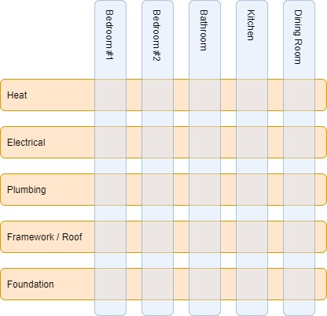
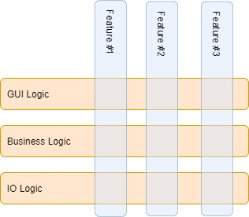

## Overview

Have you ever worked on a project that seemed like it just kept going on forever. I've worked on projects in the past that would go for what seemed to be years before delivering anything of substance to the user. I've also been on the other side of that coin where I've waited what seemed like an absurdly long time before receiving and product from a developer (and this takes into account the fact that I am a developer and I know developers usually underestimate their product's ETA.) This is usually due to the complexity of a project not revealing itself until you are deep into the development. It can also come about by ambiguities that are discovered when revisting the requirements a month or two after development has started. But, instead of going back to the customer/user, a lot of times I've seen developers simply create the more flexible "it'll do all the things". Personally, the mind set here is that when we do re-engage with the customer, we hope to have captured their needs within out apature of capability.

The issue with the above behavior is that it drastically decreases the value of the product because of the cost associated with unneccessary flexibility. Additionally, this flexibility may likely increase costs later down the line due to the inherient increase in complexity. There are many different ways to mitigate this behavior, but one sticks out as my favorite: veritcal slicing and horizontal slicing. It wasn't until 2019 that I learned about the concept of veritical slicing and horizontal slicing in an Agile methodologies course I had taken. This isn't to say you have to use Agile to take advantage of this slicing mechanic, but only to say that it does provide a structured way to view iterative development and enforce some of the principles of Agile philosophy.

## The Analogy

After I learn a new concept, I often find that the way to pass on the new concept to others is all about finding the right analogy. For vertical slicing, the analogy is DIY home construction. Here are a list of major things that needs to occur to build a home:

- Foundation
- Framework/Roof
- Sewage
- Plumbing
- Electrical
- Heat / HVAC
- Decor

For the sake of the analogy, lets say you are building your own home and until you are able to stay inside, you must live out of your car. Here is a diagram showing the different rooms and categories in veritical slices and horizontal slices respectively:

The first thing that needs to get done is the foundation, framework, and roof. This is generally the core structure of the home. It can always be modified and added to, but should encompass the shell of a complete idea or vision.

Typically, the next thing would be to install the sewage lines, potable plumbing, electrical, and heat for the entire house followed by an inspection. Lets suppose you didn't know that electrical outlets must be connected to the eletrical system with wire nuts and you instead hard wired the outlets to the system. Because you waited until the whole house was done, after the inspection you'll need to go back and fix all the outlets. Meanwhile, you are still living out of your car.

Instead of completing everything for the entire house (increasing the potential error surface area), you could have done a single room and _then_ gotten an inspection or feedback on your progress. If there were mistakes, you now only have to fix the one room. Following the fix, you can now use that one room as a model for the others. Additionally, you've likely now done a whole room and no longer have to live out of your car.

In summary, performing the install of everything across the entire home at once is what we refer to as a horizontal slice. Installing everything for just a single room within the home is referred to as a vertical slice.

## Related To Software Development

It isn't always aparent when doing software development, but you can design and structure software to follow a similar model. For example, you can usually break down software into at least, IO Logic, Business Logic, and GUI Logic. On many occasions I've seen each of these broken down into their own teams or efforts so you end up with a group developing the IO Logic for the _entire_ project, then a group developing the Business Logic for the _entire_ project, and finally a group developing the GUI Logic for the _entire_ project. Only at the end do all of these peices get put together and sent off to the customer/user for feedback. (i.e. Stacked horizontal slices.)

This is bad for several reasons, if any horizontal slice does meet the needs of the customer, its likely to affect all the other layers when updated (causing more development costs and delays). Each layer depends on the one below it, the organization may find itself working linearly so that only when the lower API is complete can the next layer begin integration, (delaying the release of the software to the users). Until the product is delivered, the user gets to use 0% of any finished capabilities.

In contrast, lets suppose you have 3 different features in your software (e.g. Feature #1, Feature #2, Feature #3). By focusing the organization on the IO Logic, Business Logic, and GUI Logic for Feature #1 (or any single feature), you get:

- More tight customer/user feedback
- Users get to start using the >%0 of the product.
- Potential for the user to determine if they even need the other features.
- Quicker lessons learned to adjust remander of product.
- Quicker integration between the different horizontally organized groups.

Here is a break down of the vertical and horizontal slicing for software development:

## Conclusion

The idea here is that requirements do not increase product value, requirements are only for accountability. To increase product value, you must strive for usability and tighter user feedback loops. A tighter feedback loop mitigates the problem with unpreviewed errors becoming worse over time. Having parts of a product be completely usable allows users to use your product to accomplish tasks that they may have no other way to accomplish and is the reason this industry exists (so lets get to that ASAP).
