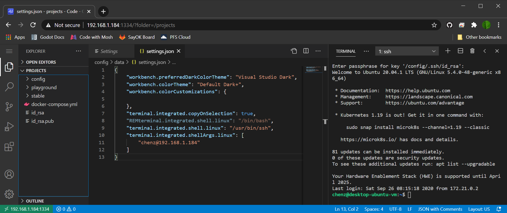
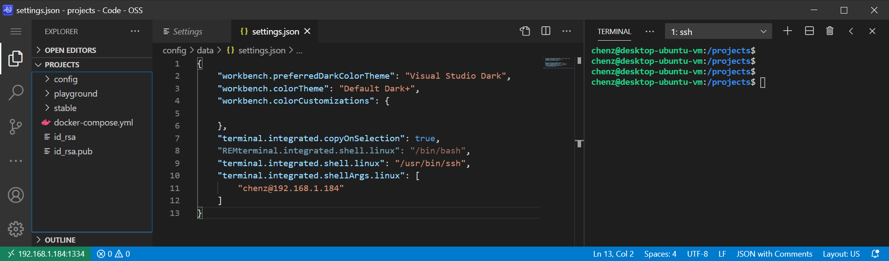

## Code Server

I've had friends telling me about online IDEs and IDEs in the cloud for about a year now. At the time, I always thought, that's great but:

<!--truncate-->

- How much will that cost?
- How easy is it to setup?
- How easy is it to use as a user?
- How private is it? (i.e. Does it involve corporate overlords?)
- How secure is it?

Until now, at least one of these has always swayed me away from wanting to give it a go. That all changed this morning when I decided to look into hosting VSCode on whatever platform I'm developing from.

### My Current Setup

The problem I'm been facing is that the Windows 10 desktop environment is clearly superior to all Linux desktop environments in terms of user experience (for reasons that are beyond the scope of this article). Therefore, I've been really pushing to do all my development, regardless of target platform, from my Windows 10 desktop environment.

My current setup is composed of a VirtualBox VM, VSCode, and SSHFS. The VM is an Ubuntu VM where I've installed all the developer environmental tools (e.g. python, node, docker, gcc, etc). I also keep all of my locally staged source code in the VM (typically tracked with git for revision control). VSCode is installed locally on the Windows 10 host and has access to the source code in the VM via SSHFS mounts from Windows Explorer. After opening an SSHFS mounted folder in VSCode, my typical workflow involves me opening 1-N terminals for driving revision control, tests, debuggers, or builds. (I _never_ use the built in IDE build buttons or debuggers.)

### The Problem

Occasionally, the connection between VSCode and the VM (via SSH) will go bad and leave me with an unsaved change-set. In the worst case, I have to completely restart Windows and subsequently the VM. Also, using SSHFS will exhibit issues when doing normal file system type operations from Windows, like creating folders or dealing with symbolic links, and so forth.

In the past, I've tried using WSL1 but there were constant consistency issues between the Ubuntu environment and VSCode (depending on where the files were kept.) WSL2 was better, but exhibited the same issues that SSHFS has currently. I primarily was trying WSL2 for use of Docker for Windows, but in the end I found that Docker for Windows offered me little to nothing compared to running docker in a CLI on a VirtualBox VM. Plus, VirtualBox VM is vastly superior because I can run more than 1 VM at a time without gouging my wallet.

### A New-ish Solution

I've known since I started using VSCode that it was mostly written with Typescript, but it wasn't until recently that I became much more acquainted with docker and docker-compose. A quick google turned up code-server (aka VSCode in a docker container). The github project that hosts the project is `cdr/code-server` and the top rated docker image is by `codercom/code-server`. I don't know if these are related, but what I really wanted was to docker-compose the image so that it would auto-start with my VirtualBox VM. Luckily, the #2 rated code-server image is `linuxserver/code-server` and looks to be specially tailored for running as a remotely accessible from Linux.

I have a standard convention of putting all my coding projects under `/projects` directory, so that is where I ended up dropping my `docker-compose.yml` file:

```
---
version: "2.1"
services:
  code-server:
    image: linuxserver/code-server
    hostname: desktop-vm
    container_name: code-server
    environment:
      - PUID=1000
      - PGID=1000
    volumes:
      - /projects/config:/config
      - /home/chenz/.ssh:/config/.ssh
      - /projects:/projects
    ports:
      - 1334:8443
      - 13340:8080
    restart: unless-stopped
```

This is a tad bit different from the suggested `yml` from the docker-hub documentation because:

- I added a hostname so I didn't have to see the ugly automatically generated docker container SHA based name.
- I removed the optional environment settings for TZ, PASSWORD, and SUDO*PASSWORD. (I \_really hate* the idea of storing my password in the clear.)
- I added a `config` directory within my `/projects` hierarchy to store the container's `/config` folder structure.
- I changed the listening port (on the host) to 1334 (aka leet, aka elite.)
- Finally, I mounted my personal ~/.ssh folder to the container user's ~/.ssh folder so that I can use my standard private key for accessing other hosts from the VSCode integrated terminal.

Additionally, I copied my `~/.bashrc` to the container's `/config` folder to enabled all the nice bash-isms like colored prompts and whatnot.

After that setup, you simply start it up with:

```
docker-compose up -d
```

Now you've got a completely in-browser version of VSCode running.

### Make It Better.

Even though we've got VSCode running in the browser, we've still got several issues to resolve. This includes UX and security.

#### Save Monitor Real Estate

In terms of user experience, I don't want to waste space on my monitor for browser tabs in my VSCode window. I also don't like the distraction or temptation to pop up new tabs where I code or risk losing my IDE in a sea of tabs.



Luckily, Chrome has a simply solution for this. Put simply, you launch the URL of VSCode as a Chrome app. On my windows box, the CLI command looks something like this:

```
"C:\Program Files (x86)\Google\Chrome\Application\chrome.exe" --app=http://<ipaddr>:1334
```

Drop that command in a Windows Shortcut, give it a VSCode icon and it'll be almost indistinguishable from the locally installed VSCode.



#### Persistent Connections

Created the following shell script at `/projects/code-shell.sh`:

```
#!/bin/bash
exec /usr/bin/ssh -t chenz@192.168.1.184 tmux new-session -A -s vscode-$HOSTNAME
```

Set it as default terminal by adding the following to settings.json:

```
"terminal.integrated.shell.linux": "/projects/code-shell.sh",
```

Now when I start a terminal, it'll ask me for my ssh key passphrase and then launch tmux in the remote session. I'm not a tmux expert so I've created my `~/.tmux.conf` to allow me to use my mouse:

```
set -g mouse on
```

**Note:** To copy from tmux, you hold shift and then select text to copy.

#### Securing Access

Lastly, if we're going to allow the IDE to be accessible from within a browser, I want easy access to it from anywhere with an internet connection. But this means security. Although I haven't implemented this yet, I plan to setup an NGINX terminating server in front of the VSCode docker instance. Therefore the flow will look something like:

```
ISP Router Port Forward -> NGINX (via HTTPS) -> VSCode (via HTTP)
```

With NGINX as the entry point, we can secure the service several different ways. The simplest method is to provide a password-based Basic Authentication. Ideally, adding client certificate verification would make it an optimal solution so I can install the certificate on all the user accounts and hosts I plan to work from and there will be no password required. Also, obtaining a server side certificate is a must because we don't want monitoring of the data across the wire.

### In Conclusion

I'm going to give this setup a go and see how things work out. I believe this to be a superior solution to everything else I've tried because it doesn't require any remote desktop forwarding (VNC, RDP, XWindow) that seems to never work with 4K and the code editor is running under the same host as the code itself.
