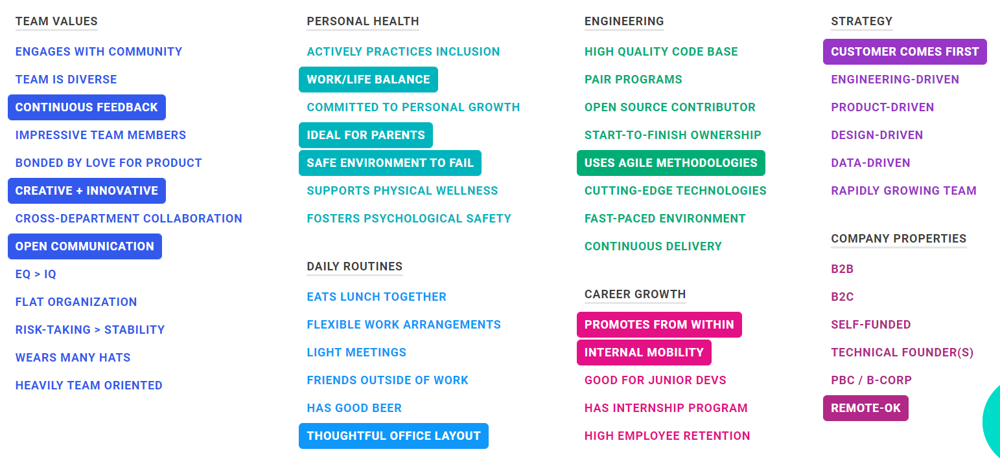

[KeyValues](https://www.keyvalues.com/) is a web site that matches software engineers by their desirable values. This is kind of neat because it pre-filters companies that you may find yourself miserable at due to prioritizing based simply on location, money, or prestiege. These are only 3 dimensions in a career that you'll likely be spending a third of your day involved in, with the other 2 thirds being life and sleep.

<!--truncate-->

For those interested, these are my chosen key values at this point in my life:

In addition to listing company values with their explanation of how they satisfy particular values, you can subscribe to the site for great interview questions to ask.
