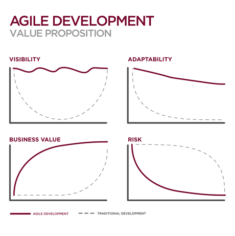
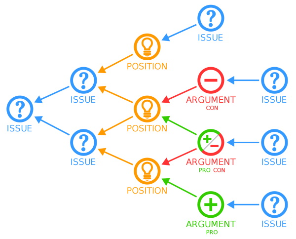

## Agile Value Proposition

## Nuggets Of Wisdom

- Collective intelligence should be the goal, not a hand full of the smart individuals in the room. (Peter Senge)
- Reward teams, not individuals. Blame process, not people.
- Just because you can develop a solution doesn't mean you should.

## Structuring Dialog

The following set of questions are merely a sample of the kinds of questions that should be answerable when starting a project. Like an employee and employer interviewing each other to make sure its a good fit, having a set of interview questions for a project is key to knowing the full context of the project and not just the technical opportunities I so often find myself drooling over.

I prefer the analogy of an interview, but the official term for this kind of questioning falls under the study of structured dialog. Allowing people to just coast through a meeting provides little to negative value. Instead of showing up to a meeting with the _hope_ that you can get it to run itself, it can often be more prudent to structure the conversation with some ground rules and guidance. Driving a meeting with deliberate questions and flow can not only be valuable to gain a deeper insight into product development, but it can also contribute to an unconscious negotiation of information that would otherwise never see the light of day.

Author: Menner, Will.

### Context

- Why are we here?

- Why is this transformation needed?

- What portfolio will this solution be a part of?

- What business or mission model / strategy applies?

- What is the larger context within which this transformation makes sense?

- What view of the domain makes this transformation meaningful?

- Who is the project champion?

### Inputs (Initial Conditions)

- What are the top problems?

- What are the relevant characteristics of the top problems?

- What is causing the problems?

- What are the goals and needs of our stakeholders?

- What is the post-transformation vision?

- What input or data is needed to work the problem?

- Who are the suppliers of input or data?

- What constraints are we operating under? (e.g. policies, legalities, budget, schedule)

- What assumptions are we making?

### Outputs (Desired Outcomes)

- Who cares?

- Who should care?

- How do we reach them?

- Who are the stakeholders?

- Who are the winners? losers?

- What potential reactions can we anticipate?

- How do we know when the goals have been achieved?

- What are the intermediate points where progress can be inspected?

- If successful, what is the payoff?

- If unsuccessful, what are the risks?

### Solution

- What are the best courses of action?

- What are the best ideas for solving the problem?

- How should we sequence our actions?

- If we were unconstrained, how would we solve the problem?

- Has somebody else already solved the problem or a portion of it?

- Who are the "performers"?

- What makes this project unique?

- Who "owns" the solution process?

- How is this project different from prior attempts?

- What implementation tools and techniques should we use?

- If the transformation is successful, what future or unintended consequences might occur?

### Personal Experience

I originally learned these questions back in April 2020. Since then I've attempted to apply many of them to existing projects. It was surprising how many of them could not be answered by project leads off the cuff. Most commonly, folks would let me know they need to look into _that_ and then never get back to me.

<!--truncate-->

Additionally, its interesting to ask these questions with confidence you already know the answers. Personally, I feel like folks give me the dumbfounded look or "don't waste my time" look. The important thing to remember here is that everyone needs to be on the same page or communication, intent, and relationships corrode. Ask the questions you already know the answers to ... you may find an opportunity to train or a bit of missing information that'll change your perspective.

## IBIS - Issue Based Information System

[IBIS](https://en.wikipedia.org/wiki/Issue-based_information_system) is another fantastic meeting facilitation technique that basically has a discussion topic broken down into problem-proposal-pros-cons. The major difference is that its visually represented on a white board with a mapping from problem to proposal, and multiple edges connecting proposal to pros and cons, and each pro and con potentially mapped to new problems and proposals. This manifests itself as a tree where all participants can visually identify other participant concerns and agendas.

## Conway's Law

The last nugget of wisdom that has stuck with me is Conway's Law. (Conway, Melvin E.)

> Any organization that designs a system (defined broadly) will produce a design whose structure is a copy of the organization's communication structure.

The general idea here is that you should expect products to be modularized in a way that matches the organizational chart for the business. Another way to put it is that, in my opinion, the organizational chart (or relevant information systems) should be organized to meet the needs of the product (and therefore the customers) and not the needs of the organization (irrespective of the product).

## Comments

<Comments />
