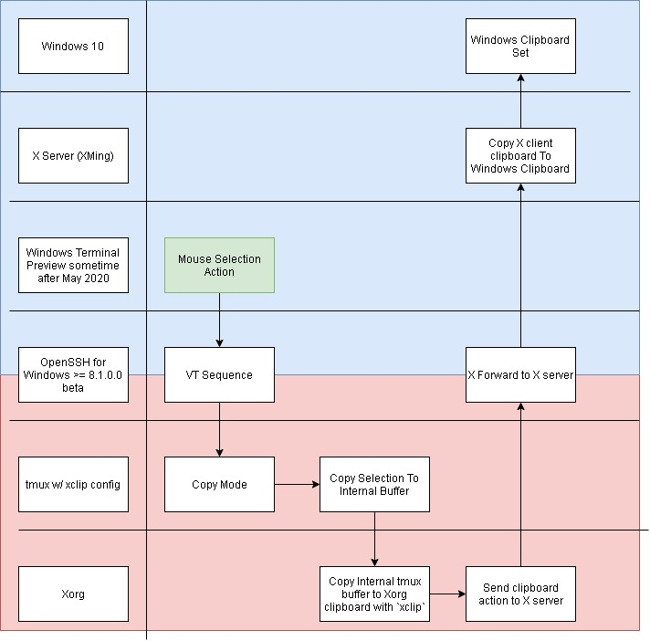

## Overview

Started using tmux this year in an attempt to streamline some of my typical workflows. It also is handy to make up for the lack of terminal tab support in VS Code. When I first started using tmux, it became quickly apparent that copy/paste actions are a little more involved. Since I only ever did horizontal splits, I quickly just fell back to holding `Shift` for everything.

<!--truncate-->

Over the months, this has become increasing frustrating and I thought it was time to dig into how to get my environment setup so that I could quickly select text in my terminal and paste it into other windows.

## Why So Hard?

There are several aspects of this task that quickly present a challenge. In addition to this, there seem to be an irregular number of bugs in current software contributing to preventing me from doing what I want our of a box. First, lets briefly go over what needs to happen:

1. When I select text in a terminal, the mouse actions are sent through the terminal to the underlying application. Since all of my development happens through SSH, this means that any action that the underlying application performs is not going to inherently effect my local system.

2. If the underlying application is configured to copy on select, its only going to copy to the application's private (internal) clipboard or the system clipboard local to the remote system.

3. The clipboard on the remote system needs to then somehow get copied from the remote system to the local system clipboard. From here, I should then be able to paste what was copied within the remote system.

Wow, that's crazy complicated (IMHO) for just copy/paste.

Here is a diagram I drew up to summarize the actions:



# Problems & Solutions

## Terminal

For this task, I used Windows Terminal. It turns out that it wasn't until June 2020 that Windows Terminal was able to fully support sending the byte sequences required for terminal mouse support. ([Github Issue #376](https://github.com/microsoft/terminal/issues/376)) Therefore, at the time of this writing i am using the Windows Terminal Preview to accomplish copy/paste.

A quick way to determine if your mouse support is adequate in Windows Terminal is to open up a SSH session to a remote Linux machine, create a tmux session with several panes and then try to resize the panes with the mouse.

To enable tmux mouse support (internal to tmux), you should add the following to your `~/.tmux.conf` file:

```
set -g mouse on
```

## Shell

I typically will always start my Windows Terminal in the mingw bash prompt that comes with mingw or git. At the time of this writing, I've been unable to use these to accomplish copy/paste. Instead, I suggest using `cmd.exe` or PowerShell. The following examples assume `cmd.exe`.

## OpenSSH

OpenSSH is the primary bridge that links the local system to the remote system. To properly interface with Windows, I use the "built-in" OpenSSH for Windows client and server. Turns out that the latest OpenSSH (v7.7) has a bug that doesn't properly support the mouse in the terminal. Instead, at the time of this writing, you have to install the OpenSSH for Windows 8.1.0.0 beta [from github](https://github.com/PowerShell/Win32-OpenSSH/releases/tag/v8.1.0.0p1-Beta).

I got hung up on this quite awhile because I had OpenSSH installed in three different locations. To determine which is being used by `cmd.exe`, you can use the `where` command which is very similar to the `which` command in linux.

In summary, I had OpenSSH Client and OpenSSH Server installed in my Program Files (from Powershell?) _AND_ as a built in feature under the Windows 10 "Manage Optional Features". The Optional Feature OpenSSH probably takes precedence. I removed this feature and installed the OpenSSH for Windows following the install instructions in the Github Wiki.

Once OpenSSH was updated to >= 8.1, I validated it supported mouse in terminal by verifying that I could resize tmux terminals with the mouse.

## X Server

Since we're expecting X Forwarding to be used to get the remote system clipboard to the local system clipboard, I installed Xming to handle that for me. A quick XLaunch default configuration did the trick... Just make sure that you've selected the "clipboard" option.

## Xorg Clipboard Interface

When you want to pipe some data into the Xorg clipboard, the easiest thing to do is use a program like `xclip` or `xsel`. (For WSL1, use `clip.exe`.) On Ubuntu 20.04, xclip can be installed with:

```
sudo apt-get install -y xclip
```

When I first set out to complete this task, I didn't have any X client binaries installed, so I personally ended up running:

```
sudo apt-get install -y xinit xclip
```

## Tmux

Several articles, SO questions, and github issues will point at how to perform copy/paste with keyboard bindings and `xclip`. These mostly mimic vim or emacs behavior. I am a firm believer that the mouse is superior for _Random Access Selection_, and therefore I'm not interested in keyboard visual blocking. :) I ended up reverse engineering a tmux plugin called [`tmux-yank`](https://github.com/tmux-plugins/tmux-yank) to determine what commands it uses to support copy on select via a mouse. Here is the resulting `~/.tmux.conf` configuration:

```
set -g mouse on
bind-key -T copy-mode-vi MouseDragEnd1Pane send-keys -X copy-pipe-and-cancel "xclip -se c -i"
bind-key -T copy-mode MouseDragEnd1Pane send-keys -X copy-pipe-and-cancel "xclip -se c -i"
```

If at this point you attempt to use Tmux copy/paste with the mouse, it wont work unless you properly setup the DISPLAY environment variable. To learn how to accomplish this, read on.

## SSH_ASKPASS

Ok, so we have a good OpenSSH client and an active X Server running. To proceed, we now need to set the DISPLAY environment variable before running our SSH session with X Forwarding.

```
set DISPLAY=127.0.0.1:0
```

The 127.0.0.1 (localhost) instructs SSH to use the local XServer. The `:0` indicates the display index to use. You can fetch this by looking at the Xming active configuration, but IIRC this is the value you also set in the XLaunch configuration.

After the `DISPLAY` variable is set, run the SSH command:

```
ssh -Y user@host
```

BUT, if your environment is like mine, you'll likely see noise that resembles the following:

```
CreateProcessW failed error:2
ssh_askpass: posix_spawnp: No such file or directory
Permission denied, please try again.
CreateProcessW failed error:2
ssh_askpass: posix_spawnp: No such file or directory
Permission denied, please try again.
CreateProcessW failed error:2
ssh_askpass: posix_spawnp: No such file or directory
user@host: Permission denied (publickey,password).
```

This is because the OpenSSH for Windows doesn't come with a `ssh-askpass.exe` file to launch a dialog for collecting the user password. Perhaps I could have used an SSH key to skip this step ... but that shouldn't be strictly necessary. After some searching, I found that Git for Windows comes with an `askpass.exe` binary that would meet my needs. This was located at `c:\Program Files\Git\mingw64\libexec\git-core\git-askpass.exe` on my disk.

Therefore, now the sequence of command to get an SSH session started with X Forwarding from my Windows machine to my remote Linux machine is:

```
set SSH_ASKPASS="c:\Program Files\Git\mingw64\libexec\git-core\git-askpass.exe"
set DISPLAY=127.0.0.1:0
ssh -Y user@host
```

Thats a lot, if you want to perma-set the environment variables, you can opt to use the `setx` command in `cmd.exe`.

# Conclusion

I now have Windows Terminal with `cmd.exe` able to support using tmux clipboard from a remote Linux system to my local Windows system. I really don't like the sophistication it took to set this up. I suspect I'll just lean on holding `Shift` in the future, but its good to know all the widgets required to make things better are already in place.

In the future, I'd also like to see this process working with Visual Studio Code's Remote SSH extension and its integrated terminal (i.e. xterm.js). For now, I'm settling on using PowerToys fancy zones to align my Windows Terminal with VSCode.

# Other Mentions

For those that aren't as obsessed with becoming Windows Terminal experts, you can use Putty as another SSH terminal that supports X Forwarding with Xming out of the box. I've been using Putty with Xming for over 15 years, but Putty is becoming dated and I really only use it when I _have_ to.

Its also worth mentioning that Windows Terminal can now be split into its own panes similar to tmux. Therefore, you may not need to support Tmux copy/paste at all if that terminal functionality solves your personal workflow issues. I prefer tmux because I almost always do development on a \*nix platform, but I don't always work from a Windows environment like I do from home.

Earlier in this article I mentioned that I reverse engineered a tmux plugin to locate the command I needed for xclip integration. That plugin was [`tmux-yank`](https://github.com/tmux-plugins/tmux-yank). I personally prefer to have minimal configuration so that it travels easier, but if you know that 99.99% of your development is going to occur on an internet connected system, I encourage just using the plugin. It has been designed to work with many tmux supported platforms. This may allow you to synchronize a single Tmux configuration across all your linux and OSX machines. Also, if you already use the tmux package manager, its a one line addition to `.tmux.conf`.

# Misc References

- [Everything you need to know about Tmux copy paste - Ubuntu](https://www.rushiagr.com/blog/2016/06/16/everything-you-need-to-know-about-tmux-copy-pasting-ubuntu/)
- [tmux in practice: integration with system clipboard](https://www.freecodecamp.org/news/tmux-in-practice-integration-with-system-clipboard-bcd72c62ff7b/)
- [tmux-yank](https://github.com/tmux-plugins/tmux-yank)
- [Unable to copy ~/.ssh/id_rsa.pub](https://stackoverflow.com/questions/18695934/unable-to-copy-ssh-id-rsa-pub)
- [How to configure Putty & Xming (on your laptop)](http://laptops.eng.uci.edu/software-installation/using-linux/how-to-configure-xming-putty)
- [-X flag (X11 Forwarding) does not appear to work in Windows](https://unix.stackexchange.com/questions/207365/x-flag-x11-forwarding-does-not-appear-to-work-in-windows)
- [CreateProcessW failed error:2 ssh_askpass: posix_spawn: No such file or directory Host key verification failed, jupyter notebook on remote server](https://stackoverflow.com/questions/60107347/createprocessw-failed-error2-ssh-askpass-posix-spawn-no-such-file-or-director)
- [[Terminal] VT Mouse Support](https://github.com/microsoft/terminal/issues/545)
- [[Conpty] Add support for mouse input](https://github.com/microsoft/terminal/issues/376)
- [Win32-OpenSSH Repo](https://github.com/PowerShell/Win32-OpenSSH)
- [Git Askpass for Windows](http://microsoft.github.io/Git-Credential-Manager-for-Windows/Docs/Askpass.html)
