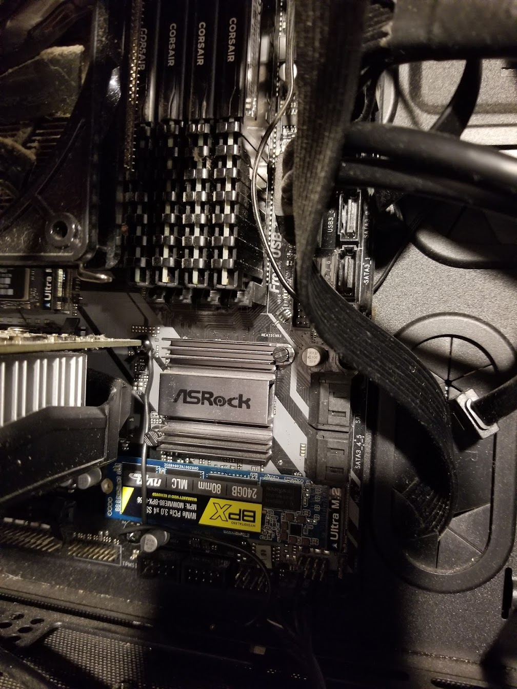

I wanted to install Windows 11 on my desktop today. In preparation for this I specifically ordered a new M.2 SSD to install Windows on. In the back of my head I thought about backing up my old M.2 SSD or buying some device that would allow me to read the SSD through some other adapter. Ultimately I didn't do anything because I had recalled I had a second M.2 slot on my board and in a pinch I may have to just switch back for a backup if there were files from the old install.

<!--truncate-->

Well, once I got the old M.2 taken out and the new M.2 put in, it was time to drop the old M.2 down into the secondary slot. I quickly found the slot, but there was no screw in the board to mount the M.2 chip down with. I scoured my basement and garage for the motherboard box to no avail.

## Workaround

The riser at the end of M.2 slot was actually screwed into a lower riser. I originally thought I could just sandwich the chip between the first riser and the secondary riser. After much fiddling and cursing I was able to get the secondardy riser threaded with the M.2 Chip underneath. Trouble was that I had actually flexed the chip to do this. I was worried that I was going to short the chip with the other "short" M.2 risers that were underneath it.

Ok, so back to the drawing board. *What do we have?* Its a M.2 that is kept in place with friction and a fastener. The M.2's are inserted at almost a 45 degree angle and remain springy until the fastener holds the chip down. Basically, all I needed was a way to keep the chip held down and the friction from the spring should be enough to hold it in place. *What to use?*

I originally thought that I could use tape, but I was very concerned that would wear out after a day or so. The dust and vibrations in the machine were just no bueno for tape. I took another look at the motherboard and noticed that there was a screen directly above and below the end of the M.2 chip. *What if I could use those screws to create a clamp?* I couldn't find any plastic or other heat resistant/non-conductive material that would have been appropriate. Ultimately I settled on using a piece of insulated wire. Its as simple as looping around the upper screw and looping around the lower screw with a relatively taught pull. This turned out to be ridiculously easy and feels strong.

Here is a picture of the M.2 mounting job:

In the end, I was just tickled how well this ridiculous fix worked out.