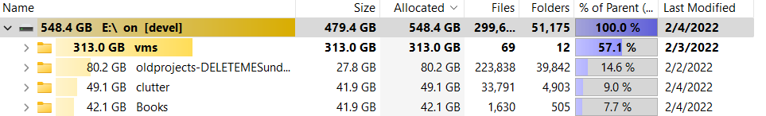
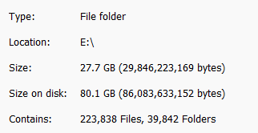
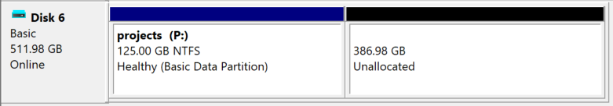
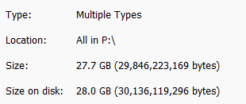

In my day to day I'm always working on several projects. While the contributions or time spent on the projects is small, the amount of resources they take up is immense. All to often these days, whenever you want to build a thing from source, you may as well budget at least 20GB for a single project. This of course includes toolchains, dependencies, build cache, and so forth. This causes me a good deal of hardship because I can easily find myself filling up my limited SSD space. Today I decided to take some time to consolidate with the expectation that I was going to buy a HDD for archival purposes. Turns out that wasn't needed for some very strange (new to me) reasons.

<!-- truncate -->

## Overview

So I began my cleaning session by manually going through all the folders on my "extra" drives (D: and E:) in Windows. D: is supposed to be for games and E: is supposed to be for development. But alas, over the years the purpose gets lost in the noise. To trim a lot of stuff I started by removing a bunch of out of date downloads that I know I could re-download if needed (e.g. 10 different versions of raspbian). I also consolidated a bunch of stuff, like digital assets and ebooks onto a single drive.

My drive D: is a 512GB drive (465GB usable).
My drive E: is a 1TB drive (931GB usable).

Once I was able to wrap my head around everything I had on the drives, I used [TreeSize](https://www.jam-software.com/treesize_free) to sort of decide where the bulk of my storage was going. To my surprise, my `projects` folder (now named `oldprojects`) was 27GB but 80GB on disk!





Ok, so I'm acutely aware of how hard drives align objects on a cluster boundary. This means that if you write ten 1 byte files, it'll actually take up `10 * cluster-size` bytes on disk. If the cluster size is 4096 bytes, that totals out to be ~41K. That said, its pretty rare to have a bunch of 1 byte files so the dead space isn't usually *that* bad. But to lose 53 gigabytes over 27GB of data seemed a bit extreme to me.

## Inspecting The Cluster Size

There are quite a few ways to inspect the cluster size. Most of them differ in complexity, depending on the file system type format on the disk. Of all the methods I tried, `wmic` was the simplest. You can inspect the cluster size with `wmic` in the command prompt:

```cmd
C:\>wmic volume get driveletter,blocksize
BlockSize  DriveLetter
131072     D:
262144     E:
4096       F:
4096       C:
```

OK ... so when I order my drives, I think I shoved them in, made sure I could use them, and then moved on. I knew they were exFAT and, to me, that meant that they'd be more compatible with Linux and therefore (potentially) more usable between my Windows runtime and WSL.

It turns out that there is a catch with exFAT. To support drives greater than 256MB (which is every drive as far as I'm concerned), you have to set very large cluster sizes:

- 256MB - 32GB: 32KB cluster size.
- 32GB - 256TB: 128KB cluster size.

That means that a single 1 byte file is 131072 bytes on disk. *Not good for small function sized source files and sprite sized assets.* Note: NTFS supports up to 16TB drives with 4096 byte cluster size.

## Solution

One option to solve all the missing space with the `projects` folder would be to simply reformat the disk to NTFS with a smaller cluster size. I'm still conflicted here because of the exFAT compatibility I'm still hoping to benefit from. The real question is how can I make more efficient use of each cluster in the existing formatted disk.

If you think about how a Virtual Machine works, it creates only a few files to store the entire virtualized system. This virtual disk can be made physically efficient while making the guest OS think its doing a similar cluster alignment to the real alignment. How do we do the same natively in Windows?

TIL, you can create virtual hard disks from Windows' Disk Management tool. Once open, you simple click `Action` and then `Create VHD`. I ended up creating a 512GB VHDX virtual disk so that I could resize the disk in the future. Additionally, VHDX files only grow as needed (just like VM virtual disks.) After creating the disk you must initialize it to do anything to it. Once initialized, I then created a 128GB NTFS volume within the disk with an allocation unit (i.e. cluster size) of 4096 bytes. The thought process here is that I can keep a limit on the amount of space the virtual drive will consume on my real drive but still give me the flexibility to resize later if required. Here is the Disk Management visual representation:



After doing this, I grabbed a screen grab of the `Properties` of my new VHDX drive:



Now that's more like it!

## Conclusion

The key take away here is that when I'm doing projects that contain many smaller files (in Windows), I must consider the filesystem I'm storing those files in. Having a VHDX setup per project or project group may not be a bad idea, especially with the ability to limit the size and resize these virtual disks while saving space.

## Resources

[Default cluster size for NTFS, FAT, and exFAT](https://support.microsoft.com/en-us/topic/default-cluster-size-for-ntfs-fat-and-exfat-9772e6f1-e31a-00d7-e18f-73169155af95)

## Comments

<iframe src="/comment-iframe.html" height="1024" width="100%" onLoad=""></iframe>