As part of the Embedded Systems Analysis material development I was recently doing some work with a Raspberry Pi I had sitting on my desk. I noticed that the USB-C power connection had fallen out of the device. Naturally I got under my desk to fetch the squirrel-y cable and plug it back in. I got the cable all the way to the RaspberryPi before I realized that the connector that was supposed to be attached to the RPi was still on the cable. _The whole USB-C assembly had cleanly popped of the RPi4.

<!-- truncate -->

It turns out that I'm not the only one to have had this issue:

- [USB C power port fell off](https://forums.raspberrypi.com/viewtopic.php?t=262531)
- [Raspberry Pi Broken Usb C connector](https://forums.raspberrypi.com/viewtopic.php?t=264766)

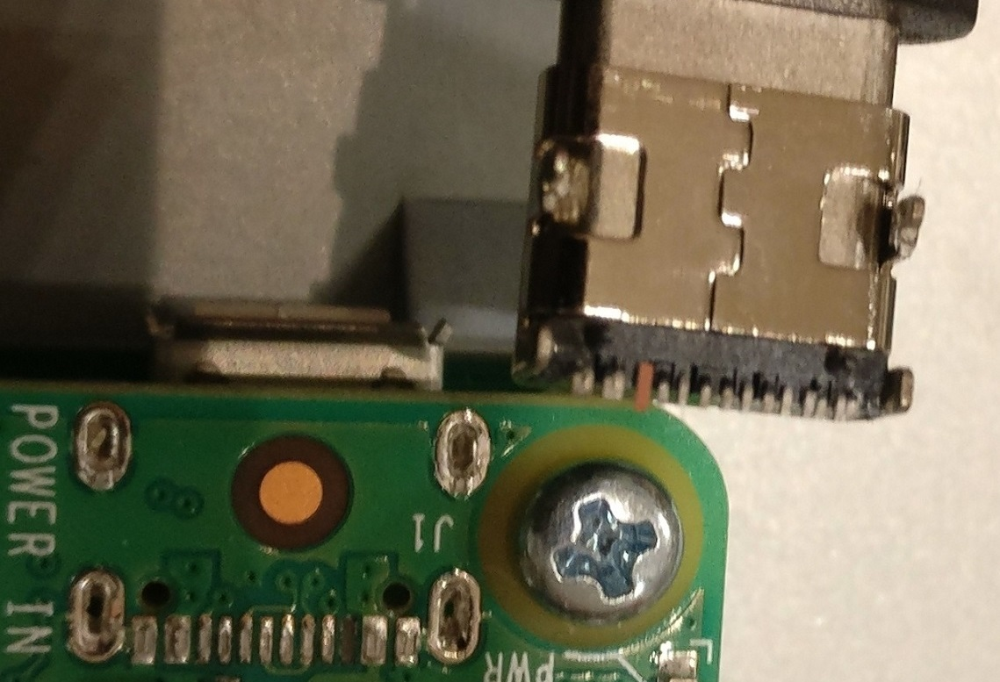

Observe those through hole dips in the board. If you ask me there was no metallurgic bond between the connector and the board except for the actual USB-C lines. _Arguably_, the connector has a through hole connection that doesn't actually go through the board. I suspect that a lack of solder flow on the back side causes this ports to fall out in certain conditions. Either way, here I was in early 2022 with a broken RPi4. For those that are aware of the current RPi supply situation know that you aren't going to find a board without it being part of an expensive kit or price gouged. The cheaper board only sales are $150 at the time of this writing. That ain't going to happen with my budget so I decided to buy a bunch of these:

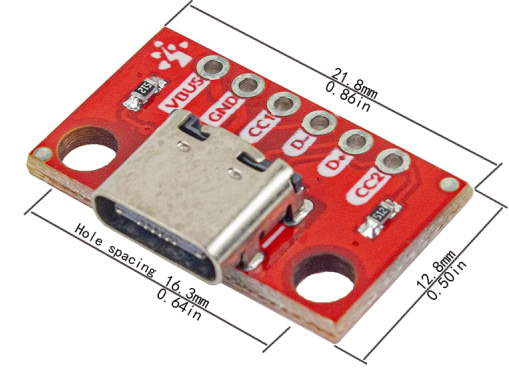

The hope was that I could solder some wires to the traces and then connect those wires to this break out board. I don't have solder skills or tips capable of re-soldering those really small USB-c leads, so my only goal was to connect VBUS and GND to power the board.

## The Rig

First things first, I needed to double check the pin out of the USB-C connector. I was able to find a [_Dimensional Drawing_ Datasheet](https://cdn.sparkfun.com/assets/8/6/b/4/5/A40-00119-A52-12.pdf) at SparkFun[https://sparkfun.com] that looked pretty spot on for the connector that fell off of the RPi. Luckily it had the pin out I needed:

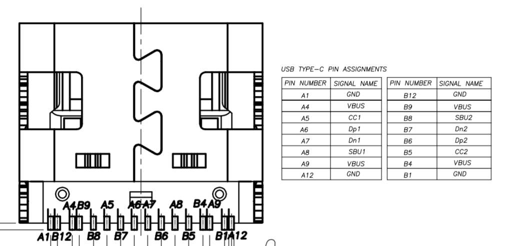

Next was to design a rig that allowed my to have my FTDI MiniModule, Logic Analyzer, some bread boards, and RPi4 secured so that this kind of event wasn't going to happen again. Just playing with the idea I laid out the various gizmos on the board:

Top View:

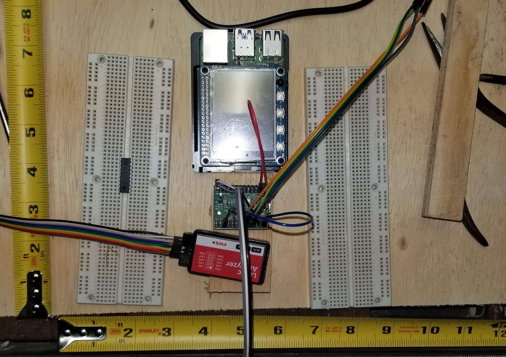

Side View:

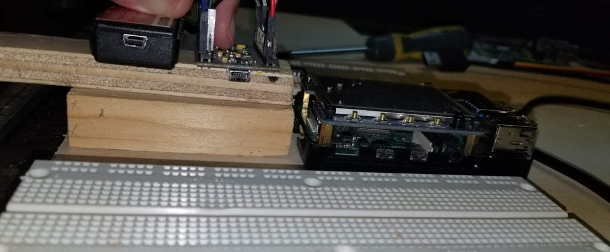

As seen in the images, I was putting the RPi4 in the top center with bread boards on either side. The Logic Analyzer and the FTDI MiniModule would be below the RPi4 (in top view), but raised for easy access to the RPi and the bread boards. I forgot to take some pictures of the rig during construction, but towards to end I got to the dreaded bit where I needed ot solder the wires back onto the RPi4 USB traces.

## The Solder

My first attempt was trash:

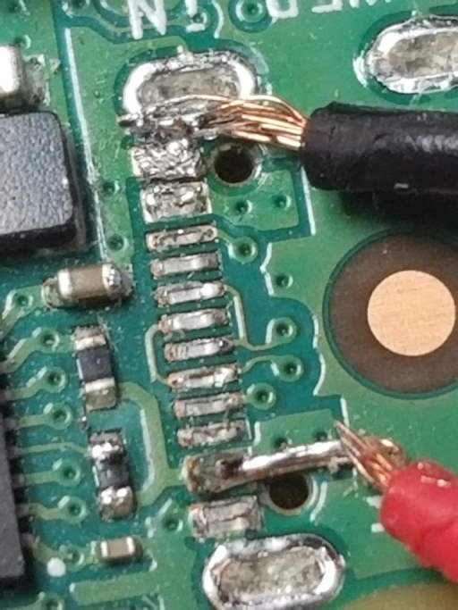

Here is an image of the whole USB-C from RPi4 to breakout:

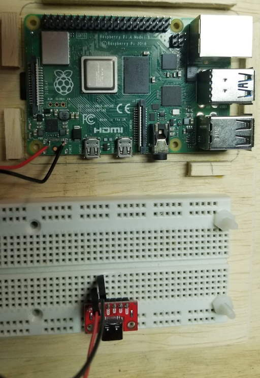

When I powered it up, it actually did work! BUT, the moment I picked up the RPi4 for the surface, the solder joints fell off (or the wires snapped, can't remember). It was just bad. Instead of suffering through that again I decided to take a different approach. Looking at the board for a few minutes I identified some test points at the bottom of the board:

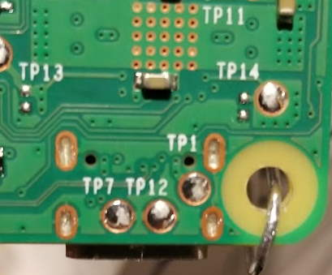

Turns out TP7 & TP12 are GND and TP1 is VBUS! Those test points are significantly larger than the USB-C traces and comfortably fall within my skill. I made quick work of soldering on the wires and testing the board powering up. Once again, I didn't get images of the actual solder joints because I was now afraid of the thing falling apart again. I quickly covered the joints with electrical tap and screwed the RPi4 back into its case to hold everything firmly together.

## The Assembly

Now that I had the actual fix in place and a rig constructed, I assembled everything with some nylon bolts/nuts and zip ties. Here are several images of the final product (before hooking up the MiniModule and Logic Analyzer). You'll likely see many more images of this rig pop up in the Embedded Systems Analysis material going forward.

Top View:

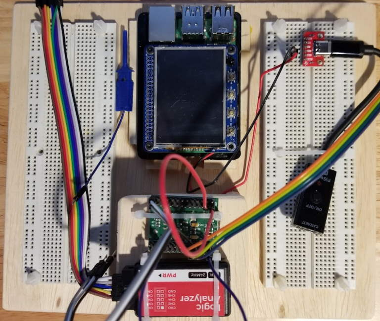

Rear View:

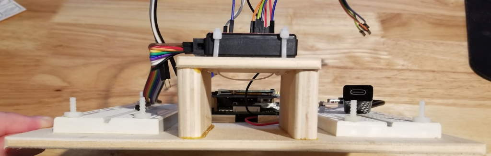

Perspective View:

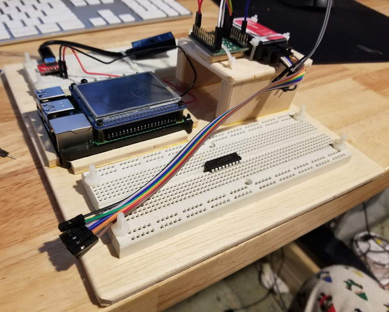

## Other Thoughts

To prevent from having to do any of this in the first place, you could consider:

- Adding epoxy to the USB-C connector itself to give it some extra strength.
- Add some tension protection with a short USB-C wire tied down or taped to the RPi4.

One idea I had immediately following the port falling off was how to power the RPi from the GPIO pins. While this is perfectly reasonable, there is a risk of over driving the circuitry. This risk doesn't exist from the USB-C connector because there is electrical regulation between the USB-C connector and the rest of the system. This regulation doesn't exist on the GPIO side and so its a _bring-your-own_ kind of situation.

Also, in theory you can power the device from the other USB connectors, but they only work after the initial power on. For example, you could power on the Pi with USB-C, power the Pi with USB-A and then pull the USB-c and the Pi would remain on.

Finally, the Raspberry Pi should be able to be powered with PoE (Power over Ethernet). While I could have went this route, I would have had to purchase a PoE injector and a PoE hat or other circuit for the Pi and figure out how to integrate it with my TFT display. All I needed was power and my final solution cost me ~$10 (minus the rig to hold everything.)

## Conclusion

If you've got a RPi4 with a USB-C port that's fallen off in these hard times, go ahead and grab a breakout board and solder it to the underside (via the test points) of the RPi4 to keep things moving. At least until RPi's are able to come back in stock.

## Comments

<iframe src="/comment-iframe.html" height="1024" width="100%" onLoad=""></iframe>