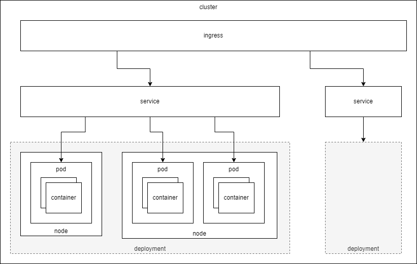
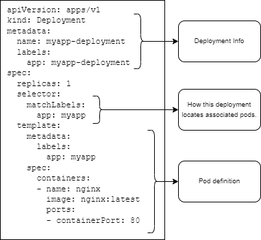
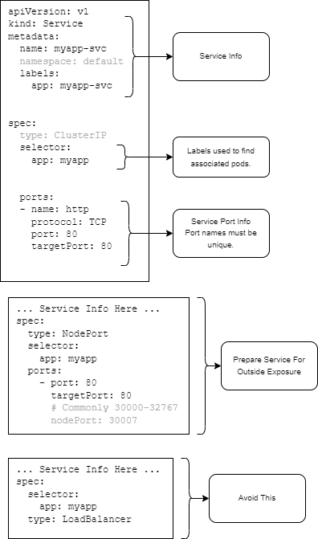
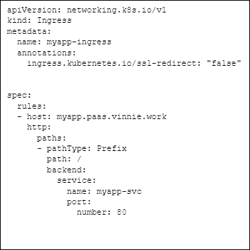
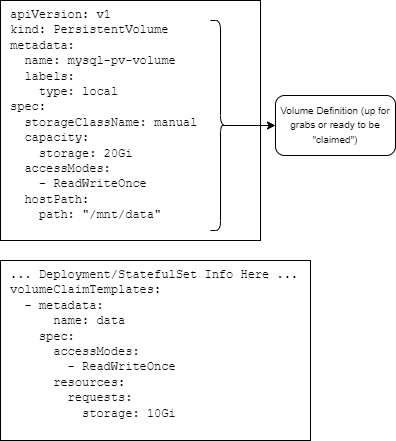
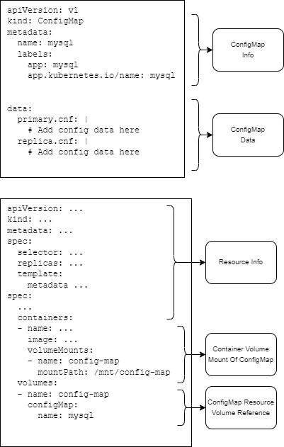
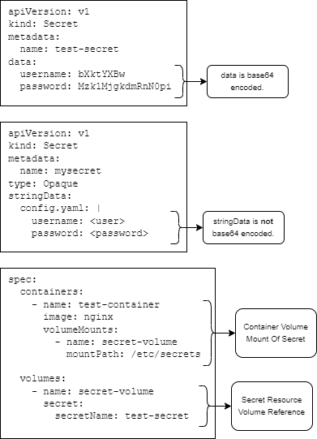

## Introduction

This is my overview of kubernetes. There are many like it, but this one is mine.

Back in 2020 when I first started looking into building a mobile application I wanted to do things "smart" by architect-ing the backend system on Kubernetes. After all, kubernetes was the hot new thing that all the cloud services were supporting. I think I went about it all wrong at the time. I took a very top down approach (which I very often do) jumped right into some cloud infrastructure on GKE and just started poking around with `kubectl` and the various GUIs. Turns out this doesn't work in Kubernetes land without some solid base knowledge. I had no context, no terminology. To make matters worse, I watched a few how-to videos on youtube that went kind of like: "`kubectl` this, `kubectl` that, and viola! You have a working infrastructure." In reality "Kubernetes is not making my job easier! Kubernetes is just creating another career's worth of complexity in my application." At the time I settled for `docker-compose` instead.

Now I've returned to Kubernetes in pursuit for a flexible home/DIY Platform As A Service (PaaS).

<!-- truncate -->

## Kubernetes

### What?

IMO, Kubernetes is a framework (implemented in software) that defines a way to manage the physical and logical infrastructure resources required support (typically online) services and/or applications. Whether these services or applications require scaling, resiliency, and/or security are merely features of Kubernetes and independent of what Kubernetes _is_.

Assuming you are running a local DIY Kubernetes, Kubernetes **is not** a way to get away from worrying about:

- Network device configurations (e.g. firewalls, switches, routers).
- Hardware acquisition and maintenance.
- Operating system maintenance.
- Physical security (e.g. locks, monitoring, good operational practices).
- Virtual security (e.g. identity management, policy enforcement, updates).
- Power, space, and cooling requirements.

Kubernetes _assists_ with the deployment, utilization, and monitoring of raw CPU, raw memory, raw network, and raw disk space across the entire _system_, as configured with the above listed considerations. Kubernetes does build in Role Based Access Control (RBAC) and identity management to a degree, but only in the context of Kubernetes resources and not as a wholistic business practice.

### Why?

Ok ... I manage my own server and I can setup my own services via docker-compose with a nginx gateway reverse proxies and TLS termination.

_What does Kubernetes give me that docker-compose and nginx doesn't?_

**Nothing.** You can do everything Kubernetes can do with shell scripts and configuration files if you want. The primary reason, as I see it, to use Kubernetes is because it has a large supportive community of developers and it provides a level of standardization across cloud vendors never seen before.

_But I'm not using cloud infrastructure, why Kubernetes locally?_

There are in fact other technologies that can accomplish the same sort of abstraction that Kubernetes provides. Such as the docker-swarm abstraction framework Dokku. Dokku touts itself as an open source Heroku like tool that you can use to support your own DIY PaaS. Coolify, Caprover are plain'ole Docker versions of the same thing and can give you a lot of what you need for smaller businesses and application scales.

The reason I am attempting to use Kubernetes locally is purely so that I have an easy off load ramp when I determine that something I am running needs a bit more babysitting than I can provide on my home setup. For example, if I develop a specific application that starts to have real users, I want to be able to take 99% of that configuration and apply it to a cloud provider and receive the same behavior that I'd see on my local system. In the same vain, but reverse, if I have a deployed application, I want to be able to take 99% of the real deployment and run that locally on my home setup for development and testing.

### How?

I plan to talk about this more in another Kubernetes article, but suffice to say that Kubernetes is a level of abstraction built on top of container runtime and Linux namespaces. Without container runtimes or Linux namespaces, Kubernetes would not exist as you know it today.

## Kubernetes Primer

When I jumped into Kubernetes, I knew all the things I know about namespaces and containers ... how hard could it be? Well, Kubernetes is solving a different problem. Kubernetes is entirely about **managing system state** through the use of \_semi-\_standard APIs, namespaces, containers, and so forth.

Here are some common terms you should already be familiar with before ever thinking about tinkering with Kubernetes (IMO):

- [Linux Namespace](https://en.wikipedia.org/wiki/Linux_namespaces) - A partitioned set of resources defined and managed by the Linux kernel. (The thing that all containers depend on.)
- [Container](<https://en.wikipedia.org/wiki/Containerization_(computing)>) - The state of a running or created namespace, usually based on a container image.
- Container Image - A [standardized](https://github.com/opencontainers/image-spec) set of layers that define the mount namespace of a container to be created or run.
- Container Runtime - A [standardized](https://github.com/opencontainers/runtime-spec) executable that uses the clone() syscall to run containers in their assigned namespaces.
- [Yaml (Yet Another Markup Language)](https://yaml.org/) - A common configuration format that is typically more human readable than JSON and more terse than XML. (YAML is a superset of JSON.)

For Kubernetes, specifically, there are are a number of new terms to define right up front:

- Namespace - This is a grouping or related set of resources within Kubernetes.
- Node - Think of this as an (atomic) running (Linux) kernel. It could be a bare metal system, a virtual machine, or some other multi-kernel architecture, just so long as it has its own (Linux) kernel.
- Cluster - A cluster is a logical grouping of Nodes.
- Pod - A pod is a **tightly coupled** grouping of containers. (Usually a single container.) ... I like to think of a Pod as a single Linux namespace where all the applications see the exact same network stack and resources.
- Service - An object for discovering and accessing a Pod that is providing a _service_.
- Ingress - A set of rules for routing URL hosts/paths to services. For example, when you do an HTTP GET request for http://my.domain.com/endpoint, which (Pod) resource does the URL forward you to?
- _Labels_ - While not a first class "object", labels are used as object attributes. These labels can be used to assist with discovery and location of objects. Each object gets a single unique name, but object labels can share the same values or divulge metadata this isn't accessible elsewhere in the object.

- Job - A configuration of a single run Pod. This is similar to running something like `docker run -ti --rm <container> <command>` as a throw away container. The primary difference is that Kubernetes will implicitly continue to attempt a Job unless there is no error return code.
- Deployment - A desired configuration of (stateless) Pods for an application. By _desired_ I mean to say that the configuration could run in a "degraded" state where not all Pods are all running at the same time. This could be due to a Node having been taken offline due to failures or required updates.
- DaemonSet - Similar to a Deployment but is intended for running a Pod on every node. This can be used to run a local syslog service on all nodes.
- StatefulSet - Similar to a Deployment but the names of Pods are indexed so that references can refer to the same Pod allowing for local state to be stored in the container.
- _Other Configuration States_ - There are a number of other state definition types, but they are out of the scope of my personal needs.

There are many many more terms, but these are the more basic objects that you'll likely use all the time.

Here is a diagram I made for myself to visualize the relationships between the various resource types:



## Kubernetes Interfaces

Kubernetes has many different third party interfaces that can be used to manage and monitor the state of all clusters. When all said and done, the least common denominator for control of Kubernetes is going to be `kubectl` CLI. From this CLI command you can monitor, add, remove, change, rewind different Kubernetes resources, deployments, or applications. In fact, unless I'm troubleshooting a system, there is nothing I would want any external tool to do that `kubectl` does not do. `kubectl` is my sanity check that the system is doing what it is support to be doing.

Another major aspect to the Kubernetes interface is its Yaml configurations. I've used Yaml as a primary configuration in past projects with the same complexity as Kubernetes. The thought at that time was that everything the machine will eventually see was going to be in XML so that we could use the power of XPath to manipulate and view the data as needed. Knowing that XML is less than ideal for human consumption and manipulation, we opted to have Yaml be the primary input mechanism and then transliterated it into XML for machine processing. But I digress... Kubernetes uses Yaml as a configuration and you should get comfortable with its look, layout, and syntax. The following are some examples of Yaml configurations that show different definitions for Kubernetes resources. Note: I deliberately will try to only show the Yaml configurations that you'll need to know to deploy applications. There are many other Resources that you can plug in manually (e.g. Pod), but this doesn't make any sense in the context of Kubernetes because you'll always want to generate a Pod via a Deployment or Job.

Please note that the following example configurations are representative only and are not likely to work out of the box. That said, I've included both a png diagram to point at various aspects of the Yaml as well as a drop down preformatted section for easy copy/paste.

### Deployment Configuration

Here is an example of a minimal deployment. Below you'll see:

- Some deployment metadata (e.g. name)
- `replicas` - How many Pod replicas you'll want running at a time (for resiliency).
- `selector` - How this deployment will locate associated Pods.
- `template` - The template definition used across all Pod replicas. The labels in the `template.metadata` must match the selector for the deployment.
- `template.spec.containers` - The containers that will be launched within each Pod. In the following example we deploy Nginx and expect to see its "Welcome to Nginx!" page when access is provided.



<details><summary>Deployment YAML</summary>

```yaml
apiVersion: apps/v1
kind: Deployment
metadata:
  name: myapp-deployment
  labels:
    app: myapp-deployment
spec:
  replicas: 1
  selector:
    matchLabels:
      app: myapp
  template:
    metadata:
      labels:
        app: myapp
    spec:
      containers:
        - name: nginx
          image: nginx:latest
          ports:
            - containerPort: 80
```

</details><br />

### Service Configuration

The following is an example of a Service that can be used to reference several Pods (e.g. Deployment) as a single Service. If we leave the Service as a `type: ClusterIP`, you won't be able to access it without additional steps (e.h. Ingress). As an alternative, you can setup the Service with a HostPort or a NodePort.



<details><summary>Service YAML</summary>

```yaml
apiVersion: v1
kind: Service
metadata:
  name: myapp-svc
  namespace: default
  labels:
    app: myapp-svc

spec:
  type: ClusterIP
  selector:
    app: myapp

  ports:
    - name: http
      protocol: TCP
      port: 80
      targetPort: 80
```

```yaml
# ... Service Info Here ...
spec:
  type: NodePort
  selector:
    app: myapp
  ports:
    - port: 80
      targetPort: 80
      # Commonly 30000-32767
      nodePort: 30007
```

```yaml
... Service Info Here ...
spec:
  selector:
    app: myapp
  type: LoadBalancer
```

</details><br />

### Ingress Configuration

Ingress definitions to me are a way to abstract reverse proxy rules from a web proxy into Kubernetes speak. For example: I could setup server/location directives in an `nginx.conf` and get the same result, but if I do this in Kubernetes I get the changes in Service settings for free and a standard interface that should _mostly_ work in a deployed cloud instance.



<details><summary>Ingress YAML</summary>

```yaml
apiVersion: networking.k8s.io/v1
kind: Ingress
metadata:
  name: myapp-ingress
  annotations:
    ingress.kubernetes.io/ssl-redirect: 'false'

spec:
  rules:
    - host: myapp.paas.vinnie.work
      http:
        paths:
          - pathType: Prefix
            path: /
            backend:
              service:
                name: myapp-svc
                port:
                  number: 80
```

There are many gotchas when setting up an IngressClass in your Kubernetes system. I intend to talk about this in some detail in another article, but for now the take away should be that Ingress definitions are heavily dependent on their engine and the engine specific annotations required to make them work as intended. For example:

- If you don't intend to enable TLS in your Kubernetes system (because you do TLS termination outside of the system), you need to annotate no ssl redirection. The way this is done is different between Traefik and Nginx.
- If you intend to use path prefixes, you'll likely need to annotate some kind of rewrite rule into the definition. The way this is done is different between Traefik and Nginx.

</details><br />

### Volume Configuration

When you need persistance for logs, a database, or a cache, you'll need to define available disk volumes that can be claimed by a Deployment or StatefulSet. Here is an example of a local mount point Volume definition with an _arbitrary_ max disk usage capacity. Note: The capacity is used as a metric to determine it the volume satisfies a volume claim requirement.



<details><summary>Volume YAML</summary>

```yaml
apiVersion: v1
kind: PersistentVolume
metadata:
  name: mysql-pv-volume
  labels:
    type: local
spec:
  storageClassName: manual
  capacity:
    storage: 20Gi
  accessModes:
    - ReadWriteOnce
  hostPath:
    path: '/mnt/data'
```

```yaml
# ... Deployment/StatefulSet Info Here ...
volumeClaimTemplates:
  - metadata:
      name: data
    spec:
      accessModes:
        - ReadWriteOnce
      resources:
        requests:
          storage: 10Gi
```

</details><br />

### Configuration Configuration

You can always setup volumes as your configuration or you can use the ConfigMap resource to manage configuration values. The ConfigMap acts similar to a volume mount. You can define configuration files in the yaml itself and then mount them into the Container's file system on start. These configurations will be read only.



<details><summary>Configuration YAML</summary>

```yaml
apiVersion: v1
kind: ConfigMap
metadata:
  name: mysql
  labels:
    app: mysql
    app.kubernetes.io/name: mysql

data:
  primary.cnf: |
    # Add config data here
  replica.cnf: |
    # Add config data here
```

```yaml
apiVersion: ...
kind: ...
metadata: ...
spec:
  selector: ...
  replicas: ...
  template:
    metadata ...
spec:
  ...
  containers:
  - name: ...
    image: ...
    volumeMounts:
    - name: config-map
      mountPath: /mnt/config-map
  volumes:
  - name: config-map
    configMap:
      name: mysql
```

</details><br />

### Secret Configuration

You can always store secrets (certificates, keys, passwords, usernames) in a volume mount or configuration, but it is recommended to use the Kubernetes Secret store. At a minimum, the secret store has mechanisms built in to prevent secrets from being exposed in terminal logs or easily being searched for in binary. This is mostly accomplished by base64 encoding secrets in their respective objects. Note: Kubernetes secrets are stored encoded but **not encrypted** in the Kubernetes API server. See official documentation for information about setting up [`EncryptedConfiguration`](https://kubernetes.io/docs/tasks/administer-cluster/encrypt-data/).



<details><summary>Secret YAML</summary>

```yaml
apiVersion: v1
kind: Secret
metadata:
  name: test-secret
data:
  username: bXktYXBw
  password: Mzk1MjgkdmRnN0pi
```

```yaml
apiVersion: v1
kind: Secret
metadata:
  name: mysecret
type: Opaque
stringData:
  config.yaml: |
    username: <user>
    password: <password>
```

```yaml
spec:
  containers:
    - name: test-container
      image: nginx
      volumeMounts:
        - name: secret-volume
          mountPath: /etc/secrets

  volumes:
    - name: secret-volume
      secret:
        secretName: test-secret
```

</details><br />

## Explaining Kubernetes Resources

One of the most aggravating aspects of Kubernetes when I first approached it, circa 2020, were the number of options used to define a resource. I would go from Yaml to Yaml and see many levels of different options. This can be made even worse when you `kubectl get` a running yaml configuration. In that case, all the implied options become explicit. You'll also get `state` values that you can't set (but don't know that unless you read about them or try).

When you start to define or tweak resource Yaml definitions, you need to be aware of 3 key resources:

- [Kubernetes API Reference](https://kubernetes.io/docs/reference/kubernetes-api/) - Official Website Documentation ... good for seeing options for all supported versions of Kubernetes.

- `kubectl api-resources` - This command will give you a list of all the recognized resource types in _your_ system and their associated command line names and abbreviations if applicable. This is a list of the top level of configurable resources that you can then dive into with `kubectl explain`.

- `kubectl explain` - This command will give you access to the API documentation directly in the terminal (similar to info pages in a POSIX system). You can access the various levels of options by creating a pseudo JSON path to the option that you are interested in. Here are some examples:

  - Find out more about "Deployment"s:

    ```sh
    kubectl explain deployment
    ```

  - Find out more about Pod Templates within a Deployment (Note: This isn't in the K8S cheatsheet!):

    ```sh
    kubectl explain deployment.spec.template.spec
    ```

Without using these 3 resources, any new definitions becomes a guessing game of unknown unknowns until you accidentally become a Kubernetes master. And who has time for that?

## Signing Off

So that's it for now. Please don't see this information as a tutorial or reference. This is a _very_ quick summary of the bare minimum concepts required to have an idea of what is what and how things are defined and connected (in theory). This text is merely a touchstone when performing tangible tasks after successfully setting up a system.

## Comments

<Comments />
