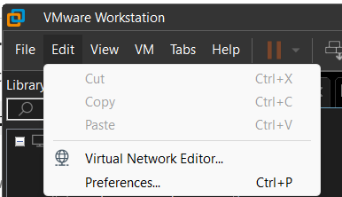
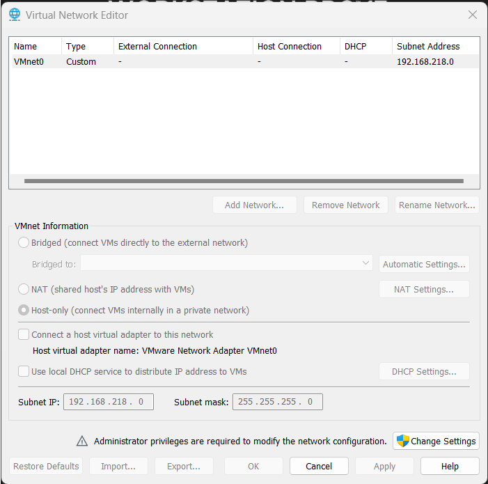
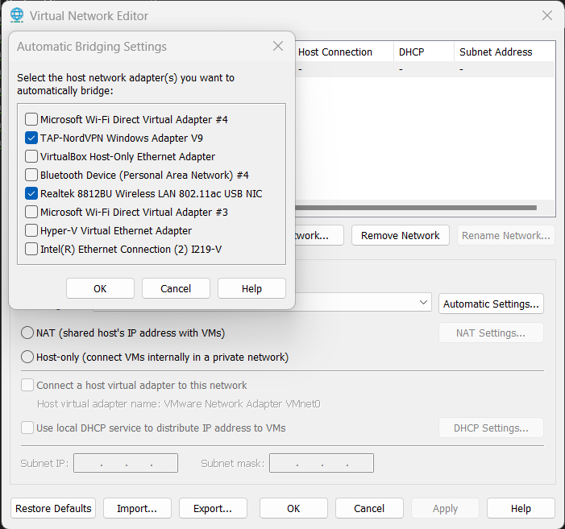

## Overview

In short, I've been using Tailscale, but it drains my battery when I leave it enabled on my phone but I need access to my network for nightly backups.
VMWare Workstation 17 (on Windows 11) has a pretty bad UX for networking. That said, its the lesser of problematic hypervisors, so its _my_ poison of choice. Recently I had a requirement to make the networking behave more deterministically.

<!-- truncate -->

## VMWare Causing Problems

Any reasonable hypervisor allows you to create a VM and setup a networking adapter to bridge mode. This should always mean that the VM will be receiving DCHP responses from outside of the host (or hypervisor framework), IMHO. For reasons unknown to me, this did not work out of the box on VMWare Workstation 17.

Not only did I have to set each VM to "bridge" mode, but I also had to create a custom virtual network in the Virtual Network Editor of VMWare Workstation. Due to some issues I was having with VirtualBox and the fact that my Windows 11 was using HyperV in some unknown context, when I saw that VMWare was using HyperV Virtual Ethernet Adapter, I submitted to VMWare's will. After all ... the networking appeared to be working. But was it?

All of my services use tailscale so that I can easily route my traffic through my local router. Because of this, I didn't realize that there was an additional layer of NATing happening at the VMWare/HyperV layer. This became apparent when I decided to do a nightly backup of my phone to my local network but tailscale was draining my battery during the day. I didn't want to have to manually enable tailscale and there was no nice way to tell tailscale to only enable itself while the phone was charging. (Aggravatingly, there is no app for this kind of automated tasking either! Shame on you _Google_!) 

## Bad Hyper-V, Bad!

After thinking about this issue in a background thread in my head for the day, it occurred to me that I should be able to configure my backup app to talk to the local LAN traffic instead of the tailscale traffic since I usually only charge while within the range of my router at home. This'll make things fast and require no manual intervention. So why does my VM get a DHCP response that changes every reboot?!

Looking back at the Virtual Network Editor, I was reminded of the fact that VMWare was using the Hyper-V Virtual Ethernet Adapter. After some investigating in the Hyper-V Manager and Windows 11 configurations, I could not find a way to configure the DHCP responses of Hyper-V to issue static addresses.

I ended up replacing the Hyper-V Virtual Network Adapter with my Realtek adapter (and other misc international VPN adapter) and sent out all new dhclient requests from all of my VMs to update the IPs. Finally, I was getting 192.168.1.* addresses and they were in fact being issued directly from my home router. Success! That said, it remains to be seen what kind of residual effects there may be. If this doesn't work, I'll likely give actual static addresses a go (which I hate because who wants to manage IP addresses in 2024!).

## But why use VMWare?

Right, so even with all of these issues, VMware remains one of the best maintained hypervisor tools for development across multiple platforms. _But what about VirtualBox?_; I've been a pretty avid user of VirtualBox for years, but once Windows 10 and subsequently Windows 11 was released with its new Hyper-V layers included in the OS piecemeal (depending on the edition and features), VirtualBox seemed like it couldn't keep up and Oracle didn't care enough for my liking. Meanwhile VMWare Workstation 17 had just been released and not only had the required Microsoft Windows support I wanted, but also included VM Autostart out of the box.

Note: I have **not** re-tested with VirtualBox 7.x and later yet as of this writing.

_So why not use Hyper-V or WSL?_ Tried WSL for its first two years and ran into way to many file corruption issues to go back to that in the same decade. As for Hyper-V, its Microsoft biased and therefore not going to support all the weirdness that I've come to expect from VMWare, Virtualbox, or other hypervisors. I'll accept the fact that my frontend is using Hyper-V features under the hood, but no way am I becoming dependent on something that requires a $200 Windows Pro license everywhere I go, Nope.

## Comments

<Comments />
