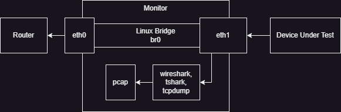
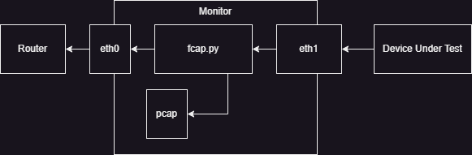
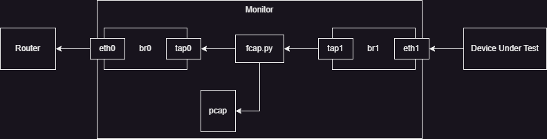

## Passive Packet Capture

In every situation where I've wanted to monitor a device's packets for troubleshooting or analysis purposes in the past 25 years, I've always listened to a single interface that I knew the packets were traversing. This works great for completely controlled environments in short bursts, but what if you wanted to provide some guarentees that all packets leaving the monitor were being captured?

In otherwords, what is the cost of analysis when packets are permitted to traverse the network without you knowing about them? How do we prevent this?

<!-- truncate -->



In the above diagram, we've got a monitor with an inside interface and an outside interface that are bridged (or connected by some means). We can easily listen to one or both of the interfaces for packets. But this setup has some risks. The most straight forward risk is if the sniffer (e.g. Wireshark) crashes or is shutdown, the Device Under Test (DUT) will continue to operate. (This is good in production, but bad in an analysis context.)

## Active Packet Capture

One solution to the risks with passive packet capture is to take a more active approach. Instead of listening to packets traversing an interface, put yourself into the process, as done by `fcap.py` script in the following diagram.



In the above network flow, all packets must be read by our script, captured into a pcap, and *then* transmitted to the output interface. In this design, if the script crashes, the network traffic stops.

The below script is quite rough, but I used it with `veth` interfaces for testing. The script will asynchronously open an "inside" interface and an "outside" interface with a raw socket for all packets. 

```python
socket(AF_PACKET, SOCK_RAW, ETH_P_ALL)
```

When a packet is read, it's appended to our PCAP, and **then** transmitted.

<details>
<summary>fcap.py Source Code</summary>

```python
#!/usr/bin/env python3

import asyncio
from fcntl import ioctl
import os
import struct
import atexit
import time
from scapy.all import PcapWriter, Ether
from socket import socket, AF_PACKET, SOCK_RAW, ntohs


class Pkt(object):
  def __init__(self, data, src, dst, ctx):
    self.data = data
    self.src = src
    self.dst = dst
    self.ctx = ctx

  def ether_obj(self):
    return Ether(bytes.fromhex(self.data.hex()))


class Iface(object):
  def __init__(self, iface_name):
    ETH_P_ALL = ntohs(0x0003)
    self.name = iface_name
    self.socket = socket(AF_PACKET, SOCK_RAW, ETH_P_ALL)
    print(self.socket.bind((self.name, 0)))
    self.socket.setblocking(False)

  async def process(self, dst, ctx):
    print("Process loop running.")
    while True:
      data = await ctx.loop.sock_recv(self.socket, 2048)
      await ctx.cap_q.put(Pkt(data, self, dst, ctx))
      await ctx.loop.sock_sendall(dst.socket, data)


class Ctx(object):
  def __init__(self):
    self.outer = Iface("fcap_01")
    self.inner = Iface("fcap_10")
    self.pkt_cap = PcapWriter('capture.pcap', append=True, sync=True)
    self.pkt_count = 0

  async def capture(self):
    print("Capture loop running")
    while True:
      pkt = await self.cap_q.get()
      self.pkt_cap.write(pkt.ether_obj())
      self.pkt_count += 1
      #print("Cap Packet: %s" % pkt.data.hex())
      if self.pkt_count % 100 == 0:
        print("%d packets processed." % self.pkt_count)

  async def main(self):
    self.loop = asyncio.get_event_loop()
    self.cap_q = asyncio.Queue()
    await asyncio.gather(
      self.inner.process(self.outer, self),
      self.outer.process(self.inner, self),
      self.capture())


if __name__ == "__main__":
  asyncio.run(Ctx().main())

'''
# Setup
sudo ip link add fcap type veth
sudo ip link add name fcap_10 type veth peer name fcap_11
sudo ip link add name fcap_00 type veth peer name fcap_01
sudo ip netns add ns_fcap
sudo ip netns add ns_inner
sudo ip link set fcap_10 netns ns_fcap
sudo ip link set fcap_01 netns ns_fcap
sudo ip link set fcap_11 netns ns_inner
sudo ip netns exec ns_inner ip addr add 10.1.0.111/16 dev fcap_11
sudo ip addr add 10.1.0.100/16 dev fcap_00
sudo ip link set dev fcap_00 up
sudo ip netns exec ns_fcap ip link set dev fcap_01 up
sudo ip netns exec ns_fcap ip link set dev fcap_10 up
sudo ip netns exec ns_inner ip link set dev fcap_11 up
'''
```

</details>

## Another (Faulty) Approach

When I first attempted to solve this issue, I naively used the kernel's `tuntap` interface. My intention was to bridge a tap interface to each of the physical interfaces and then do the manual reads and writes between the taps. This ended up being a mistake because of the way the kernel determines when to transmit packets coming into a bridge. You can set the setup (without namespaces) below:



After attempting to do many tricks with masquerading MAC addresses and setting up ebtables to rewrite addresses in a layer 2 NAT like fashion, I determined things had gotten to messy and become really bad from an analysis point of view.

That said, within the kernel controlled system, this approach did initially work. (I only doesn't work when leaving the kernel.) Therefore there may still be value add in specific situations, such as sniffing from applications running in a given network namespace.

This script also is a decent example of how to perform asyncronous handling of file descriptors in python using only `asyncio`. (There is no dependency on `aiofiles`.)

<details>
<summary>fcap-tuntap.py Source Code</summary>

```python
#!/usr/bin/env python3
## Note: Requires at least Python 3.10

import asyncio
from fcntl import ioctl
import os
import struct
import atexit
import time
from scapy.all import PcapWriter, Ether

TUNSETIFF = 0x400454ca
IFF_TUN = 0x0001
IFF_TAP = 0x0002
IFF_NO_PI = 0x1000
TUNSETPERSIST = 0x400454cb
SIOCGIFHWADDR = 0x00008927

DEFAULT_MTU = 1500
ETHERNET_HEADER_SIZE = 18
FRAME_SIZE = DEFAULT_MTU + ETHERNET_HEADER_SIZE

pktcap = PcapWriter('capture.pcap', append=True, sync=True)
pkt_count = 0

cap_q = asyncio.Queue()

async def process_direction(reader, writer, iface):
  while True:
    res = await reader.read(frame_size * 2)
    await cap_q.put({"data": res, "iface": iface})
    writer.write(res)
    await writer.drain()

async def process_capture():
  global pkt_count
  global cap_q

  while True:
    obj = await cap_q.get()
    pktcap.write(Ether(bytes.fromhex(obj["data"].hex()))
    pkt_count += 1
    if pkt_count % 100 == 0:
      print("%d packets processed." % pkt_count)

async def connect_fd(file_no):
  fileobj = os.fdopen(file_no)
  loop = asyncio.get_event_loop()
  reader = asyncio.StreamReader()
  protocol = asyncio.StreamReaderProtocol(reader)
  await loop.connect_read_pipe(lambda: protocol, fileobj)
  w_transport, w_protocol = await loop.connect_write_pipe(asyncio.streams.FlowControlMixin, fileobj)
  writer = asyncio.StreamWriter(w_transport, w_protocol, reader, loop)
  return reader, writer

async def main(inner, outer):
  inner_read, inner_writer = await connect_fd(inner["fd"])
  outer_reader, outer_writer = await connect_fd(outer["fd"])

  await asyncio.gather(
    process_direction(inner_reader, outer_writer, inner),
    process_direction(outer_reader, inner_writer, outer),
    process_capture())

def setup_tuntap(name, addr):
  dev = '/dev/net/tun'
  iface = name.encode("utf-8")
  fd = os.open(dev, os.o_rdwr)
  ifs = ioctl(fd, tunsetiff, struct.pack("16sH", iface, IFF_TAP | IFF_NO_PI))
  real_name = ifs[:16].decode("utf-8").strip("\x00")
  bridge = "br_%s" % name
  ns = "ns_%s" % name

  
  os.system("ip netns add %s" % ns)
  os.system("ip netns exec %s ip link add name %s type bridge" % (ns, bridge))
  os.system("ip netns exec %s ip link set dev %s up" % (ns, bridge))
  os.system("ip link set dev %s netns %s" % (iface, ns))
  os.system("ip netns exec %s ip link set dev %s master %s" % (ns, iface, bridge))
  os.system("ip netns exec %s ip link set dev %s up" % (ns, iface))
  os.system("ip netns exec %s ip addr add %s dev %s" % (ns, addr, bridge))

  return {"name": real_name, "fd": fd}

if __name__ == "__main__":
  inner = setup_tuntap("inner", "10.1.0.11/16")
  outer = setup_tuntap("outer", "10.1.0.10/16")
  asyncio.run(main(inner, outer))
```

</details>

## Comments

<Comments />