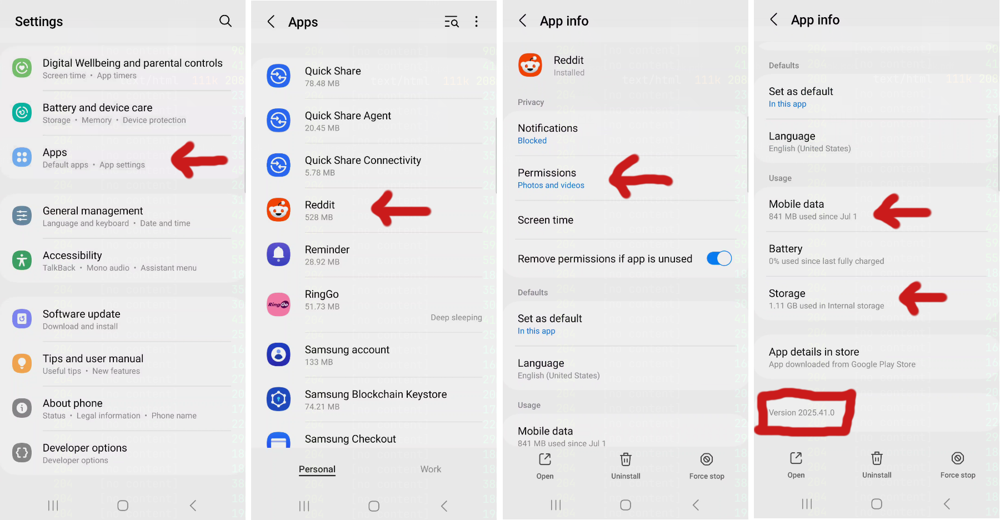
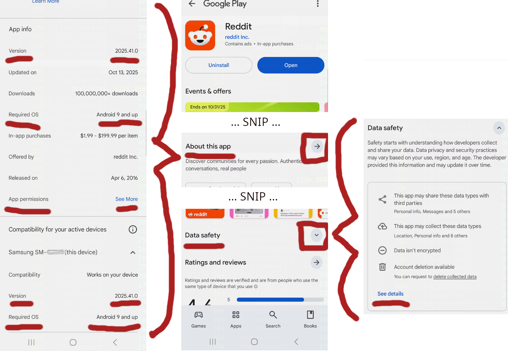

<!-- pagebreak -->

# Initial Application Inspection

:::warning

Work In Progress - Initial Rough Draft

:::

<!-- 
- Application Overt Inspection:
  - Overt usage?
  - Permissions on system?
  - Permissions requested on install?
  - Storage requirements?
  - Other system feature requirements?
  - Analyze the Ecosystem
    - Dependencies (GPL claims and the like)
    - Privacy Policies, Usage Policies, and associated resources.
    - If plugable, identify developer kits, documentation, dev accounts
    - Other Online Research
 -->

## Overt Application Analysis

Ok, so you've downloaded an android application onto your device and its behaving in a way that draws your attention. Perhaps its asking for permissions that you never thought it required. Maybe its generating network traffic that you'd like to know more about. Or, my favorite, maybe you want the application to behave differently than the developer has intended, how do I change the code to make it work the way I want. All of these are topics that I plan to discuss in the following material.

First thing is first. You should attempt to understand everything you can about the application in a non-invasive way. For those who have dabbled, you don't always need to start rooting or connecting the phone to the computer to begin analysis of an application. There is a large amount of information and research we can do to get started without "going deep".

### Settings Menu

For starters, by using the Settings in Android, you should be able to quickly locate the Apps menu to see various information about the applications. The App settings menu for each application is where you'll likely find permissions that you've given to the application, default language, and statistic information like network data usage, battery usage, and device storage. This can all be useful information! Especially if you monitor it over time and over many different applications. Consider that an application's permissions may change over versions.

Looking at the storage and battery usage screens, are these the kinds of numbers you expected? Maybe you have an application that is using bluetooth that you never considered a bluetooth enabled application? Maybe an online only application is taking up multiple gigabytes? Lots of things can be tips or hints into questionable behavior that we can investigate further if desired.

Finally, grabbing the application Version (possibly at the bottom) is a key peice of information. If you are examining a piece of software, having the exact version sometimes required for repeatability and consistency. Later on, if you are doing any memory related tasks, the memory offsets can change unless you have the exact right version. Of course all that said, versions are usually only the start of verification, usually you'll want to verify via CRC or hash as well. More on that later.

### Playstore Info

If the application was downloaded from the Playstore, there may be a link to the store entry. The "Data Safety" entry may have information about the developers and relavant support information. This can be useful for additional documentation about the application that is not often accessed. Even downloading the privacy policy, usage agreements, and all the information about the sources of those documents can provide information about the intentions or uses of an applications permissions or network traffic. (Grab it all!)

The "About this app" entry will have additional descriptions, compatibility information, and current app info. You can even check on what permissions the application will request. But remember, this is about the current application as it is in the Playstore. The app information from the phone and the app information in the Playstore can be completely different unless you've updated in the last few minutes. But if you haven't grabbed the playstore information for your current version installed on the device, having the current Playstore entry at least is something to go on. Make sure any information you gather from here is associated with the advertised version number.

One of the nice pieces of information you can grab from the Playstore About App entry is the Android compatibility number. Knowing that your application can run on Android 13 and below will make your life significantly easier once you get into more dynamic analysis of the application!

### Application Screens

GUI applications are normally developed as a set of forms or screens that are then tailored for a context specific need. Each of these screens have multiple interactive elements that could be links, buttons, text input, drop down menus, hamburger menus, context menus (i.e. floating cross in lower right), and many others. There are a number of interactive and non-interactive elements that users never think about or see as well. For example, the ability to scroll itself is an interactive element. Also the layout of fields, labels, and panels are examples of non-interactive elements (unless explicitly made into a link or button).

To the greatest extent possible, you'll want to capture all of these aspects of the application. From a vulnerability analysis standpoint, they are all potential things included in the attack surface of an application. For example, an unvalidated text field can be used to gain access to an application or application server. A set of actions in a particular state can unlock hidden developer features of an application. Its also very nice to use GUI elements to navigate and discover the under the hood calls to external cloud services while doing deeper levels of analysis. All of this is to say, capture everything you can about an application or the area of an application that you care about.

<!-- TODO: Develop a draw.io graph of screens and menus and what not. -->

### Reinstall Application

After you've captured as much information as you can about an application, a useful task can be to reinstall the applicaiton to see what permissions it asks for and/or requires on install and startup. Note: I would advise against this if you are stuck using a Playstore Install that isn't the same version as your target version. But if you don't care what version we're working with yet, by all means do an upgrade by way of removing the existing version from the device, capturing all of the information about the applications install process that you can and then redo everything from above for the current version of the application. 

### External Research

Applications that use (General Public License) GPL or any number of other open source licenses are (usually) legally required to indicate what open source dependencies thay are using. This will usually include the dependency's name, version, and license. This information is not always show from the application. Sometimes its only available on the developer or vendor website. Identifying this information can assist greatly with overcoming application obfuscation as you go deeper. The license information can also provide insight into more application behaviors or surface area to use to make the application bend to your will. For example, if you know the application is using `ffmpeg`, you can now look at all the information about ffmpeg, its code, what it looks like if built for the CPU of your device, and the CVE database.

When doing analysis of an app, there is likely information already available on the internet. That information is also likely out-of-date, inaccurate, biased, or has any number of other issues. Don't even get me started on the brainless information LLM platforms spit out these days. But even considering all of that, understanding the approaches of these writings or the challenges that folks may have faced can be invaluable for the analysis ahead. It may even get you to whatever goal you may have with an easy button that someone has already developed.

Aside from general Reddit or stray forum information, I would recommend finding your application on a thirdparty APK archive if the vendor does not readily provide APK downloads. Having a copy of the upstream APK can be an easy win if all you need is some information from an APK manifest or a light bit of reverse engineering to understand a behavior. You may also be able to extact the APK from the device its installed on itself, but that is a later topic. Here we're attempting to get as much information about the application as possible without side effects or complex dev environments.

If the application is a plugable platform, checkout the developer documentation. Can you write a plugin to get you access to the information or behaviors that you desire? Note: Many applications developers will host many components or libraries for their Playstore applications openly on Github and other online revision contol systems. This can be a real quick way to get up to speed on the code you are after. Don't forget to check for old releases, tags, and branches of the code on github and other platforms. Even the commit log can be invaluable to leading to the information you are looking for.

Long story short, use the internet to get lessons learned (or answers), get open source dependencies to decrease the area of the unknown, and look for quick wins by grabbing your target APK, or a close version of it, to give you the background to be smart about potential future dynamic analysis.

