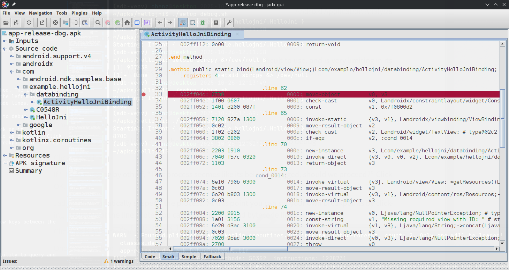
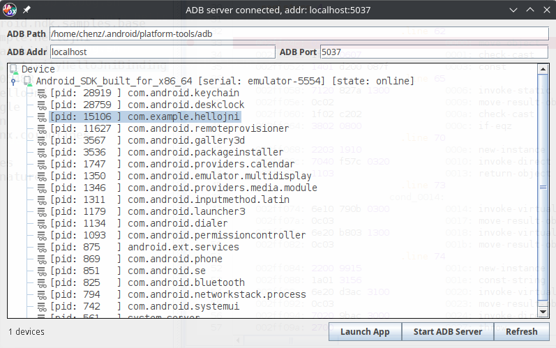
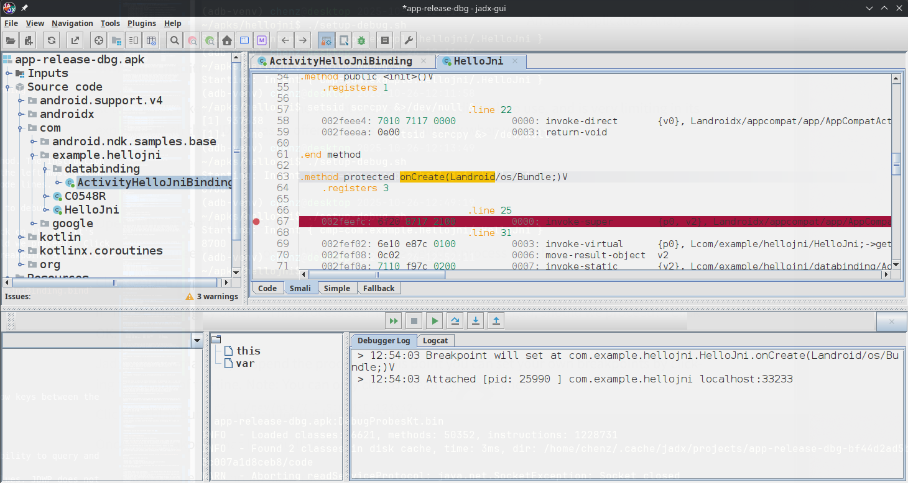
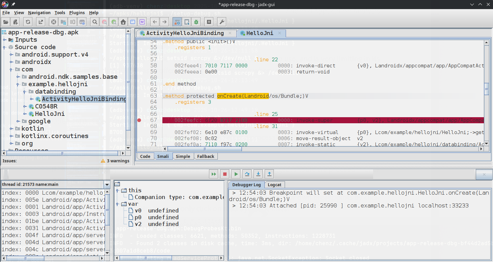
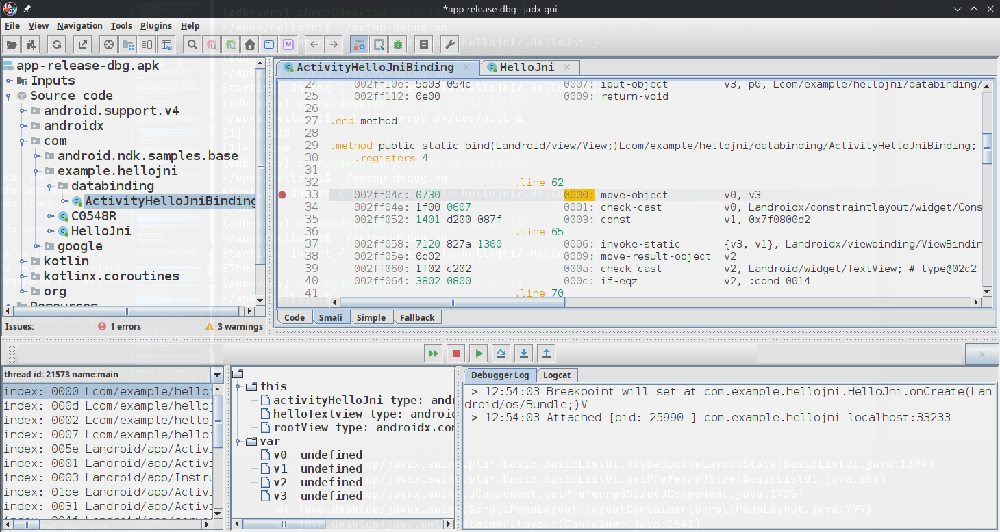
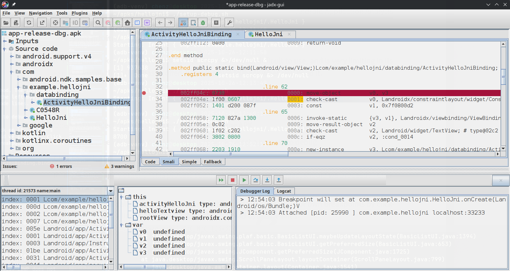
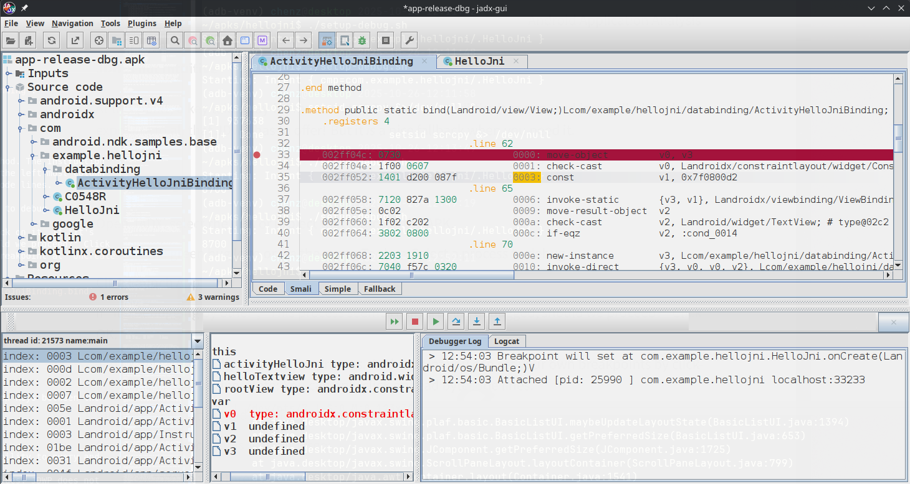
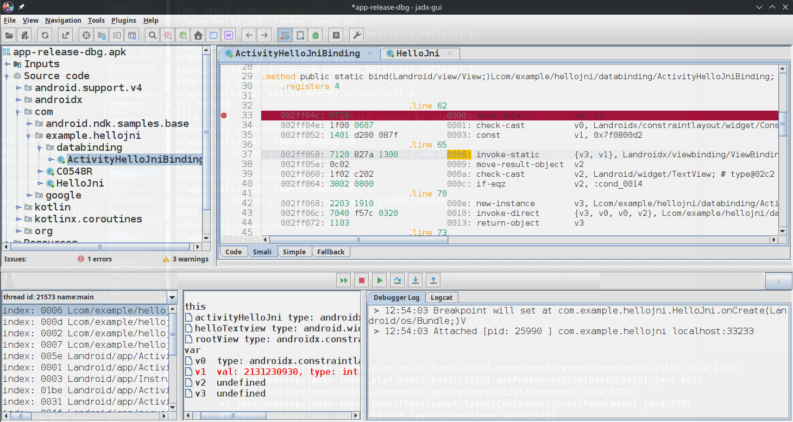
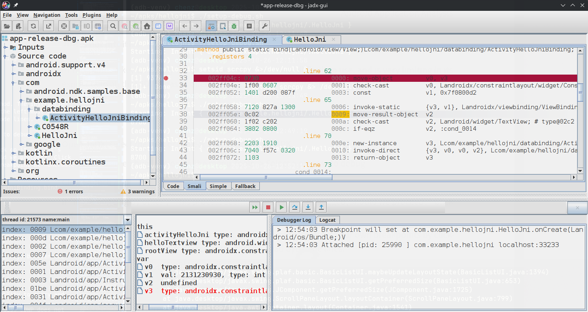
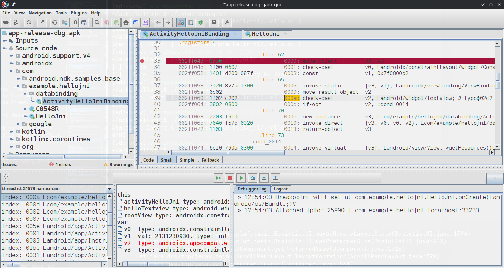

<!-- pagebreak -->

# Dynamic Analysis with JDWP

:::warning

Work In Progress - Initial Rough Draft

:::

<!--     
    - What is JDWP and the JDWP agent.
      - Compare with Frida agent.
      - Can coexist.

    - Application debug via Android GUI
      - Forward JDWP, attach to application with jdb
      - Notice: Usability.

    - Application debug via ADB:
      - Forward JDWP, attach to application with jadx-gui.
      - Notice: VRegister access, Stack Trace access.
       -->

## Debugging Android Applications

When I first jumped into Android rooting (circa 2016), as a long time `gdb` user, I had always assumed that `adb` was the "debugger". Now that we know this is very wrong, I had the same question at the beginning of this year: How do I run a debugger on an Android application running on Android? 

<!-- Example Inline Footnote
<span class="only-pandoc">^[This is an inline footnote.]</span> -->

Android Developers may laugh because the functionality is built right into Android Studio. You write your code, click some items, and you are debugging line by line in either the emulator or the physical device. But one key aspect to that is that, the _normal_ Android developer has the build files and source code to accompany their debugging sessions. All I have is some minimal knowledge of the ABI, mostly because Android _is_ Linux. What do you do when you want to run an APK in a debugger that you do not have the source code for?

## Native Libraries and JVM Execution

To review, an APK is made up of metadata, resources, native (or CPU architecture specific) executable code, and CPU architecture agnostic bytecode. When Android launches a process, (roughly) it forks from a initial system process (zygote) and loads the infrastructure to start execution of the "Main Activity" defined in the AndroidManifest. There is no traditional `main()` to start an APK like there is in standard C/C++ applications. The developer defined "Main Activity" in Dalvik Bytecode _is the entry point_. The native libraries are lazily loaded when the bytecode specifies that in needs the libraries loaded. Many applications will do this early in execution to maintain a smooth user experience, but there are no guarantees that this will happen.

When running a process with a debugger, you can debug the process with something like `gdb`, but you'll be purely in the native code space. This means you'll be breaking, watching, and stepping code from the Zygote forked process and Android Runtime library (ART). You can also break and step code in native libraries, but setting up these breakpoints before the libraries have actually been loaded can be tricky. If you are able to successfully hook into a native library, you also have the complexity of waiting for the Dalvik bytecode to call into the library and when you return to Dalvik space, there is no real visibility into the Java/Kotlin side of the code. This all leads us to my original question: **How does one debug the Dalvik bytecode execution?**

<!-- pagebreak -->

## Java Debug Wire Protocol (JDWP)

Oracle states the Java Debug Wire Protocol (henceforth JDWP) as:

> the protocol used for communication between a debugger and the Java virtual machine (VM) which it debugs (hereafter called the target VM).

Android provides the JDWP as a means to debug the Dalvik execution. The specifics about JDWP can be read at:

- [Java Debug Wire Protocol](https://docs.oracle.com/javase/8/docs/technotes/guides/jpda/jdwp-spec.html) - An overview of the packet format and datatypes used in the protocol.

- [JDWP Protocol Details](https://docs.oracle.com/javase/8/docs/platform/jpda/jdwp/jdwp-protocol.html) - A specification of each of the RPCs, their inputs, outputs, and error formats in the context of the packets described in the _Java Debug Wire Protocol_ page.

There is little need to understand this protocol unless you are developing your own debugger. The point that I am trying to make is that any debugger that supports this protocol will likely be able to be used as a debugger for Dalvik byte code in an Android application. `jdb` is one such debugger. `jadx-gui` is another common tool that implements JDWP. There is one more special case that we'll discuss later.

## Native Debuggers, JDWP Debuggers, and Frida

So far, we've discussed 3 different mechanisms that can be used to debug or dynamically analyze the runtime state of an Android application. All of these are independent of each other and can be used simultaneously (with care). Of course there will be edge cases where you could setup a `gdb` hook that Frida clobbers or you could be doing something with `gdb` or `Frida` that halts the JDWP itself while monitoring bytecode. But in general, they can all coexist in the same running process without issue.

When using all three interactively, you'll want 3 different shells or panes that show them all separately. If you are programmatically interacting with these mechanisms, you'll always be managing them via 3 different sockets, but you can interlace interactions quite nicely. For example, maybe you've setup some Frida RPCs to read native memory so that while you are stepping through bytecode that doesn't have raw memory access, you can see what is happening in the physical (or native) environment.

## Targeting An Application For Debugging

A native application (on a rooted device) can always be ptrace-d or attached to by a native debugger. The JDWP agent code on the other hand is only made active by the Dalvik code itself and only when an APK both declares itself debuggable and has been targeted for debugging. The declaration of debuggable was performed in a previous section on APK reconstruction. The targeting of a APK for debugging can happen in two ways:

- You can open Developer Options in the Settings of Android, drop down the option "Select debug app" and select the application you want to debug. This can be either the package name or the display name of the application. I recommend also selecting the option "Wait for debugger".

If you selected "Wait for debugger", when you now start the application you'll see a modal that pops up saying "Wait For Debugger". At this point you can cancel the operation by clicking "Force Close" or attaching with a debugger.

At this point I'd like to highlight that to find and select the application, it was kind of annoying. The list of possible application to target for debugging can be very long because it includes all of the system packages and third party packages. They are (thankfully) in alphabetical order, but there is no way to filter the list so you end up scrolling, scrolling, scrolling. This is made even worse when you have to do it on a developer host via the emulator GUI or scrcpy GUI. Luckily there is an easier way. Using `adb`, simply run the following:

```sh
adb shell am set-debug-app -w com.example.hellojni
```

To unset any application for debug, run the following:

```sh
adb shell am clear-debug-app
```

Once the application has been targeted for JDWP based debugging, there is one more annoying step that needs to be handled. JDWP is a packet based protocol that generally operates over TCP. When JDWP is enabled for a process, there is a convention that says that its JDWP port will be the same as the process id. The issue is that port is only accessible within the Android system. Therefore we need to forward the internal JDWP port to a developer host accessible TCP port. This is achieved with the `adb forward` command.

### adb jdwp

Before forwarding the port, I'll mention that a lot of online documentation will say you must use the `adb jdwp` command to see all of the JDWP ports that are available for debugging. I personally find this information useless because it only lists the ports. It can be useful to verify the port you plan to forward is available, but that is it. To make matters more weird, the `adb jdwp` command never seems to return. You have to `Ctrl-C` out of it. _Meh._

### adb forward

In brief, when forwarding a JDWP port, I do something like the following. Note: I use 8700 as a convention, but you can use any available port on your developer host. Presuming my targeted process PID was `18431`, I'd do:

```sh
adb forward tcp:8700 jdwp:18431
```

At this point, we can now connect to the process with a debugger via `127.0.0.1:8700` on the developer host. You can also chain this out to other hosts via SSH forwarding if desired or required.

Right, so to forward a JDWP port to a developer host accessible port, you need to:

- Targeted the application for debug
- Start the application
- Get the application PID
- Forward PID-port to developer TCP-port

The first two can be done manually in the GUI. And sometimes that can be easier. But if you are starting the application hundreds or even dozens of times, you want to automate as much of the process as possible. The following is a script that can be used to assist with auto starting:

```sh
#!/usr/bin/env bash
# Target the application for debugging
PKG=com.example.hellojni
INTCAT=android.intent.category.LAUNCHER
adb shell am set-debug-app -w $PKG
# Fetch the application's launch activity
ACT_NAME="$(adb shell cmd package resolve-activity -c $INTCAT $PKG)"
ACT_NAME=$(printf "%s\n" "$ACT_NAME" | grep -oP 'name=\K\S+' | head -n 1 | sed -s "s/$PKG/$PKG\//")
# Launch the application
adb shell am start -n $ACT_NAME
# Get the PID
PROC_PID=$(adb shell ps -A | grep $PKG | awk '{print $2}')
# Forward the port
adb forward tcp:8700 jdwp:$PROC_PID
```

The above script does make some assumptions about the structure of the APK, but hopefully they are reasonable and will work for any of your setups. I usually drop the above script in the folder specific to the target apk. In this case I'd put it in `~/apks/hellojni/setup-debug.sh`. (Ensure its executable with `chmod +x ~/apks/hellojni/setup-debug.sh`.) 

<!-- pagebreak -->

## Java Debugger (JDB)

Now that the application is sitting there waiting for a debugger, lets attach the terminal based Java Debugger (`jdb`) to the process. Presuming ou are in a `(adb-venv)` environment, `jdb` should already be in your path. We can attach `jdb` with the following command:

<!-- TODO: Make sure there is an note about namespaces where applicable. -->

```sh
jdb -attach localhost:8700
```

If everything successfully connected, the application will resume. You can choose to set a breakpoint that may or may not execute later, but the automatic resume is a bit of a let down if you wanted to see how the application was initializing. Kill `jdb` REPL with `exit` and restart the wait screen by running `~/apks/hellojni/setup-debug.sh` again. Note: When starting an application from `adb` that is already running, Android will restart the process instead of launching a second.

Now this time, when we attach `jdb` to the process, we'll immediately have it submit a suspend call. This gets about as close to the initialization as you can with pure `jdb` debugging:

```sh
cat <(echo "suspend") - | jdb -attach localhost:8700
```

Once it has successfully connected, the "Waiting for debugger" modal should go away, but the application should remain unusable. It'll seem like its locked up and non-responsive if you try to use it. This means its suspended (i.e. at a breakpoint) and now is a good time to take a look around inside the Dalvik's VM process space.

You can list available `jdb` command with:

```text
> help
```

A simple way to set a breakpoint for later is through the `stop` command. If you want to break on the `ActivityHelloJniBinding.bind()` method, you'd specify the fully qualified Java class name and method:

```text
> stop in com.example.hellojni.databinding.ActivityHelloJniBinding.bind
Deferring breakpoint com.example.hellojni.databinding.ActivityHelloJniBinding.bind.
It will be set after the class is loaded.
```

When running this specific breakpoint, since we're suspended at the start of the process, the class itself has not been loaded yet. That is what it means by "Deferring breakpoint". The way JDWP works, the actual breakpoint can not be set until the class is loaded, therefore `jdb` does some record keeping. `jdb` will watch for every class that is loaded and when it sees a class that it has a `breakpoint` for, it'll then set the breakpoint. 

Once you are satisfied with your processes place in existence and you are ready for execution to continue, you may use the `resume` command. The `resume` command can specify a specific thread (based on JDWP thread id) or implicitly `resume` all Dalvik threads if there is no argument.

Example resume by a thread by ID: `resume 21574`.

Example resume of all threads (compressed for readability):

```text
> resume
All threads resumed.
> Set deferred breakpoint co..ng.ActivityHelloJniBinding.bind

Breakpoint hit: "thread=main", co..ng.ActivityHelloJniBinding.bind(), line=62 bci=0

main[1]
```

In the above example output, we had told `jdb` to stop at a specific place in the code. You'll see that the actual breakpoint was not set until after we resumed. Then a short time after that, the target location was reached and the code is now suspended again. This time the prompt is not a `>` but an actual `main`. This is an indication from `jdb` that we're running the the `main` thread. You can also see in the `Breakpoint hit` line that we're at the breakpoint we specified in the `main` thread. It also is indicating our breakpoint is at source code line `62` and we're at bytecode index (bci) `0`.

- **line** - The source code line information is quite meaningless without the source code.
- **bci** - The bytecode (i.e. smali code) has an atomic unit of 16 bits. The index starts at the beginning of the _method_ (not the class and not the file). Therefore, to get the 8-bit byte offset of the instruction, its `bci` divided by `2`. The BCI is what the Dalvik program counter (PC) points at when executing each instruction. **This is one of the most important concepts to understand to walk raw DAlvik code.**

Ok, so our Dalvik breakpoint worked, what about a native breakpoint? You don't need to follow along with this, but if you do try to set a break point on a JNI entrypoint (i.e. a native library) in `jdb`, you'll get an error that resembles the following:

```text
> stop at com.example.hellojni.HelloJni.stringFromJNI
> Exception in thread "event-handler" com.sun.jdi.NativeMethodException: 
Cannot set breakpoints on native methods
        at jdk.jdi/com.sun.tools.jdi.EventRequestManagerImpl.createBreakpointRequest
        (EventRequestManagerImpl.java:842)
        at jdk.jdi/com.sun.tools.example.debug.tty.BreakpointSpec.resolveEventRequest
        (BreakpointSpec.java:85)
        at jdk.jdi/com.sun.tools.example.debug.tty.EventRequestSpec.resolve
        (EventRequestSpec.java:73)
        at jdk.jdi/com.sun.tools.example.debug.tty.EventRequestSpecList.resolve
        (EventRequestSpecList.java:68)
        at jdk.jdi/com.sun.tools.example.debug.tty.EventHandler.classPrepareEvent
        (EventHandler.java:246)
        at jdk.jdi/com.sun.tools.example.debug.tty.EventHandler.handleEvent
        (EventHandler.java:112)
        at jdk.jdi/com.sun.tools.example.debug.tty.EventHandler.run
        (EventHandler.java:74)
        at java.base/java.lang.Thread.run
        (Thread.java:833)
```

`jdb` does not support setting breakpoints on native calls. Note: This is a limitation of `jdb` alone.

### Exploring The jdb Breakpoint

Listing available threads and their states in `jdb` can be accomplished with the `threads` command. Note: Only VM threads are halted by `jdb`. Native threads keep going unless halted at the native level.

```text
> threads
Group system:
  (java.lang.Thread)21574 Signal Catcher                     cond. waiting
  (java.lang.Thread)21575 ADB-JDWP Connection Control Thread cond. waiting
  (java.lang.Thread)21578 ReferenceQueueDaemon               cond. waiting
  (java.lang.Thread)21579 FinalizerDaemon                    cond. waiting
  (java.lang.Thread)21580 FinalizerWatchdogDaemon            cond. waiting
  (java.lang.Thread)21581 Jit thread pool worker thread 0    running
  (java.lang.Thread)21582 HeapTaskDaemon                     cond. waiting
  (java.lang.Thread)21586 Profile Saver                      running
Group main:
  (java.lang.Thread)21573 main                               running (at breakpoint)
  (java.lang.Thread)21576 binder:14381_1                     running
  (java.lang.Thread)21577 binder:14381_2                     running
  (java.lang.Thread)21583 binder:14381_3                     running
  (java.lang.Thread)21767 RenderThread                       running
```

When performing commands in `jdb`, sometimes you want information from the context of another thread. You can set the thread you're implicitly working with by running the `thread` command with a thread id (provided by `threads` command).

```text
thread 21573
```

Each method in Dalvik is provided with a set of virtual registers (vregs) that act as the variables for everything that the method needs. The vregs cover for the method parameters and the local variables (that would traditionally be stack based). The `locals` command allows you to see these local variables. Note: Only the variables that have a direct correlation to the Java or Kotlin source code will show up in the `locals`. Variables or vregs that were generated from the source code (i.e. vregs that are only used in smali) are not accessible via JDWP, and `jdb` does not provide support for access to them.

To see what we _can_ see, use the `locals` command:

```text
main[1] locals
Method arguments:
Local variables:
 = instance of androidx.constraintlayout.widget.ConstraintLayout(id=22391)
```

`jdb` has a list command that would provide a source code listing if the method we're in, if we had source code.

```text
main[1] list
Source file not found: ActivityHelloJniBinding.java
```

Performing a backtrace is possible. Most documentation will indicate that you want to use the `where` command to see the backtrace. This is wrong for our use case because the `where` command omits the bytecode index (bci). Since we're working entirely from the smali code, we always want the bytecode index and therefore you should always use the `wherei` command when attempting to view the backtrace. (`pc` or program counter is the bytecode index.)

Example (compressed for readability):

```text
main[1] wherei
  [1]  com.example.hellojni.databinding.ActivityHelloJniBinding.bind 
       (ActivityHelloJniBinding.java:62), pc = 0
  [2]  com.example.hellojni.databinding.ActivityHelloJniBinding.inflate    
       (ActivityHelloJniBinding.java:53), pc = 13
  [3]  com.example.hellojni.databinding.ActivityHelloJniBinding.inflate 
       (ActivityHelloJniBinding.java:43), pc = 2
  ... snip ...
  [19] com.android.internal.os.RuntimeInit$MethodAndArgsCaller.run
       (RuntimeInit.java:548), pc = 11
  [20] com.android.internal.os.ZygoteInit.main
       (ZygoteInit.java:936), pc = 312
```

In many cases of Java and Kotlin (by design), you'll be running within a class. From this fact, we know that there may be a _this_ reference that we can investigate. You don't need to have the object ID to dereference the _this_ reference. `jdb` allows you to use the `this` keyword. Note: static breakpoints like `ActivityHelloJniBinding.bind` do not have a _this_ pointer, we we'll use `com.example.hellojni.HelloJni.onCreate` for the following example:

Do breakpoint setup (compressed for readability):

```text
> stop in com.example.hellojni.HelloJni.onCreate
Deferring breakpoint com.example.hellojni.HelloJni.onCreate.
It will be set after the class is loaded.
> resume
All threads resumed.
> Set deferred breakpoint co..ni.HelloJni.onCreate

Breakpoint hit: "thread=main", co..ni.HelloJni.onCreate(), line=25 bci=0

main[1] wherei
  [1] com.example.hellojni.HelloJni.onCreate (HelloJni.kt:25), pc = 0
  [2] android.app.Activity.performCreate (Activity.java:8,305), pc = 94
  /* ... snip ... */
```

See the instance id of the _this_ object.

```text
print this
```

Example output:

```text
main[1] print this
 this = "com.example.hellojni.HelloJni@6b30581"
```

See the fields of the _this_ object.

```text
dump this
```

Example output (compressed for readability):

```text
main[1] dump this
 this = {
    Companion: instance of com.example.hellojni.HelloJni$Companion(id=22094)
    androidx.appcompat.app.AppCompatActivity.DELEGATE_TAG: 
      "androidx:appcompat"
    androidx.appcompat.app.AppCompatActivity.mDelegate:
      instance of androidx.appcompat.app.AppCompatDelegateImpl(id=22096)
    androidx.appcompat.app.AppCompatActivity.mResources:
      null
    androidx.fragment.app.FragmentActivity.FRAGMENTS_TAG:
      "android:support:fragments"
    androidx.fragment.app.FragmentActivity.mCreated:
      false

    /* ... snip ... */

    android.content.Context.WINDOW_SERVICE:
      "window"
    android.content.Context.sLastAutofillId:
      -1
    java.lang.Object.shadow$_klass_:
      instance of java.lang.Class(reflected class=co..ni.HelloJni, id=21791)
    java.lang.Object.shadow$_monitor_:
      -2035087999
}
```

Sometimes you want to capture all of the classes that are currently loaded in the process. `jdb` makes this easy via the `classes` command. `jdb` also makes this command useless because there is no real way to filter the list and it can be tens of thousands of classes all at once. All of the classes comes from both the general overhead of running an Android application and the fact that many classes are replicated from the forking of Zygote and its process memory.

Print all of the loaded classes (usually thousands).

```text
classes
```

If you happen to have the fully qualified Java class name of a class you are interested in (Hint: Use JADX), you can lookup information about the class, including the class metadata, its methods, and its fields.

See class metadata with: `class <FQCN>`

```text
main[1] class com.example.hellojni.HelloJni
Class: com.example.hellojni.HelloJni
extends: androidx.appcompat.app.AppCompatActivity
nested: com.example.hellojni.HelloJni$Companion
main[1]
```

See class methods with: `methods <FQCN>`

```text
main[1] methods com.example.hellojni.HelloJni
** methods list **
com.example.hellojni.HelloJni <clinit>()
com.example.hellojni.HelloJni <init>()
com.example.hellojni.HelloJni onCreate(android.os.Bundle)
com.example.hellojni.HelloJni stringFromJNI()
com.example.hellojni.HelloJni unimplementedStringFromJNI()
androidx.appcompat.app.AppCompatActivity <init>()
androidx.appcompat.app.AppCompatActivity <init>(int)
androidx.appcompat.app.AppCompatActivity initDelegate()
... over 1000 more lines of methods ...
```

See class fields with: `fields <FQCN>`

```text
main[1] fields com.example.hellojni.HelloJni
** fields list **
com.example.hellojni.HelloJni$Companion Companion
java.lang.String DELEGATE_TAG (inherited from an..pp.AppCompatActivity)
an..pp.AppCompatDelegate mDelegate (inherited from an..pp.AppCompatActivity)
... over 300 more lines of fields ...
```

### Stepping Byte Code

Lets get back to the `ActivityHelloJniBinding.bind` breakpoint:

```text
(adb-venv) $ ./setup-debug.sh
Starting: Intent { cmp=com.example.hellojni/.HelloJni }
(adb-venv) $ cat <(echo "suspend") - | jdb -attach localhost:8700
Set uncaught java.lang.Throwable
Set deferred uncaught java.lang.Throwable
Initializing jdb ...
> All threads suspended.
> stop in com.example.hellojni.databinding.ActivityHelloJniBinding.bind
Deferring breakpoint co..ng.ActivityHelloJniBinding.bind.
It will be set after the class is loaded.
> resume
All threads resumed.
> Set deferred breakpoint co..ni.databinding.ActivityHelloJniBinding.bind

Breakpoint hit: "thread=main", co..ng.ActivityHelloJniBinding.bind(), line=62 bci=0

main[1]
```

Before we go any further, I recommend that you use JADX to get the Smali code (including the Dalvik bytecode and offsets) for reference. `jdb` is not able to disassemble or even provide the raw bytecode. (Sigh).

JADX reports the method's code as (compressed for readability):

```smali
.method public static bind(Landroid/view/View;)Lcom/ex...snip...;
    .registers 4

    002ff04c: 0730              0000: move-object         v0, v3
    002ff04e: 1f00 0607         0001: check-cast          v0, type@0706
    002ff052: 1401 d200 087f    0003: const               v1, 0x7f0800d2
                              
    ... snip ...
```

Since we're in a breakpoint, we can step the actual code. If you follow various documentation sources and step with the command `step`, you'll be sorely disappointed because it runs all of the bytecode in between source code line markers all at once. This `step` is clearly defined for normal developers that have source code at their finger tips.

To step one (smali) instruction at a time, always use the `stepi` command. 

```text
stepi
>
Step completed: "thread=main", co..ng.ActivityHelloJniBinding.bind(), line=62 bci=1

main[1]
```

As you can see, the step increased the `bci` by 1. Notably, this since `bci` increment is not because it executed a single instruction, but because it executed a single 16-bit instruction (`0730`) and each index value represents a 16-bit word. I also want to point out that even though we executed the instruction, the `line` value is still `62`.

Once more, lets run another step:

```text
main[1] stepi
>
Step completed: "thread=main", co..ng.ActivityHelloJniBinding.bind(), line=62 bci=3

main[1]
```

Notice that `line` is _still_ 62 after 2 instructions. You can also see that `bci` went from `1` to `3`. This means that the _single_ instruction (`1f00 0607`) that was executed was 32 bits.

If we were to do another `stepi`, based on what we see in the JADX alone (see above), we'd expect that the `line` would still be `62` and the `bci` would be `6` because the `bci` at `3` is a 48 bit instruction. Hopefully you can get a feel for the code execution pattern from here. Once you understand how the BCI and PC work, you can start to follow the code flow and everything left is understanding the Dalvik instructions themselves.

To continue execution until next assigned breakpoint, run: `cont`

### JDB is not intuitive

At this point, a key takeaway for me is that JDB is primitive, difficult to use, and is very limiting in its exposure to all that JDWP has to offer! But it _is_ a nice fallback when you need it.

## JADX Debugging

JADX, being the amazing APK decomposer and decompiler that it is, has another trick up its sleave. JADX has a built in smali debugger that does the single instruction stepping that `jdb` does, but utilizing the instructions that it has from the APK decomposition, it can also actively show you the instruction that its running, the backtrace and the vregs that it has access to via the JDWP.

To begin:

- In the terminal, once again reset the target application for debugging. For example, use the following:

  ```sh
  cd ~/apks/hellojni
  ./setup-debug.sh
  ```



To setup the desired breakpoint in JADX:

- Open `jadx-gui`.

- Select the APK or project that matches the APK.

- Optionally, you can also launch the process from JADX.

- In the JADX source code viewer, open `com`/`example.hellojni`/`databinding`.

- Select `ActivityHelloJniBinding`

- Select the `Smali` view at the bottom of the window.

- Roughly, line ~33 should be the first instruction of the `bind()` method. The instruction is `0730    mode-object  v0, v3`. Set that as a breakpoint by clicking the left most column to the left of the code listing. Note: You can only click on read bytecode lines.

To start the debug session:

- Click on the green bug logo or via the menu Tools -> Select a process to debug

- Locate the target application (`com.example.hellojni`) and double click on it. If "It's Debugging by other", "This process seemes like its being debugged, should we proceed?" Click OK. Note: It may restart the application and automatically attach and breakpoint at `onCreate()`.

  

- Click the play button (green triangle) until you hit the `ActivityHelloJniBinding.bind` breakpoint.

  - Initially, JADX will bring you to an `onCreate` breakpoint _setup_ for the main activity before the application is actually resumes.

    

  - The first time you click "play", it will get you to the `onCreate` breakpoint.

    

  - Finally, the second time you click "play", we'll get to our own `bind` breakpoint.

    

Once the breakpoint has hit, you'll see:

- Bottom Left - A thread backtrace.
- Bottom Middle - A watch window of this object and local variables.
- Bottom Right - Debugger Log and Android's Logcat

You can step over, into, and out of the smali code with the various arrow keys between the listing and the bottom panes.

Lets go through a few steps and walk through some of the state changes:



- In the above step, we see that the breakpoint is clearly highlighted in red, which is a bit misleading. The line 33 has already been executed and the PC is now pointing at `BCI:0001`. You can also see the BCI value in the thread backtrace in the lower left pane.



- At `BCI:0003`, you can now see that the `check-cast` instruction set the `v0` in the bottom middle "watch" pane. I'd like to highlight that while we can see the type of `v0`, JADX isn't actually able to provide a real value. (The lack of value is probably due to implicity vreg that isn't directly accessible via JDWP).



- Moving on to `BCI:6`, we see that the previous instruction set `v1` to a constant value. The "watch" pane clearly shows you the value and the type (as it should).



- In the previous instruction (`BC:0006`), the code called a static method and returned. We could have chosen to "step into" that call if we wished. Instead I stepped over because I wanted to see the return value. But at this point, the return value itself is hidden away into memory our bytecode can not access. To access a method's return value, we must run this current `move-result-object` instruction.



- After the `move-result-object` has been executed, Dalvik has now set v2 to the return value of the static function that was called in `BCI:0006`. Once again, you can see the setting was successful because there is a type, but there is no value, no object id, or any other information we can use to chase down.

Issues:

- Jadx Thread Stack is not interactable ... even through there is the ability to query and look at each of the frames individually!
- Jadx Variable watch only sees what is available via the StackFrame values. JDWP does not expose the actual values in the vregs in Dalvik.
- Jadx variables that are exposed do not provide any information of value. If I saw a object in a register, maybe I want to see its field values or any number of depth searching of that object instance tree.
- Jadx logcat is a nice addition, but it needs a fuzzyfinder and I'd rather watch logcat in tmux anyway.

Wish list:

If only JADX had a JDB REPL, it would be a really awesome interface. That said, neither (sadly) have the ability to see the real values of vregs as Smali is executing.