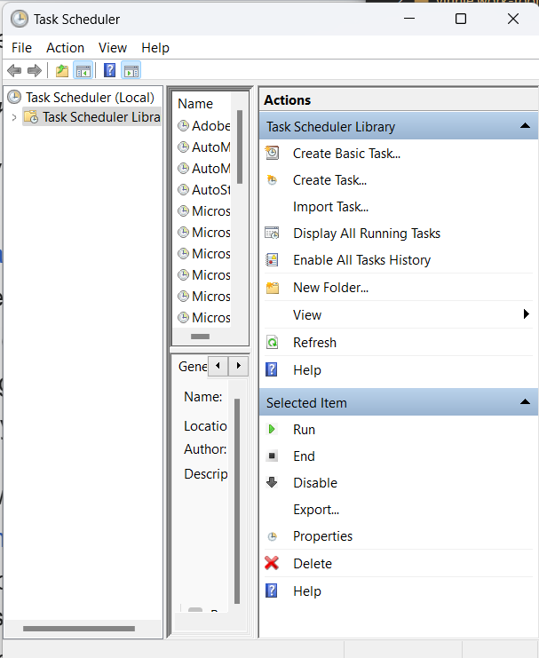

## Windows

### Terminology

- _Task Scheduler_ - Windows version of cron (for timed or event based process launching).
- _Task_ - The actual thing that represents the task to run.
- _Power Shell (powershell.exe)_ - Windows' functional shell language (in contrast to the antiquated `cmd.exe`).

### Task Scheduler

To open the Task Scheduler use "Win + R -> `taskschd.msc`" or search for "Task Scheduler".

Once you've opened Task Scheduler it should look something like:



Click "Create Task..." on the right. You'll be given a dialog that looks like the following.


In the above dialog, we've set our task name "Smart-Start" and the login/security options toward the bottom so that our task runs before login and with superuser privileges.

After the general tab, we need to specify the event that triggers our task in the Triggers tab:


Click "New..." to create the new trigger.


The only thing that needs to be set in the new trigger is the "Begin the task" field should be set to "At startup" from the drop down menu. Also ensure that the "Enabled" checkbox is still set after any changes.

After you click OK, there should now be a new trigger added to the trigger's tab.


Next we'll need to go to the "Actions" tab and add a new action.


Before you create the action, the list will be empty, the screen shot above already includes the action we're about to create. Click "New ..." to create the new action.


In the "New Action" dialog, the program we'll be running is "powershell.exe". This is because the actual actions that we want to run will be encapsulated in a powershell script that is specified at arguments.

In the "Add arguments (optional)" field, I've specified:

```
-ExecutionPolicy Bypass -File "D:\path-to\smart-start.ps1"
```

Note: You can't see the entire text in the screen shot because of legacy Windows poor HID.

The `ExecutionPolicy` argument is set to bypass protections that are in place to protect against malicious powershell scripts from having access to sensitive resources. See more in [Execution Policy documentation](https://learn.microsoft.com/en-us/powershell/module/microsoft.powershell.core/about/about_execution_policies?view=powershell-7.4).

The `File` argument points to the powershell script to be executed.

Click ok to create new action.

The final thing for the task is to ensure that the correct conditions are assigned for the script (esp in the case of a laptop.)


In the condition tab, we ensure that the task will run regardless of whether its running off battery or an external power source.

Click OK to create the task.

Once you are back in the primary Task Scheduler window, locate your new task, right click it and ensure its enabled. If there is an option to Enable click it, if there is only an option to Disable, its already enabled.

## Mac OS / OSX - Sonoma

Mac OS has changed a lot over the years. It would seem that Catalina was the last major change in regards to security models and conventions for automatically starting processes, so this article should be up to date from Catalina to Sonoma (i.e. 10.15 through 14.4).

### Terminology

- _LaunchAgent_ - A method to launch a process at User Login.
- _LaunchDaemon_ - A method to launch a process at boot (in the background).
- _launchd_ - The daemon responsible for launching user/admin defined daemons/agents.
- _launchctl_ - The command line application for interacting with _launchd_.

### Auto Mounting Extra Storage

Mac OS will not automatically mount USB drives without a User login. Since my Mac Mini has no M.2 ports and only 250G on board, I'm required to have an external USB-C drive. For services at boot to utilize this disk, the disk must be mounted at boot without a user login. This can be accomplished with:

```sh
sudo defaults write \
  /Library/Preferences/SystemConfiguration/autodiskmount \
  AutomountDisksWithoutUserLogin -bool true
```

### Security

Mac OS has a security model that resembles iOS or Android where you must specify the kinds of accesses each process receives. This is not unlike AppArmor or SELinux on Linux platforms, but you have to know its there or you'll pull your hair out dealing with "Operation not permitted" errors.

In my case, I'm running a `bash` script that starts VirtualBox VMs. Since both `bash` and `VBoxManage` require access to files on disk, I need to ensure those processes have "Full Disk Access".

- _Open_ System Settings -> _Select_ Security & Privacy
- _View_ Privacy _Panel_ -> _Expand_ Full Disk Access
- Click the plus button to add a process. You'll need to know the location or path of the process in your filesystem.

Note: Use Command + Shift + . (period) to un-hide files. There is no text field to drop in absolute paths.

I presume you have to follow the same process for other required system resources.

### LaunchDaemon

`/Library/LaunchDaemons/smart.start.plist`:

```xml
<?xml version="1.0" encoding="UTF-8"?>
<!DOCTYPE plist PUBLIC "-//Apple//DTD PLIST 1.0//EN" "http://www.apple.com/DTDs/PropertyList-1.0.dtd">
<plist version="1.0">
  <dict>

    <key>Label</key>
    <string>smart.start</string>

    <key>RunAtLoad</key>
    <true/>
    <key>KeepAlive</key>
    <false/>

    <key>ProgramArguments</key>
    <array>
      <string>/Users/vinnie/smart-start.sh</string>
    </array>
    <key>UserName</key>
    <string>vinnie</string>
    <key>WorkingDirectory</key>
    <string>/Users/vinnie</string>

    <key>StandardErrorPath</key>
    <string>/Users/vinnie/smart-start.log</string>
    <key>StandardOutPath</key>
    <string>/Users/vinnie/smart-start.log</string>

  </dict>
</plist>
```

To register the above _daemon_, run: 

```sh
sudo launchctl load -w /Library/LaunchDaemons/smart-start.plist
```

To unregister, replace `load` with `unload`.

### LaunchAgent

LaunchAgent conventions are roughly the same as daemon conventions except they don't execute until after the user logs in. The plist are also installed in `~/Library/LaunchAgents`. (Notice the `~` in that path.) After you create the plist, use the same `launchctl` commands.

### App Store Apps Can't Auto Start

I read somewhere that applications that are managed by App Store can not automatically start before a user login. Since I am a tailscale user, I needed a method for starting tailscale without App Store. Because tailscale is written in `go`, presuming you have golang installed, you can do the following to install tailscale without App Store, install its own daemon and join the client to the network:

```sh
/usr/local/go/bin/go install tailscale.com/cmd/tailscale{,d}@main
sudo /usr/local/bin/tailscaled install-system-daemon
sudo ~/go/bin/tailscale up
```

## Linux - rc.d

TODO: Write this.

## Linux - systemd

TODO: Write this.