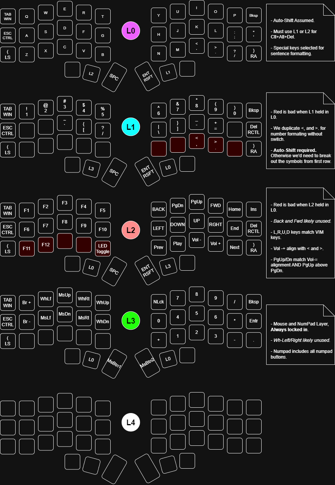

Recently jumped into using a split keyboard. This is actually the first written piece that I've attempted to write since I've started. As I am writing this, I believe I am averaging about 8 words per minute.

You see, I've spent the roughly 32 years that I've been coding using my keyboards in a completely untrained manner. I think for about 15 years I would literally keep the state of the screen in my head so that I could quickly write code while doing a fast hunt and peck technique. Once I returned to graduate school (10 years after my undergrad), I had to write so much that I learned to mostly touch type using my hunt and peck method (at 60 words per minute).

Because I didn't keep my fingers on the home row, I never suffered from ergonomic issues. Basically I used a combination of moving my whole arm so that I could favor certain fingers and then got accustomed to the location and exact geometry of the keyboard. TBF, it works. One of the draw backs with this technique and the reason I decided to give something else a go was for portability and versatility. Having to own a 18 inch laptop case for the sole purpose of being able to fit a full size keyboard is a bit ridiculous.

With a split keyboard, new options become available, such a adjustable tenting (permitting you to type within a much larger and more comfortable vertical range from surface to surface) and typing with your hands at your side (e.g. while sitting on a couch). And of course, with a split keyboard you also get the inherent custom firmware and ergonomic benefits no matter where you are.

## No Standards

Even with all the advantages, there are some significant challenges both physically and technically that I've identified in this transition.

- There a no prevalent and study backed layouts or configurations for split keyboards. Only rough impressions and editorial thoughts seem to exist at the moment.
- While the documentation of the QMK and ZMK firmware are well maintained and organized, they really don't have a "for absolute beginners" section.
- Once I had my Corne built, I remember wanting to not think about firmware. I just wanted to find a firmware online (preferably with Vial or Via support). Alas, this was not a straight forward task. Generally, I hold the distributer responsible for the poor self-help support and documentation.

## My Firmware Process

I'm no expert in the configuration of QMK, but I have gotten it to work so I intend to jot down my notes here. Its worth mentioning that these notes generally expect experience or confidence with GNU Make and GNU Toolchains. Also, I'm using a Corne GLP, some sort of unofficial derivative of the board.

```sh
mkdir qmk && cd qmk
export PIPENV_VENV_IN_PROJECT=1
pipenv shell
python3 -m pip install qmk

# Run for dependency install, but I don't actually use this checkout.
# There may be an assumption here that ~/.local/bin is in your path.
qmk setup

# Grab the upstream firmware code and initialize the build with Make.
git clone https://github.com/foostan/kbd_firmware.git
cd kbd_firmware
make git-submodule

# Say yes to appdirs install if asked
make qmk-clean
kb=crkbd make qmk-init

# Make adjustments ... see below.
vi keyboards/crkbd/qmk/qmk_firmware/rev1/rules.mk
vi keyboards/crkbd/qmk/qmk_firmware/rev1/config.h

# Build the firmware.
kb=crkbd kr=rev1 km=default make qmk-compile
```

After the firmware is built, it shows up as `src/qmk/qmk_firmware/tmp_crkbd_rev1_default.hex`. Supposidly you can use `qmk` command to flash from CLI. Since I run my builds from a VM in a Windows host, I didn't bother. Instead, I SCPed the firmware to Windows and used the `qmk_toolbox.exe` to flash the firmware to each half of the Corne manually.

## My Firmware Config

`keyboards/crkbd/qmk/qmk_firmware/rev1/rules.mk`:

```
# https://docs.qmk.fm/features/mouse_keys
# Control mouse pointer from keyboard (w/o OS Mouse Keys).
MOUSEKEY_ENABLE = yes

# https://docs.qmk.fm/features/auto_shift
# Hold key for upper.
AUTO_SHIFT_ENABLE = yes

# https://docs.qmk.fm/features/combo
# Chordic combos.
# Note: Requires config.
# COMBO_ENABLE = yes

# https://docs.qmk.fm/features/key_lock
# KEY_LOCK_ENABLE = yes

# https://docs.qmk.fm/features/layer_lock
# LAYER_LOCK_ENABLE = yes

# https://docs.qmk.fm/features/rawhid
# Bi-directional comms
# RAW_ENABLE = yes

# https://docs.qmk.fm/features/swap_hands
# Use ACTION_SWAP_HANDS to swap hands
# Note: Requires config.
# SWAP_HANDS_ENABLE = yes

# https://docs.qmk.fm/features/tap_dance
# Note: Requires config.
# TAP_DANCE_ENABLE = yes

# https://docs.qmk.fm/features/tri_layer
# TRI_LAYER_ENABLE = yes

# https://docs.qmk.fm/features/unicode
# UNICODE_COMMON = yes

# https://docs.qmk.fm/features/wpm
# Track words per minute
# WPM_ENABLE = yes

# Via Implictly sets DYNAMIC_KEYMAP, RAW, BOOTMAGIC, and TRI_LAYER
VIA_ENABLE = yes
ENCODER_MAP_ENABLE = yes

# Using RGB Matrix Instead (set in info.json)
BACKLIGHT_ENABLE = no
```

Warning:

- Only 0x7000 bytes for flash. You'll have to decide which things you want knowing you can't have everything. Unless you add a controller with more EEPROM/Flash. My current setup is `27126/28672 (94%, 1546 bytes free)`.

`qmk/kbd_firmware/keyboards/crkbd/qmk/qmk_firmware/rev1/config.h`:

```
#pragma once

#define DYNAMIC_KEYMAP_LAYER_COUNT 5
#define TAPPING_TOGGLE 2
#define MASTER_LEFT
```

`qmk/kbd_firmware/keyboards/crkbd/qmk/qmk_firmware/rev1/info.json`:

```json
{
    "keyboard_name": "Corne",
    "maintainer": "ffd",
    "manufacturer": "f",
    "url": "crkbd",
    "usb": {
        "vid": "0x4653",
        "pid": "0x0001",
        "device_version": "0.0.1"
    },
    "processor": "atmega32u4",
    "features": {
        "bootmagic": false,
        "extrakey": true,
        "nkro": false,
        "oled": true,
        "rgblight": false,
        "rgb_matrix": true
    },
    "build": {
        "lto": true
    },
    "diode_direction": "COL2ROW",
    "matrix_pins": {
        "cols": [ "F4", "F5", "F6", "F7", "B1", "B3" ],
        "rows": [ "D4", "C6", "D7", "E6" ]
    },
    "bootmagic": {
        "enabled": false,
        "matrix": [ 0, 1 ]
    },
    "split": {
        "enabled": true,
        "bootmagic": {
            "matrix": [ 4, 1 ]
        },
        "soft_serial_pin": "D2",
        "transport": {
            "sync": {
                "layer_state": true,
                "indicators": true,
                "modifiers": true,
                "matrix_state": true
            }
        }
    },
    ... default layout stuff ...
```

`qmk/kbd_firmware/keyboards/crkbd/qmk/qmk_firmware/keymaps/default/keymap.c`:

```c
#include QMK_KEYBOARD_H

#define LSFT_SP MT(MOD_LSFT, KC_SPC)
#define RSFT_RT MT(MOD_RSFT, KC_ENT)
#define WH_LEFT KC_MS_WH_LEFT
#define WH_RGHT KC_MS_WH_RIGHT
#define WH_UP KC_MS_WH_UP
#define WH_DOWN KC_MS_WH_DOWN
#define MS_UP KC_MS_UP
#define MS_DOWN KC_MS_DOWN
#define MS_LEFT KC_MS_LEFT
#define MS_RGHT KC_MS_RIGHT
#define WB_BACK KC_WWW_BACK
#define WB_FWRD KC_WWW_FORWARD

#define GUI_TAB MT(MOD_LGUI, KC_TAB)
#define CTL_ESC MT(MOD_LCTL, KC_ESC)aAtt
#define ALT_LPR MT(MOD_LALT, KC_LPRN)
#define ALT_RPR MT(MOD_RALT, KC_RPRN)
#define SFT_LPR MT(MOD_LSFT, KC_LPRN)
#define SFT_RPR MT(MOD_RSFT, KC_RPRN)
#define CTL_DEL MT(MOD_RCTL, KC_DEL)

const uint16_t PROGMEM keymaps[][MATRIX_ROWS][MATRIX_COLS] = {
  [0] = LAYOUT_split_3x6_3(
  //,-----------------------------------------------------.                    ,-----------------------------------------------------.
      GUI_TAB,    KC_Q,    KC_W,    KC_E,    KC_R,    KC_T,                         KC_Y,    KC_U,    KC_I,    KC_O,   KC_P,  KC_BSPC,
  //|--------+--------+--------+--------+--------+--------|                    |--------+--------+--------+--------+--------+--------|
      CTL_ESC,    KC_A,    KC_S,    KC_D,    KC_F,    KC_G,                         KC_H,    KC_J,    KC_K,    KC_L, KC_SCLN, KC_QUOT,
  //|--------+--------+--------+--------+--------+--------|                    |--------+--------+--------+--------+--------+--------|
      SFT_LPR,    KC_Z,    KC_X,    KC_C,    KC_V,    KC_B,                         KC_N,    KC_M, KC_COMM,  KC_DOT, KC_SLSH, ALT_RPR,
  //|--------+--------+--------+--------+--------+--------+--------|  |--------+--------+--------+--------+--------+--------+--------|
                                          XXXXXXX,   TT(2),  KC_SPC,    RSFT_RT,   TT(1), XXXXXXX
                                      //`--------------------------'  `--------------------------'

  ),

  /*[1] = LAYOUT_split_3x6_3(
  //,-----------------------------------------------------.                    ,-----------------------------------------------------.
      _______,    KC_1,    KC_2,    KC_3,    KC_4,    KC_5,                         KC_6,    KC_7,    KC_8,    KC_9,    KC_0, _______,
  //|--------+--------+--------+--------+--------+--------|                    |--------+--------+--------+--------+--------+--------|
      _______, KC_EXLM,   KC_AT, KC_HASH,  KC_DLR, KC_PERC,                      KC_CIRC, KC_AMPR, KC_ASTR,  KC_EQL, KC_PIPE, CTL_DEL,
  //|--------+--------+--------+--------+--------+--------|                    |--------+--------+--------+--------+--------+--------|
      _______,  KC_GRV, KC_UNDS, KC_PLUS, KC_LCBR, KC_LBRC,                      KC_RBRC, KC_RCBR, KC_MINS, KC_BSLS, KC_TILD, _______,
  //|--------+--------+--------+--------+--------+--------+--------|  |--------+--------+--------+--------+--------+--------+--------|
                                          XXXXXXX, TO(3),  _______,     _______,   TO(0), XXXXXXX
                                      //`--------------------------'  `--------------------------'
  ),*/

  [1] = LAYOUT_split_3x6_3(
  //,-----------------------------------------------------.                    ,-----------------------------------------------------.
      _______,    KC_1,    KC_2,    KC_3,    KC_4,    KC_5,                         KC_6,    KC_7,    KC_8,    KC_9,    KC_0, _______,
  //|--------+--------+--------+--------+--------+--------|                    |--------+--------+--------+--------+--------+--------|
      _______, XXXXXXX, XXXXXXX,  KC_GRV, KC_LBRC, KC_SLSH,                      KC_BSLS, KC_RBRC, KC_MINS,  KC_EQL, XXXXXXX, CTL_DEL,
  //|--------+--------+--------+--------+--------+--------|                    |--------+--------+--------+--------+--------+--------|
      _______, XXXXXXX, XXXXXXX, XXXXXXX, XXXXXXX, XXXXXXX,                      XXXXXXX, XXXXXXX, KC_COMM,  KC_DOT, XXXXXXX, _______,
  //|--------+--------+--------+--------+--------+--------+--------|  |--------+--------+--------+--------+--------+--------+--------|
                                          XXXXXXX, TO(3),  _______,     _______,   TO(0), XXXXXXX
                                      //`--------------------------'  `--------------------------'
  ),

  [2] = LAYOUT_split_3x6_3(
  //,-----------------------------------------------------.                    ,-----------------------------------------------------.
      _______,   KC_F1,   KC_F2,   KC_F3,   KC_F4,   KC_F5,                      WB_BACK, KC_PGDN, KC_PGUP, WB_FWRD, KC_HOME, KC_INS,
  //|--------+--------+--------+--------+--------+--------|                    |--------+--------+--------+--------+--------+--------|
      _______,   KC_F6,   KC_F7,   KC_F8,   KC_F9,  KC_F10,                      KC_LEFT, KC_DOWN,   KC_UP, KC_RGHT,  KC_END, _______,
  //|--------+--------+--------+--------+--------+--------|                    |--------+--------+--------+--------+--------+--------|
      _______,  KC_F11,  KC_F12, RGB_VAD, RGB_VAI, RGB_TOG,                      KC_MPRV, KC_MPLY, KC_VOLD, KC_VOLU, KC_MNXT, _______,
  //|--------+--------+--------+--------+--------+--------+--------|  |--------+--------+--------+--------+--------+--------+--------|
                                          XXXXXXX,   TO(0), _______,    _______,   TO(3), XXXXXXX
                                      //`--------------------------'  `--------------------------'
  ),

  [3] = LAYOUT_split_3x6_3(
  //,-----------------------------------------------------.                    ,-----------------------------------------------------.
      _______, KC_BRIU, WH_LEFT,   MS_UP, WH_RGHT,   WH_UP,                       KC_NUM,   KC_P7,   KC_P8,   KC_P9, KC_PSLS, KC_BSPC,
  //|--------+--------+--------+--------+--------+--------|                    |--------+--------+--------+--------+--------+--------|
      _______, KC_BRID, MS_LEFT, MS_DOWN, MS_RGHT, WH_DOWN,                        KC_P0,   KC_P4,   KC_P5,   KC_P6, KC_PAST, KC_PENT,
  //|--------+--------+--------+--------+--------+--------|                    |--------+--------+--------+--------+--------+--------|
      _______, XXXXXXX, XXXXXXX, XXXXXXX, XXXXXXX, XXXXXXX,                      KC_PPLS,   KC_P1,   KC_P2,   KC_P3, KC_PMNS, KC_PDOT,
  //|--------+--------+--------+--------+--------+--------+--------|  |--------+--------+--------+--------+--------+--------+--------|
                                          XXXXXXX,   TO(0), KC_MS_BTN1,   KC_MS_BTN2,    TO(0), XXXXXXX
                                      //`--------------------------'  `--------------------------'
  ),

  [4] = LAYOUT_split_3x6_3(
  //,-----------------------------------------------------.                    ,-----------------------------------------------------.
      XXXXXXX, XXXXXXX, XXXXXXX, XXXXXXX, XXXXXXX, XXXXXXX,                      XXXXXXX, XXXXXXX, XXXXXXX, XXXXXXX, XXXXXXX, XXXXXXX,
  //|--------+--------+--------+--------+--------+--------|                    |--------+--------+--------+--------+--------+--------|
      XXXXXXX, XXXXXXX, XXXXXXX, XXXXXXX, XXXXXXX, XXXXXXX,                      XXXXXXX, XXXXXXX, XXXXXXX, XXXXXXX, XXXXXXX, XXXXXXX,
  //|--------+--------+--------+--------+--------+--------|                    |--------+--------+--------+--------+--------+--------|
      XXXXXXX, XXXXXXX, XXXXXXX, XXXXXXX, XXXXXXX, XXXXXXX,                      XXXXXXX, XXXXXXX, XXXXXXX, XXXXXXX, XXXXXXX, XXXXXXX,
  //|--------+--------+--------+--------+--------+--------+--------|  |--------+--------+--------+--------+--------+--------+--------|
                                          XXXXXXX, XXXXXXX, XXXXXXX,    XXXXXXX, XXXXXXX, XXXXXXX
                                      //`--------------------------'  `--------------------------'
  ),

};

#ifdef ENCODER_MAP_ENABLE
const uint16_t PROGMEM encoder_map[][NUM_ENCODERS][NUM_DIRECTIONS] = {
  [0] = { ENCODER_CCW_CW(RGB_MOD, RGB_RMOD), ENCODER_CCW_CW(RGB_HUI, RGB_HUD), ENCODER_CCW_CW(RGB_VAI, RGB_VAD), ENCODER_CCW_CW(RGB_SAI, RGB_SAD), },
  [1] = { ENCODER_CCW_CW(RGB_MOD, RGB_RMOD), ENCODER_CCW_CW(RGB_HUI, RGB_HUD), ENCODER_CCW_CW(RGB_VAI, RGB_VAD), ENCODER_CCW_CW(RGB_SAI, RGB_SAD), },
  [2] = { ENCODER_CCW_CW(RGB_MOD, RGB_RMOD), ENCODER_CCW_CW(RGB_HUI, RGB_HUD), ENCODER_CCW_CW(RGB_VAI, RGB_VAD), ENCODER_CCW_CW(RGB_SAI, RGB_SAD), },
  [3] = { ENCODER_CCW_CW(RGB_MOD, RGB_RMOD), ENCODER_CCW_CW(RGB_HUI, RGB_HUD), ENCODER_CCW_CW(RGB_VAI, RGB_VAD), ENCODER_CCW_CW(RGB_SAI, RGB_SAD), },
};
#endif

// Set up the RGB color change when layers change
/*layer_state_t layer_state_set_user(layer_state_t state) {
    switch (biton32(state)) {
        case 0:  // Layer 0
            rgblight_setrgb_range(127, 63, 127, 0, RGBLED_NUM);  // Pink
            break;
        case 1:  // Layer 1
            rgblight_setrgb_range(0, 127, 127, 0, RGBLED_NUM);  // Cyan
            break;
        case 2:  // Layer 2
            rgblight_setrgb_range(127, 63, 31, 0, RGBLED_NUM); // Orange
            break;
        case 3:
            rgblight_setrgb_range(0, 127, 0, 0, RGBLED_NUM); // Green
            break;
        case 4:
            rgblight_setrgb_range(127, 127, 0, 0, RGBLED_NUM);  // Yellow
            break;

        default: // Default: White
            rgblight_setrgb_range(255, 255, 255, 0, RGBLED_NUM);  // White
            break;
    }
    return state;
}*/

layer_state_t layer_state_set_user(layer_state_t state) {
    switch (biton32(state)) {
        case 0:  // Layer 0
            //rgb_matrix_set_color_all(127, 63, 127);  // Pink
            rgb_matrix_set_color_all(15, 7, 15);  // Pink
            break;
        case 1:  // Layer 1`
            //rgb_matrix_set_color_all(0, 127, 127);  // Cyan
            rgb_matrix_set_color_all(0, 15, 15);  // Cyan
            break;
        case 2:  // Layer 2
            //rgb_matrix_set_color_all(127, 63, 31); // Orange
            rgb_matrix_set_color_all(15, 7, 3); // Orange
            break;
        case 3:
            //rgb_matrix_set_color_all(0, 127, 0); // Green
            rgb_matrix_set_color_all(0, 15, 0); // Green
            break;
        case 4:
            //rgb_matrix_set_color_all(127, 127, 0);  // Yellow
            rgb_matrix_set_color_all(15, 15, 0);  // Yellow
            break;

        default: // Default: White
            rgb_matrix_set_color_all(31, 31, 31);  // White
            break;
    }
    
    return state;
}

bool rgb_matrix_indicators_user(void) {
    switch (biton32(layer_state)) {
        case 0:  // Layer 0
            //rgb_matrix_set_color_all(127, 63, 127);  // Pink
            rgb_matrix_set_color_all(15, 7, 15);  // Pink
            break;
        case 1:  // Layer 1`
            //rgb_matrix_set_color_all(0, 127, 127);  // Cyan
            rgb_matrix_set_color_all(0, 15, 15);  // Cyan
            break;
        case 2:  // Layer 2
            //rgb_matrix_set_color_all(127, 63, 31); // Orange
            rgb_matrix_set_color_all(15, 7, 3); // Orange
            break;
        case 3:
            //rgb_matrix_set_color_all(0, 127, 0); // Green
            rgb_matrix_set_color_all(0, 15, 0); // Green
            break;
        case 4:
            //rgb_matrix_set_color_all(127, 127, 0);  // Yellow
            rgb_matrix_set_color_all(15, 15, 0);  // Yellow
            break;

        default: // Default: White
            rgb_matrix_set_color_all(31, 31, 31);  // White
            break;
    }

    return 1;
}


bool process_record_user(uint16_t keycode, keyrecord_t *record) {
    switch (keycode) {
        case LALT_T(KC_LPRN):
            if (record->tap.count && record->event.pressed) {
                tap_code16(KC_LPRN);
                return false;
            }
            break;
        case LSFT_T(KC_LPRN):
            if (record->tap.count && record->event.pressed) {
                tap_code16(KC_LPRN);
                return false;
            }
            break;
        case RALT_T(KC_RPRN):
            if (record->tap.count && record->event.pressed) {
                tap_code16(KC_RPRN);
                return false;
            }
            break;
        case RSFT_T(KC_RPRN):
            if (record->tap.count && record->event.pressed) {
                tap_code16(KC_RPRN);
                return false;
            }
            break;
    }
    return true;
}

```

## My Layout



## Training

https://keyboard-layout-try-out.pages.dev/
https://usevia.app/
https://www.typelit.io/
https://monkeytype.com/l
