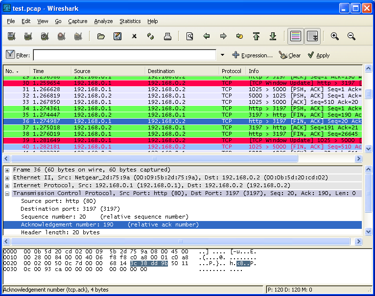

:::danger Incomplete

This document is not yet written.

:::

## Overview

This section is isolated runtime analysis, not because we intend to not plug anything into the device. Its more of a way to understand what the behavior of the device is with as much of the environment under our control as possible. If you have a development workstation or laptop plugged into the device with a network cable or UART console connection, no other part of the development workstation or the device should be plugged into the internet or other networks.

There are several reasons for this:

- Devices that we do not yet understand, could call back to their vendor's servers for purposes of licensing or awareness of the network its plugged into. (For some, this is a violation of privacy, for others is a convenience provided by the vendor.)
- Devices can advertise their existence and readiness to serve to the whole network or internet, depending on the configuration of the device. I've experienced many junior engineers not properly isolating systems correctly when they plug their device into a internal LAN, resulting in the device serving DHCP to the entire network. This rookie mistake can prevent other systems performing work for other projects from receiving a network relevant DHCP lease (i.e. prevent other users from getting access to the network).

While outside the scope of this material, using a managed switch with [VLANs](https://en.wikipedia.org/wiki/Virtual_LAN) configured is a nice way to initially isolate network traffic between a device and a development workstation without having to setup an entirely new network environment for the single device.

Take away: Isolate your device until you fully understand the impact on the network and its general behavior.

## Network Analysis

### Know Its LINKED

In networking there is a lot of overloaded terms. For the sake of this discussion, a link is a hardware controlled connection between two ethernet nodes. Note: Typical linux firewalls have no control over whether a network device is linked to another. When you have physical access to the target device, the most straight forward way to determine if a device is linked is by looking at the LINK LED lights on both sides of the network connection. If they've successfully auto-negotiated the link, the LEDs will be lit. Auto-negotiation is the process that the network devices use to determine what speed they will be communicating at.

Troubleshooting tips for lack of a link light:

- Known good cable?
- Is the development interface side of the link UP?
- Is the target device powered on?

### Know It Can CONNECT

**Can you ping it?** While this will provide an easy way to determine if the system is available, if the ping fails it doesn't mean that you can't reach the system. Firewalls can block the ping protocol ICMP while still allowing UDP, TCP, or other protocols through.

When the ping doesn't work, I suggest having a good knowledge of network stacks. Network stacks are beyond the scope of this material, but in general I would ensure:

- Is there a switch or other network equipment I can remove from the setup?
- Is there a firewall rule on the development host blocking me?
- Can I arping the destination device?
- Is the target device in the `arp` table?
- Is there an IP `route` defined to access the target device?
- Am I using the correct subnet to access the device? (The manual is your friend here, otherwise read about `tcpdump` below.)

### Packet Capture

Whether you know if you can connect or not, its useful to watch for potential network traffic that the target device transmits when its first powered on. This can provide early indication of what ports the device interacts with (as a client) and what network its configured to talk on. The tool I always use for this is `tcpdump`. This is a CLI tool that, with root privileges, allows us to monitor traffic promiscuously (i.e. all packets whether they are intended for us or not). Tcpdump out of the box provides nice little protocol layer packet summaries that we can use to deduce subnets and ports. Tcpdump can also create complete packet capture files (PCAPs) for later analysis with tools like Wireshark.

<!-- TODO: Show tcpdump usage and analysis. -->

### What Does It Respond To

If we're now at the point where we know our device has an IP and what our device calls out to when it powers on, we'll want to know what other kinds of things it responds to. Due to the nature of TCP, this can be as simple as looking for any ports that respond to a SYN with a SYN/ACK. This task is performed by `nmap`. Nmap is quite a few other scanning mechanisms that each have their own pros and cons, but the one I've usually gotten the most mileage from is the TCP port scanning:

## Wireshark

## Restricted User Functionality

Once you have a good

## Peripherals To Consider

RJ45 Ethernet for Twisted Pair CAT5e/6 cabling has taken the world by storm, but it is by no means the only access port on target devices. If there are ports that look like they transfer electrons or light on the device under analysis, its part of the the attack surface for initial access. Below I've listed some of the more common areas of port access that I've seen.

TODO: Show the RJ45 ethernet port.

### Universal Serial Bus (USB)

Universal Serial Bus (USB) requires no introduction. This protocol has been designed as a one size fits all serial bus for a large swath of end user peripherals. Many engineers have experienced thinking of the USB ecosystem from the "user of the peripheral" perspective. On the other hand, embedded systems are often found in those very same peripherals and require understanding the USB ecosystem from the "provider or the peripheral" perspective. To put it another way:

- USB Hosts (typically has USB-A, USB-C) - These are the computers, laptops, netbooks, smart chargers that we plug our USB gadgets into (e.g. portable disk drives, printers, phones).
- USB Gadgets (typically has USB-B, USB-Mini, USB-Micro, USB-C) - These are the peripherals that we plug into computers, laptops, netbooks, or smart chargers.

On The Go (OTG) enabled devices are able to switch between USB host mode and USB gadget mode. For example, an Android phone can have a keyboard or audio equipment plugged into the USB port in USB host more. In USB gadget mode, the Android phone can become a storage device itself. OTG adapters typically convert a USB-micro to USB-A female.

### Serial Console

The low level details of serial are mentioned later on, but suffice to say that serial ports are often used for logging, management, and maintenance of devices. They typically include functionality that allows end users to render their equipment inoperable, therefore, serial connections are often considered for trained personnel only.

Serial connections can run only nearly any two or three wired connections. I've often seen 3.5" audio jacks used as serial connections on A/V equipment. Before TI graphing calculators used USB connections, they used 2.5" audio jack connections.

TODO: Show the TI adapter. Show A/V equipment console connection.

The most common over serial connections are referred to as DB9 or specially crimped RJ45/RJ11 connections. Older systems (from the 20th century) would use parallel ports (DB25) for serial connections as well.

Note: USB, Firewire, Lightning, and other general purpose serial interfaces will also support serial console interfaces, depending on the vendor's implementation.

### Storage

While mostly associated with more beefy machines, some smaller embedded systems are known to have storage ports (e.g. e-SATA, SCSI). It also goes without saying that USB mass storage is often an option.

When a device automatically mounts storage, it may also automatically run code from such a drive. It could be run when inserted or during a boot up sequence. Regardless, don't discount storage peripherals as part of the isolated runtime analysis.

### Misc

Did you know HDMI has ethernet?

> HDMI you may already know as High Definition Multimedia Interface. HEC is the
> HDMI Ethernet Channel, and enables HDMI connected devices to access the internet
> without each of them requiring separate Ethernet cables.

## Resources

- [XKCD Pinouts](https://galigio.org/2020/06/08/pinouts/)
- [HDMI HEC Pinout](https://www.flickr.com/photos/jmarcd2/8091356838)
