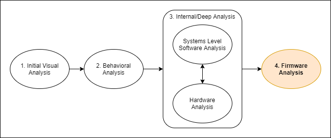

:::danger Incomplete

This document is not yet written.

:::

## Overview

- Analysis
  - Unpacking via sasquatch, binwalk, hex editors, file, etc. (1 hours)
  - IVT / EVT
  - Booter/BareMetal Binary Construction (stack pointer, crti, Linker Scripts)
- Assembly - Repacking via Firmware Mod Toolkit, uboot tools (4 hours)
- Testing - u-boot tftp, JTAG in-memory loading (2 hours)
