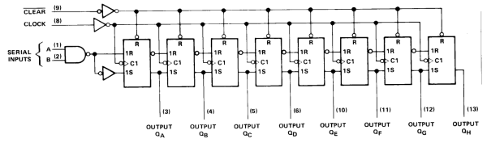
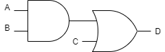
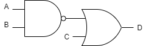
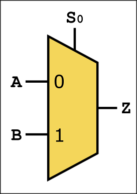
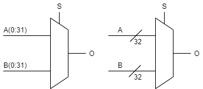

:::danger Incomplete

This document is not yet written.

:::

```text
  - Logical Components (30mins)
    - Schematic symbols
    - truth tables
    - (Combinatorial / Sequential)
    - (state machines?)
  - Bus Concept - Schematic Expression, Serial v Parallel (60 mins)
    - I2C Bus - Clocks
    - Intro to Logic Analyzer (v OScope) (15mins)
  - Datasheets
    - Block diagrams (for architecture) (15mins)
```

When studying datasheets to understand digital logic, there are often logical schematics that describe the actual design of the logic of the circuits. In a previous section, we looked at the SN54LS164 Serial To Parallel Converter. Its schematic was:



## Symbols

Digital logic symbols represent one or some combination of boolean logic. Here are some common examples:


So for example, if you wanted a signal to perform `(A and B) or C`, you may do something like:



In contrast to software, you must not think of each of these operations as being broken down an performed in steps. They are combinatorial, meaning that all of the boolean logic is performed instantaneously. 

<!-- ## Logic Types

Combinatorial Logic - All in parallel, no sense of time.
Sequential Logic - Processed based on state and time. State means the system "remembers" something. -->


When a small bubble is placed in front of one of the symbols, the result becomes inverted. For example, you can do something like `~(A and B) or C` with:



### Truth Tables

To table out the input and outputs of a logic diagram, you can use a truth table. The following truth table represents our `~(A and B) or C` diagram.

| A | B | C | D |
| - | - | - | - |
| F | F | F | T |
| F | F | T | T |
| F | T | F | F |
| F | T | T | F |
| T | F | F | F |
| T | F | T | F |
| T | T | F | F |
| T | T | T | F |

Note: An issue with using truth tables for everything is that they can very quickly become exponentially large.

### More Ways Than One

One nice thing about boolean logic is that you can refactor the equations so that they become more efficient. You can also refactor to get the same output with completely different operators. For example, you can replace an AND gate with two NAND gates.

An interesting property of boolean logic is DeMorgan's Law:

```text
a' or b' = (a and b)'
a' and b' = (a or b)'
```

As an exercise:

- Make an AND with a NAND. Answer: `(ab)''`
- Make an OR gate from a NAND. Answer: `((aa)'(bb)')'`
- Make an AND with a NOR. Answer: `(a+a)'+(b+b)')'`
- Make an OR with a NOR. Answer: `(a+b)''`
- Make an XOR with AND/OR/NOT, then convert all to NAND gates. Answer: `((a'b)'(ab')')'`

<!-- TODO: Mention that there can be multiple inputs per gate. -->

## Multiplexing

One thing that is done often with digital boolean logic are multiplexers. This is a way to use a control signal to indicate which data signals to allow through the gates. The following is an example of a multiplexer symbol you might see in a schematic:



Inside that yellow trapezoid is a series of gates that allow either signal `A` or `B` to pass through to `Z` depending on the value of `S0`. Keep in mind, the above multiplexer is about as simple as they come, the multiplexer can be implemented to accept as many input signals, output signals, or control/select signals as the application requires. The key take away is that when we see a trapezoid in your diagrams, its a multiplexer and you should be able to identify its inputs (long side), its outputs (short side) and its control signals (slanted side, usually top side)

## Bus Indicators

When communicating over serial, we have many single bits transmitted all in turn over the same transmission wire. When communicating in parallel, we're putting each bit of a value on an array of wires at the same time. This means that for a 32bit machine, we could have 32 wires going into a component (e.g. multiplexer). To prevent from making such a schematic diagram unreadable we often simplify the schematic with bus notation. Here are some examples:



<!-- TODO: Discuss uses of a bus. -->

### Common Bus Use Cases

- Peripheral Bus - CPU to peripherals.
- System Bus - CPU to memory.
- Local Bus - Peripherals connected to memory.

<!-- TODO: As an exercise, identify some of the buses on a board from visual inspection. -->

https://en.wikipedia.org/wiki/Multiplexer