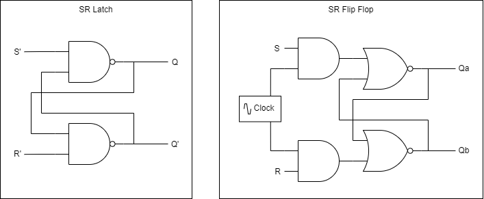
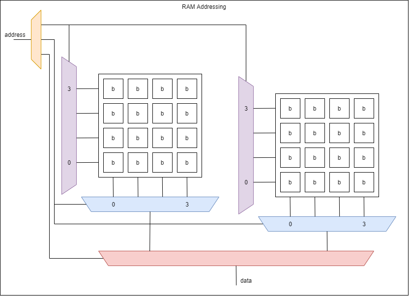
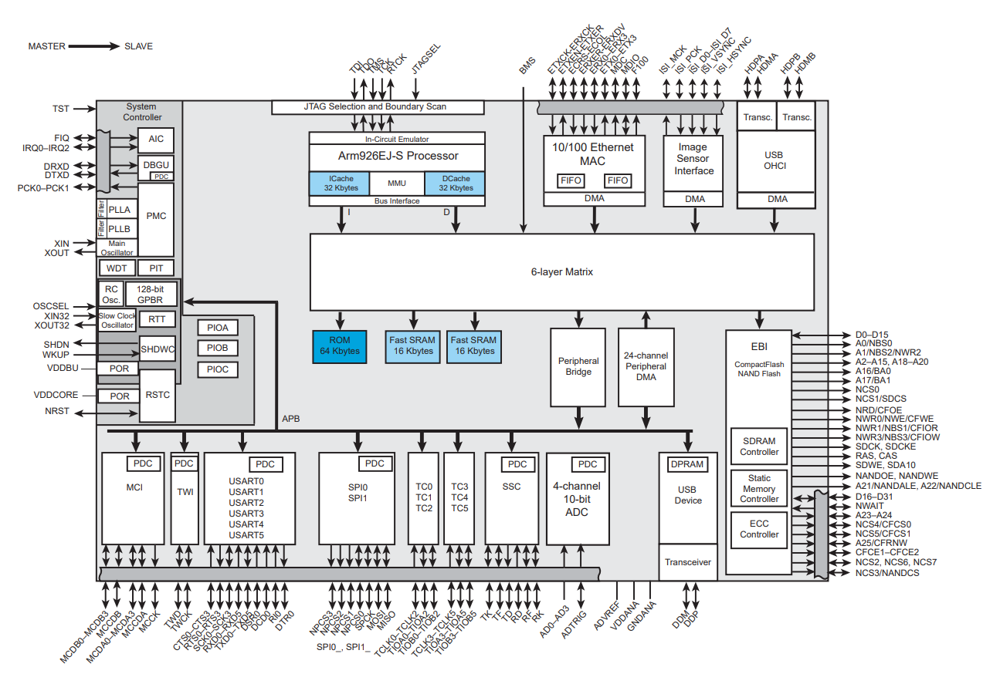
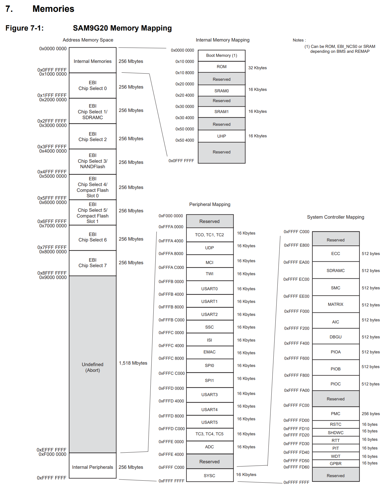

:::danger Incomplete

This document is not yet written.

:::

```text
  - Memories (45mins)
    - Volatile
      - Flip flops (transistors) / Latches (caps)
      - DRAM, SRAM, ??SDRAM ... other memories? DDR?
    - Nonvolatile
      - ROM, PROM, EPROM, EEPROM
      - Flash, NVRAM
    - Addressing Breakdown - chip select, rows/depth, columns/width
    - Calculating Memory Layouts
    - SPI (60mins)
      - In Circuit Analysis / Extraction
```

## Overview

What do you think about when you think about memory? As a software developer I usually think about read-write memory (RAM) and all the memory that is required to run my programs. As an embedded software developer I sometimes think about read only memory (ROM). Are there other types of memory that you might experience from a digital logic perspective?

## Flip Flops & Latches

Registers are a very small type of memory that plays a critical role in a CPU architecture. While many NN-bit (e.g. 8, 16, 32, 64) architectures have a set of registers, some components have registers that are a single bit. Registers are basically an array of these single bit storage bins. These registers may be implemented as flip flops or latches.

Flip-flops and latches both store a bit of information, but the key difference between the two is that flip flops are edge triggered and latches are level triggered. What we mean by this is that flip flops will only change its state when a clock edge is detected whereas a latch is continuously updating its state based on its input. While latches can be used, flip-flops are generally preferred for sequential circuits.

Here is a simple visualization that shows the difference between a latch and a flip flop:



## RAM / Memory

Random Access Memory is the type of memory that most software developers are familiar with. Most RAM architectures are mapped into matricies that have an array of wordlines/rows and bitlines/columns. Within RAM there are two major types: dynamic RAM (DRAM) and static RAM (SRAM).

What is the difference between dynamic RAM (DRAM) and static RAM (SRAM)?

- DRAM is a matrix of capacitors that represent the stored data. Due to the nature of capacitors, they slowly drain their charge and therefore have to be periodically recharged or they lose their state. DRAM takes less transistors and footprint but requires complex control logic.
- SRAM is a matrix of flip flops that does not drain and therefore doesn't need to be periodically refreshed. SRAM is a much simpler design but is much most costly than DRAM and has a larger footprint due to the transistor requirements.

### Addressing Memory (page 37-38)

Whether the memory is based on SRAM or DRAM, its broken down into a grid. This grid has a decode and a multiplexer that selects the row and column to fetch from the grid. To get wider memory we simply add more grids and decoders/multiplexers to filter our output down to the single bit we've requested from our address. When addressing memory, the address value itself can usually be broken down into rows, columns, and chip selects. This is how the system knows how to get the data that is requested. Take a look at the following diagram:



This diagram shows an address at the top left (i.e. the input) and a data output at the bottom (i.e. the output). The address is 5 bits. These 5 bits are broken into 3 parts:

- The row selector - This _decoder_ tells all of the bits in a given row (for all chips simultaneously) to be output to the column selector multiplexer.
- The column selector - This _multiplexer_ tells the system which column value is going to be output (for all the chips simultaneously).
- The chip selector - This tells the bottom chip multiplexer which chip value is going to be output as data.

Assuming the chip on the left is `0`, the chip on the right is `1`, and the address break down is `[4 - chip select][3:2 - row][1:0 - col]`; if the address `10011b` (`13h`) is given, the last `11b` means we're reading the last column, the middle `00b` means we're reading the bottom row, and the first `1b` means we're reading the chip on the right.

<!-- TODO: Discuss why this is a 5 bit address? -->

Note: The break down of the address to rows/cols/chip-selects is completely arbitrary. That said, there are some advantages and disadvantages to the order that is selected. For example, using higher bits for more significant groupings can allow easier management of memory in software. Using the opposite ordering can spread memory access across the chips, allowing for faster DRAM performance because DRAM has refresh latencies from chip to chip.

<!-- TODO: Consider adding values to image? -->

<!-- TODO: Consider the memory bingo game? -->

## ROMs and Flash

- Masked ROM - Hardcoded values in circuitry.
- PROM - One time programmable.
- EPROM - UV light that can erase entire chip.
- EEPROM - Electronically erasable with a different voltage level that erases entire chip.
- Flash ROM - Can erase sections of a chip. Suffers from finite erase cycles.

Flash file systems use wear leveling and bad block tables.

NAND - 4k erase blocks, sequential, higher density, faster erase/write
NOR - large erase blocks, random access

## FIFO

Good for different clock domains. Allows slow sequential software to talk to timing specific hardware.

## SDRAM

## CAM - Content Addressable Memory

Generally used for networking equipment to quickly search for values from packets for switching or routing. Binary CAM access requires a complete key to look up a value whereas a ternary CAM access allows wild card bits (i.e. don't care bits) to be in the query.

## Quick Memory Comparisons

- Cost from Cheapest to Pricey
  - Masked, DRAM, PROM, EPROM, FLASH, EEPROM, SRAM
- Density from least to most
  - Masked, PROM, EPROM, EEPROM, DRAM, SRAM, Flash
- Write Speed from slowest to fastest
  - EEPROM, Flash, DRAM, Masked, PROM, EPROM, SRAM
- Read speed from slowest to fastest
  - DRAM, Masked, PROM, EPROM, DRAM, SRAM, Flash

So far we've really only talked about DRAM and SRAM. There are many other types of memory, including non-volatile memory. Non-volatile memory is memory that doesn't lose its state when power is removed from the system.

For volatile memory:

- DRAM (1 cap, 1 transistor)
- SRAM (6 transistors)
- SDRAM - Synchronous (with clock of CPU) Dynamic RAM
- DDR (SDRAM) - Double data rate by triggering on rise and fall of clock edge.
- Masked ROM - Hardcoded values in circuitry.
- PROM - One time programmable.
- EPROM - UV light that can erase entire chip.
- EEPROM - Electronically erasable with a different voltage level that erases entire chip.
- Flash ROM - Can erase sections of a chip. Suffers from finite erase cycles.

## Block Diagrams

Block diagrams are visual representations of how sub-components of a system relate. These are invaluable when it comes to integrated circuits and micro controller units (MCUs) because it very quickly can show what the capabilities or a chip are and that capability's relationship to all the other functionality in the system. In the context of memory, this can show us how we can access a peripheral, memory, or some other control logic that may be multiple bus accesses away from the CPU.

Here is a block diagram of the Atmel AT91 SAM9G20 Micro Controller (from p4 of the datasheet):



Some quick observations tell us:

- The primary memory bus from the CPU is connected to 64K ROM, 32K of SRAM, and the APB (i.e. peripheral bridge).
- SPI, UART, and TWI (i.e. I2C) are all connected through the APB.
- SDRAM and Flash are accessed through the EBI (i.e. extended bus interface).

Now knowing this new information, lets take another look at the memory map (p22):



- The ROM and SRAM on the primary bus interface is accessible from 0x100000 thru 0x304000
- The internal peripherals are mapped from 0xFFFFA000 thru 0xFFFE400.
- The SDRAM and Flash are mapped to the EBI which is accessible from 0x10000000 thru 0x8FFFFFFF. Note: It appears that the high 4 bits of the 32 bit address are the chip select of the EBI.

## Design Memory Architecture

Boot code
Main executable
File Storage
Working Memory

### Properties

Depth - number of storage locations
Width - size of each storage location = number of data lines out
N = number of address lines = Depth = 2^N where N = log2(depth)

Example:

Depth = 1024
N = log2(1024) = 10
Width = 8
Size = 1024 x 8 = 8192 bits = 1024 bytes = 1kB

### Pin Outs

ROM:

A0 - A9 - Address lines
D0 - D7 - Data lines
CS - Chip Select
OE - Output Enable

RAM:

A0-A9
D0-D7
CS - Chip select
R/W~ - Read / Write

### Memory Mapping

Decoder Circuitry (MMU)

Memory Mapping (page 47)

Memory Ghosting
