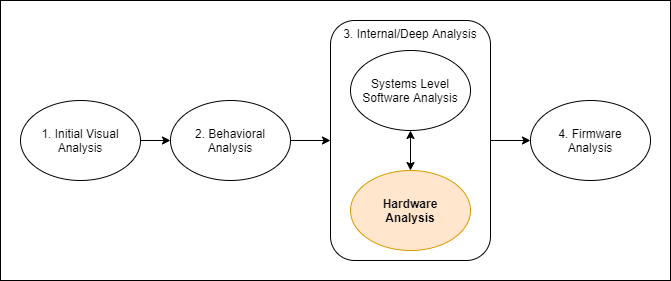

:::danger Incomplete

This document is not yet written.

:::

## Overview

- Practical EE - EE baseline.
  - Safety
  - Voltage
  - Multimeter
  - Schematics - Analog Circuits (e.g. source, switch, load, drain)
  - Prototyping (e.g. schematic -> breadboard)
  - Datasheets - Determine packaging, resets, inputs, voltage, current, temperature, timing

- Digital Primer
  - thresholds / bouncing
  - active high / active low
  - edge triggered, level triggered
  - digital signal reality
  
  - Pull Ups / Pull Downs
  - Controlling LED

- Digital Logic
  - Logical Components - Symbols, Truth Tables
  
  - Clocks - Combinatorial / Sequential

  - Memories
    - Addressing
    - Volatile
      - Flip flops / Latches
    - Nonvolatile

- Analyzing Logical Circuits
  - Datasheets - Block diagrams
  - Buses
  - Logic Analyzer (and OScope)

- PCB Analysis (and other methods for analysis) (2 hours?)
  - Buses
  - 
  - Logical Circuits
  - Logic Analyzer / OScope
  - Datasheets -> packaging, inverted inputs, resets, control inputs, voltage specs, current output, temperature specs, timing diagrams, block diagrams

- Serial Access - UART, RS232/TTL, Uboot, more logging and information. (1 hour)

- Memory
  - 

- SPI/I2C Analysis (2 hours) ??

- In Circuit Analysis / Extraction (1 hour)

- JTAG Access - More System Info via IDCODEs, Analyze Kernel/Booter, Memory Access (NOR/NAND) (2 hours)
  - WatchDog Timers
  - JTAGulator
  - OpenOCD / FTDI MiniModule
