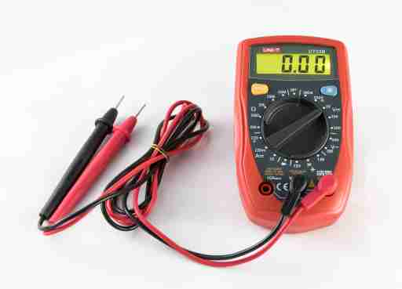
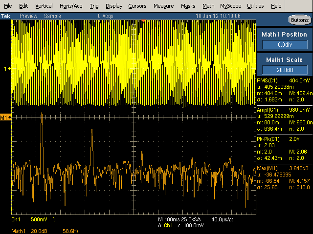

:::danger Incomplete

This document is not yet written.

:::

## What is voltage?

Before we jump into _What is a digital signal?_, lets review _What is voltage?_ Conceptually, voltage is a pressure that drives electrons/current through a circuit. The amount of current being pushed through the circuit is measured as the amperage or amps. Often in digital circuits the amperage is measured in milliamps or mA.

There are two primary voltage types:

- **Alternating Current** (AC) - Voltage that alternates in a sine wave over a regular time. This type of voltage is the output of a rotary generator.

- **Direct Current** (DC) - Voltage that remains at a constant voltage (within a given threshold.) The is graphically visualized as a "straight line" (in contrast to a wave). DC voltage is the output of stored energy (e.g. batteries, capacitors)

## Reference Ground

<!-- TODO: This paragraph needs help talking about "potential difference" and "reference ground". -->

Voltage is also referred to as the _potential difference_. It is the difference of electrical potential between two points in a circuit (i.e. the difference between the voltage source and its ground). In other words, the voltage that a component is processing is the difference between its input voltage and ground pins.

Printed circuit boards (PCBs) are composed of multiple layers. One of these layers is a ground layer so that components on the board only need to connect a via to this layer to establish a connection with ground.

When measuring voltages of a board, its important to use the same reference ground that the components are using. Electricity will always attempt to find the path of least resistance and if you use an incorrect ground you could risk interconnecting two circuits that were never intended to be connected; at best creating bad measurements and at worst causing irreversible damage to the circuit. For this reason, it is important to locate a quality reference ground when measuring circuits or performing any in-circuit operations.

Note: Locating reference ground was referenced in the [Internal Visual Inspection](/docs/EmbeddedSystemsAnalysis/InitialVisualAnalysis/InternalVisualInspection#visually-locating-ground) section of this material.

## Multimeters

A common tool used with inspection and analysis of circuitry (e.g. voltage levels) is a multimeter.

Multimeters can measure a variety of things:

- AC Voltage - Alternating current moves in waves. Its commonly used for delivering current over long distances due to its efficiency. The wall outlet is AC.
- DC Voltage - Direct current is constant and is used extensively in digital circuits.
- Ohms (i.e. resistance) - You can use measure resistance with this function. It can be handy for checking continuity within a circuit or measuring a resistor when I don't want to look up the ohms from the markings on the components.
- Continuity - Typically makes an audible _beep_ when resistance is zero across the leads. Note: Its often safer to measure resistance manually to determine continuity. This is because you could be connected higher voltages to disconnected circuits and inadvertently overdrive a component.

The multimeter typically has 3 connections. By convention the black lead is used as the negative or ground. The lead labeled V or with an Ω (omega/ohm symbol) and usually colored red is used for the positive lines for measuring voltages and resistance.

If you want to measure the current of a circuit, the circuit itself must go through the multimeter. This is what the lead labels with A or mA and colored red is used for. Note: There is usually a maximum amperage that the multimeter is safe to operate with labeled on the meter itself.

**Caution:** Never use the multimeter leads between two different boards. Different boards will have different reference voltages and may cause damage from short circuits.

## Dirty Power

Nearly all digital circuits use DC. Digital products that source AC power usually convert the AC to DC with a power supply that does a _good enough_ job at keeping voltage levels constant. What I mean by _good enough_ is that while digital circuits aim for clean constant voltage levels, they live in an analog world where nothing is perfect. Therefore the voltage levels in a DC circuit usually output a non-zero amount of noise or ripple with them. Cheap wall warts can generate whats known as _dirty power_. This dirty power is a power source that has a large amount of noise and ripple.

From Ken Shirriff's blog, here are two images of different 5v USB chargers:

- An authentic Apple iPhone charger:

  

- A counterfeit Apple iPhone charger:

  

Notice that the first has what we might interpret as _clean power_ and yet it still shows noise on the line. In contrast, the other has very _dirty power_. While both of these USB chargers exists in identical cases, they are in fact completely different designs and have completely different manufacturing properties. The latter could actually be considered a safety hazard.

<!-- TODO: Explain effects of dirty power. -->
