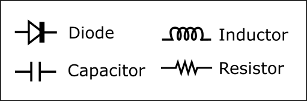
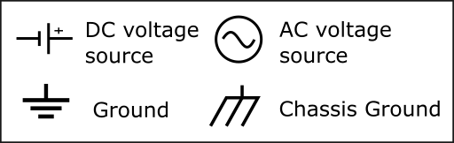
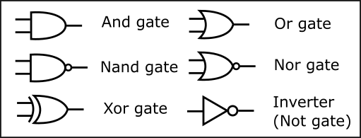
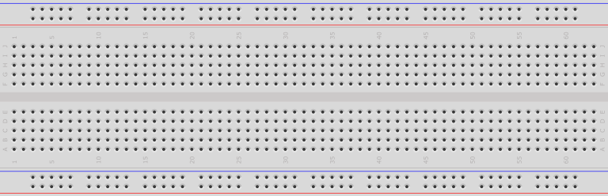

:::danger Incomplete

This document is not yet written.

:::

```text
- Practical EE
  - Schematics - Analog Circuits (e.g. source, switch, load, drain) (15mins)
  - Prototyping (e.g. schematic -> breadboard) (60 mins)
  - Datasheets - Determine packaging, resets, inputs, voltage, current, temperature, timing (30mins)
  - Pull Ups / Pull Downs  ... useful for white wiring (15mins)
  - Controlling LED ... useful for debugging (15min)
```

## Schematics

The standard way for describing an electrical circuit is through the use of a schematic. Schematics can clearly and concisely express the relationships between all of the components in a circuit. Schematics are made up of interconnected symbols that are standardized by bodies like IEEE and ANSI. There are three common categories for schematic symbols:

- Passive - These components consume or react to energy but do not produce any energy (e.g. capacitors, resistors, inductors).
  
  

- Power - Sources of voltage and ground.
  
  
  
- Logical - Represent boolean operations (e.g. AND, OR, NOR).
  
  

All of these components are interconnected with traces or lines. Dots at the intersection of these lines represent a connection. Intersecting lines without a dot are not connected.


<!-- TODO: Drop example schematic here and describe it. -->

## Breadboard

Breadboards are commonly used to prototype a circuit or parts of a circuit. Breadboards use friction to keep the components connected. Other prototyping techniques include using a *perf board* which is a board with a bunch of unused solder points. Soldering the prototype can make it more durable but less flexible for reconfiguration.



Breadboards are composed of a grid of holes that you shove leads into. Each line of 5 holes are usually connected. In the middle of the breadboard is a *ditch*. Through-hold integrated circuits (ICs) usually straddle this ditch in the middle of the board.


Great care must be taken when using breadboards. Wires can get messy and be pulled out from the slightest catch on of a moving hand or other article of clothing. Because breadboards use friction to hold leads in place, they can also become worn out and not have as good of a connection for some of the 5-hole lines. Also, long wires poking up and wrapping around each other can effect their performance. Pulsing clock lines can effect readings on adjacent wires that aren't shielded. In some cases you may need to ensure these noisy lines are kept at a distance from any data lines.

The key takeaway when working with breadboards is to be gentle and keep it as neat and clean as reasonable.

<!-- TODO: Have students draw a breadboard implementations from a given set of schematics. -->

<!-- TODO: Show pictures of the solutions. -->

## Datasheets

<!-- TODO: Focus on packaging, inverted inputs, resets, control inputs, voltage specs, current output, temperature specs, timing diagrams, block diagrams. -->

<!-- TODO: Given a timesheet, answer questions about the described components.

- 8-bit serial to parallel converter means?
- What part?
- Voltage?
- How to reset?

More information available in FCC database. -->

## Pull Ups / Pull Downs

## Controlling Small Loads (e.g. LED)

## Resources

[Wikipedia: Electronic Symbol](https://en.wikipedia.org/wiki/Electronic_symbol)
[Circuit Symbols for all Electronic Components](http://www.talkingelectronics.com/CctSymbols/Circuit_Symbols.html)
