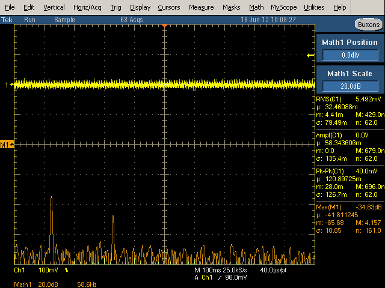
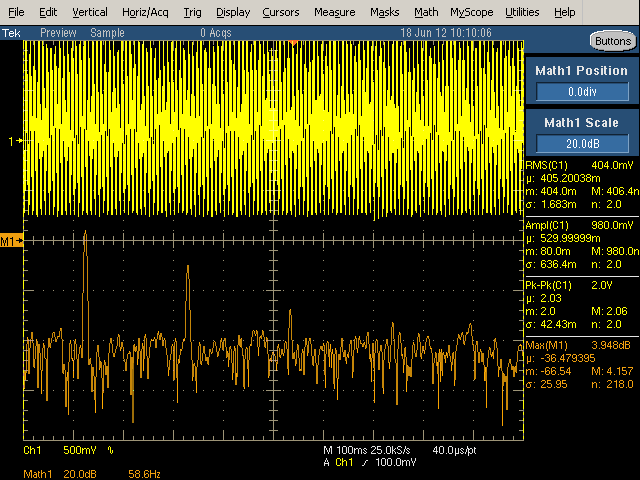
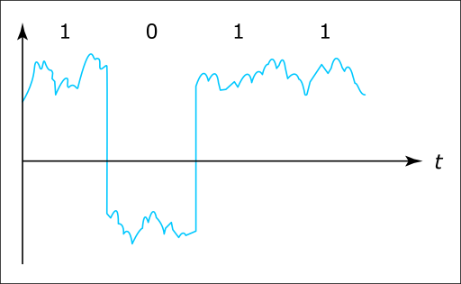
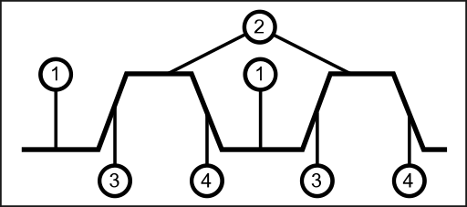

:::danger Incomplete

This document is not yet written.

:::

## What is voltage?

Before we jump into *What is a digital signal?*, lets review *What is voltage?* Conceptually, voltage is a pressure that drives electrons/current through a circuit. There are two primary voltage types:

- **Alternating Current** (AC) - Voltage that alternates in a sine wave over a regular time. This type of voltage is the output of a rotary generator.

- **Direct Current** (DC) - Voltage that remains at a constant voltage (within a given threshold.) The is graphically visualized as a "straight line" (in contrast to a wave). DC voltage is the output of stored energy (e.g. batteries, capacitors)

## Reference Ground

<!-- TODO: This paragraph needs help talking about "potential difference" and "reference ground". -->

Voltage is also referred to as the *potential difference*. It is the difference of electrical potential between two points in a circuit (i.e. the difference between the voltage source and its ground). In other words, the voltage that a component is processing is the difference between its input voltage and ground pins.

Printed circuit boards (PCBs) are composed of multiple layers. One of these layers is a ground layer so that components on the board only need to connect a via to this layer to establish a connection with ground.

When measuring voltages of a board, its important to use the same reference ground that the components are using. Electricity will always attempt to find the path of least resistance and if you use an incorrect ground you could risk interconnecting two circuits that were never intended to be connected; at best creating bad measurements and at worst causing irreversible damage to the circuit. For this reason, it is important to locate a quality reference ground when measuring circuits or performing any in-circuit operations.

Note: Locating reference ground was referenced in the [Internal Visual Inspection](/docs/EmbeddedSystemsAnalysis/InitialVisualAnalysis/InternalVisualInspection#visually-locating-ground) section of this material.

### Multimeters

A common tool used with inspection and analysis of circuitry is a multimeter.

Multimeters can measure a variety of things:

- AC Voltage - Alternating current moves in waves. Its commonly used for delivering current over long distances due to its efficiency. The wall outlet is AC.
- DC Voltage - Direct current is constant and is used extensively in digital circuits.
- Ohms (i.e. resistance) - You can use measure resistance with this function. It can be handy for checking continuity within a circuit or measuring a resistor when I don't want to look up the ohms from the markings on the components.
- Continuity - Typically makes an audible *beep* when resistance is zero across the leads. Note: Its often safer to measure resistance manually to determine continuity. This is because you could be connected higher voltages to disconnected circuits and inadvertently overdrive a component.

The multimeter typically has 3 connections. By convention the black lead is used as the negative or ground and the red is used for the positive lines.

**Caution:** Never use the multimeter leads between two different boards. Different boards will have different reference voltages and may cause damage from short circuits.

<!-- TODO: Discuss the *other* red port on the multimeter. -->

## Dirty Power

Nearly all digital circuits use DC. Digital products that source AC power usually convert the AC to DC with a power supply that does a *good enough* job at keeping voltage levels constant. What I mean by *good enough* is that while digital circuits aim for clean constant voltage levels, they live in an analog world where nothing is perfect. Therefore the voltage levels in a DC circuit usually output a non-zero amount of noise or ripple with them. Cheap wall warts can generate whats known as *dirty power*. This dirty power is a power source that has a large amount of noise and ripple.

From Ken Shirriff's blog, here are two images of different 5v USB chargers:

- An authentic Apple iPhone charger:

  

- A counterfeit Apple iPhone charger:

  

Notice that the first has what we might interpret as *clean power* and yet it still shows noise on the line. In contrast, the other has very *dirty power*. While both of these USB chargers exists in identical cases, they are in fact completely different designs and have completely different manufacturing properties. The latter could actually be considered a safety hazard.

<!-- TODO: Explain effects of dirty power. -->

## Digital Signals

Ok, so back to the original question, *What is a digital signal?*. A digital signal is a signal that is usually represented by a high value or low value for a given amount of time. Because of the noise in the power, this is usually accompanied by a threshold that determines what range is considered high and what range is considered low.

Naturally, many engineers will assume that a high value is equal to a logical `1` and a low value is equal to a logical `0`. Keep in mind that the state of a signal can be interpreted differently for different components and their configurations. These interpretations can be arbitrary so you should consult the component data sheet to know which is which.

1. Low Value (within given low range thresholds)
2. High value (within given high range thresholds)
3. Rising Edge
4. Falling Edge

Also pictured in the above diagram are the rising edges and falling edges of a signal. This is the range of time that is takes for a power value to transition from low to high or from high to low.

## Datasheets

<!-- TODO: Datasheet Exercise -->

## Clock Signals

A clock signal is a digital pulse that, when combined with a digital data signal, indicates when a component should measure or read the state of the data signal. Usually the clock signal is periodic based on a regular time interval, but this doesn't have to be the case. Just like digital signals, clock signals are usually defined by high levels, low levels, rising edges, falling edges, and relevant thresholds therein.

In the above example, the clock's falling edge is when the data level value is read.

## Active High / Active Low / Pull Up / Pull Down

Whether a signal is active high or active low is determined by *how* it is activated. In other words, an active low signal will be pulled high when not activated. This means that to activate this signal it should be connected to ground to pull it low. In contrast, an active high pin has a low value and to activate it, it should be pulled high.

<!-- TODO: Mention line over PIN name means pin is active low. -->

<!-- TODO: This paragraph sucks as written. Should all this wait until we dig into schematics? -->
The automatic bias of these signals is usually performed by what is referred to as a pull up or pull down resistor. A pull up resistor allows a voltage bias into the signal but not enough to prevent the signal to be pulled down when connected to ground. A pull down resistor is the exact opposite. A pull down adds a resistor from the signal to ground to bias the signal low, but not enough to cause the signal to be kept low if connected to a voltage supply.

Signals that have no bias up or down are considered floating. This means that they may float in and out of the threshold. The value of such a signal is considered undefined.

<!-- TODO: Consider mentioning bouncing? -->

## Resources

http://www.righto.com/2012/10/a-dozen-usb-chargers-in-lab-apple-is.html
https://www.nutsvolts.com/magazine/article/July2015_Bogatin