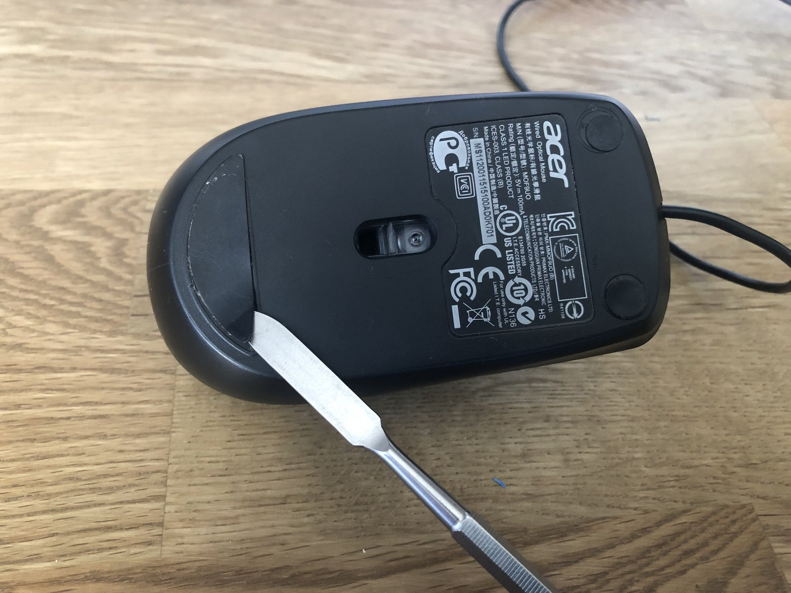
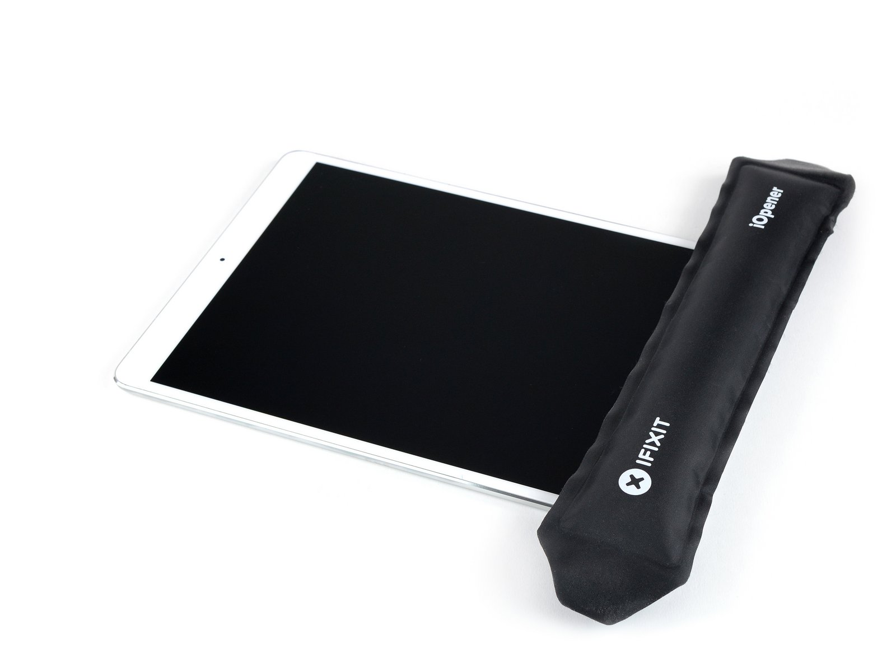
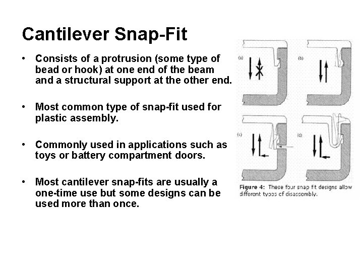
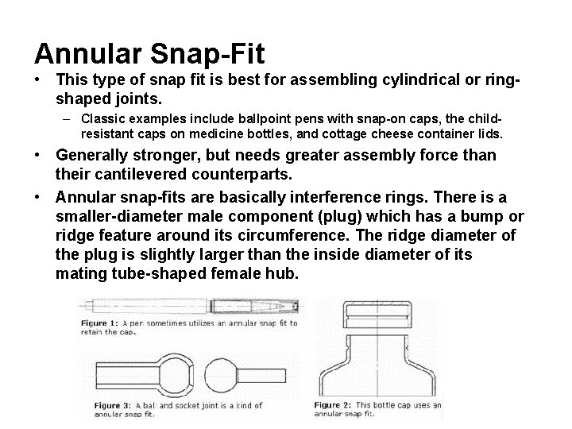
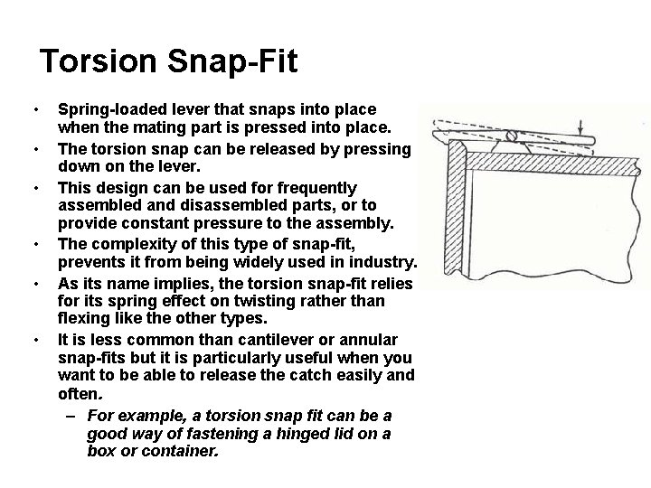
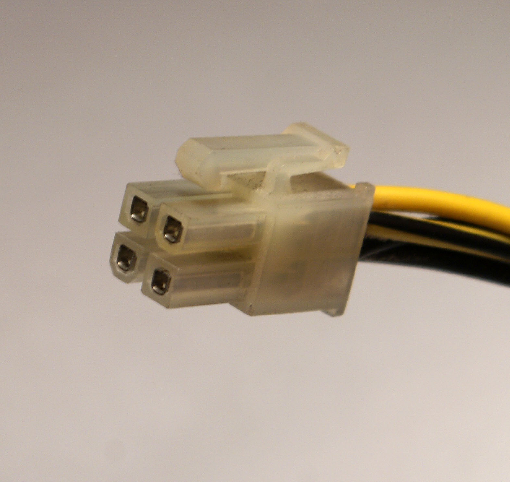

# Disassembly

## What Holds It Together

When performing analysis on a target device, usually there is some sort of opaque protective or aesthetic casing around the actual internals. The first step to disassemble the device is to remove this outer casing. The trick is to find out how its being kept together without the original manufacturer assembly documentation. There are several common methods to keep various cases together:

- **Screws (or fasteners)**. If the location of screws aren't apparent, they can usually be found under stickers, labels, or rubber feet. In the case of stickers, you can sometimes push against the sticker to feel any depressions underneath. If you feel what seems to be a screw hole, you're either right, or its a mold injection port. In the latter case, you may have destroyed the sticker for nothing so its important to ensure you've captured any information from the sticker about the device before peeling it off. Rubber feet are usually stuck on with some light-duty adhesive and can be easily peeled off with a flat head screw driver or with your bare hands.

  - Example of hidden screw under sticker [from iFixIt](https://www.ifixit.com/Teardown/Acer+Optical+Mouse+Teardown/142745):
    
    

- **Snap Locks (i.e. snap fits)**. There are 3 different common snap locks: annular, cantilever, torsion. Cantilever snapfits are the most common and are typically designed for minimal use (i.e. designed to be snapped and unsnapped from a single time to 10s of times before breaking.) Cantilever snapfits require _special_ tools to undo, but often an appropriate pry tool is enough to get the job done.

  - See more about snap locks below.

- **Adhesive**. Some manufacturers will use glues and adhesives to ensure that the device case remains extra stable and protective. (Others do it as an anti Right To Repair decision.) In either case, whats important is that we don't break the boards and circuitry within. iFixit provides a tool called the iOpener. Its basically a closed tube of some kind of gel material that can be heated (in the microwaved) enough to weaken the glues found in devices like the Apple iPad and iPhone. If you don't intend to maintain the quality of the case, you can also sometimes use a hair dryer or a more aggressive heat gun. (Note: Heat guns get hot enough to melt solder, so use with extreme caution.)

  - Example of using the iOpener to release the bottom part of the iPad [from iFixIt](https://www.ifixit.com/Guide/iPad+Pro+10.5-Inch+Battery+Replacement/122786):
    

- **Note:** There are other methods used to keep enclosures on their devices (e.g. welds, epoxies), but anything beyond what's been mentioned above is generally outside the scope of this material.

## More On Snap Locks

### Cantilever Snap Locks

Cantilever snap locks are the most common. They can be designed with a rounded edge to allow for occasional disassembly but are more often one time use and require destruction/damage of the case to undo. In laymen terms, these snaps hook against some perpendicular surface.

### Annular Snap Locks

Annular snap locks can also be found on various mold injection cases, but are less common because they usually require significantly more force to assemble. They also require more force to disengage, more than the case material is likely rated for and therefore will generally require destruction of the case. In addition to fastening to sides of a case, I've also seen annular snap locks used as a replacement for fasteners (e.g. screws) themselves in paneling commonly found in automobiles. In laymen terms, a shampoo bottle, toothpaste tube, or ketchup bottle that snaps open with a hinge at the top is a type of annular snap lock.

### Torsion Snap Lock

Torsion snap locks are the least common types of snap fits. They are designed for regular access to the internals of the case.

You'll often find torsion locks on interconnections or connectors on a board. There is usually a little tab that you have to push for the connect to be released from the board or port.

For example, many ATX power connectors and Display Port connectors have torsion locks.

<!-- TODO: Talk about:
- Friction Fittings
- Chip Mounts -->

## Tools

There are many tool outfits that put together fantastic kits and sell individual tools. Often you'll find that a home made tool or a modified material never intended for your use case are the best tools. But if you are starting from nothing, iFixIt seems to have, IMHO, some of the best starter tool kits.

If you've already got some tools in your work area and just need a good set of odd bits and prying tools, I recommend the [Pro Toolkit](https://www.ifixit.com/Store/Tools/Pro-Tech-Toolkit/IF145-307) (seen above.) If you are starting from nothing and want to go all in on a more comprehensive toolkit, I recommend the [iFixIt Business Repair Kit](https://www.ifixit.com/Store/Tools/Repair-Business-Toolkit/IF145-278?o=14). The one major downside with the Repair Business Toolkit is that I really believe it should have come with some sort of soldering iron or heat gun with chip removal attachments. Other than that, its a solid starter set for teardown and analysis of many different devices.

Of course, in a pinch, any old toolkit or tools from the hardware store can also get you started, but when I went this route, I often ended up causing irreversible damage to my devices without the right tool for the job.

## Resources

To see examples of _tear downs_, iFixIt has a gallery of tear downs of various devices. This is not only a good resource for guides on how to disassemble your devices, but can also be a way to research the internals potential component of a device without actually tearing anything down. Remember, depending on your goals, you may be able to accomplish what you need solely through software and a hardware teardown isn't required at all. In some cases, all we need are the part numbers for datasheet research.

## References

- [Injection molding design fundamentals: Snap-fits for plastic parts](https://www.plasticstoday.com/injection-molding/injection-molding-design-fundamentals-snap-fits-plastic-parts)
- [Cantilever and annular snap fit phases a Initial contact](https://www.researchgate.net/figure/Cantilever-and-annular-snap-fit-phases-a-Initial-contact-b-Deflection-c-Snap_fig1_335213253)
- [Snap Fitting Defination](https://www.brightonk12.com/Page/7358)
- [Plastic Fasteners Welding Bonding SnapFits Molded](https://slidetodoc.com/plastic-fasteners-welding-bonding-snapfits-moldedin-pieces-in/)
