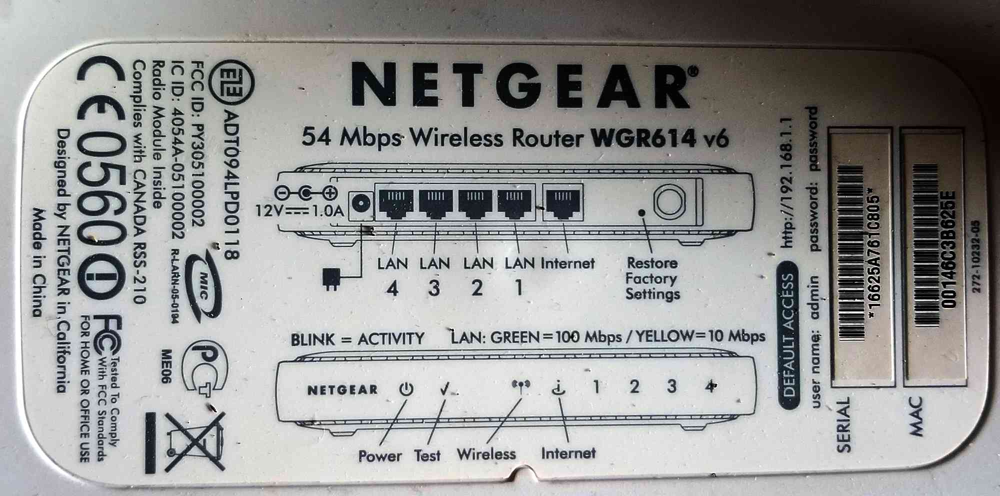
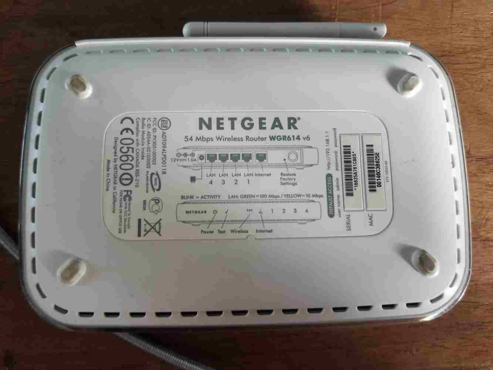
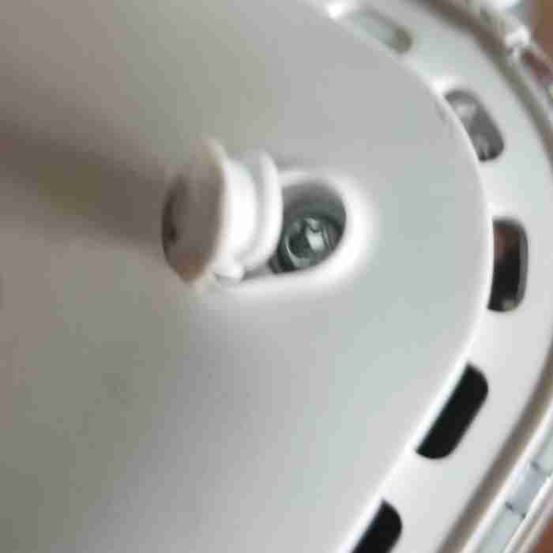
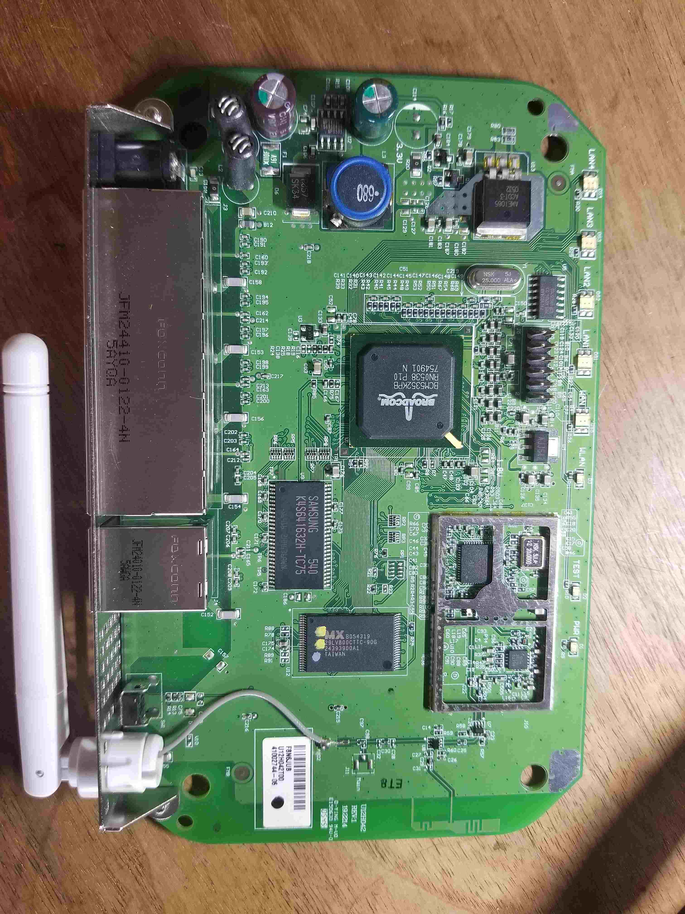
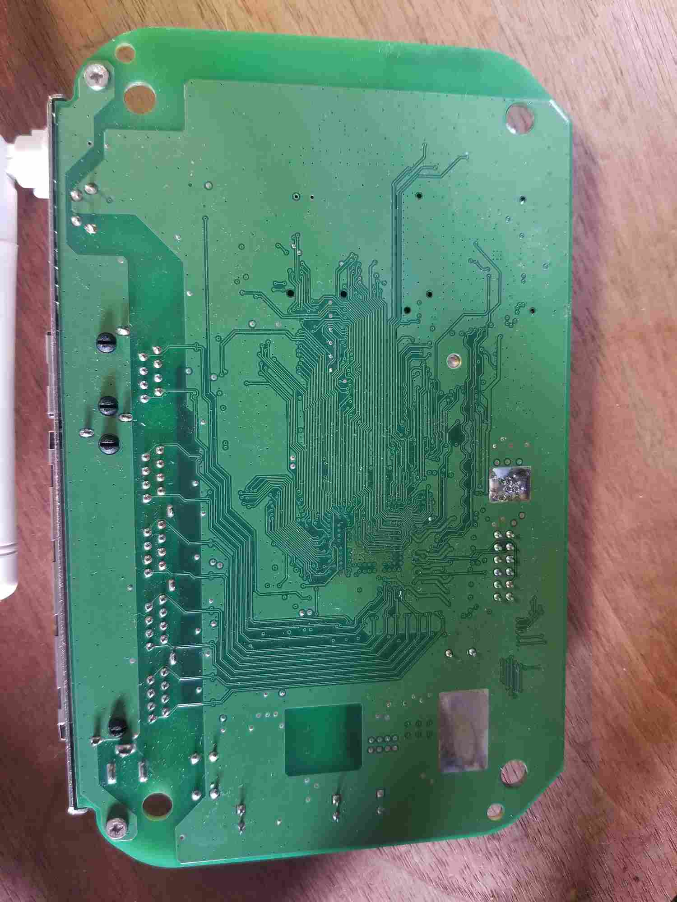

:::danger Incomplete

This document is not yet complete.

:::

## Overview

We've just been handed an old Netgear WGR614 Router and asked to profile the device for some potential reverse engineering. The approach will be to:

1. Perform external analysis, capturing what we can without popping the case.
2. Perform internal analysis, capturing what we can on whats under the case.
3. Identify device components and locate datasheets.

## External Analysis

The first observable bit of information about this router is the label on the bottom of the case:

To summarize the contents:

- **Make:** Netgear
- **Model:** 54 Mbps Wireless Router WGR614 v6
- **Power:** 12VDC / 1.0A (barrel connector)
- **Default Access:** http://192.168.1.1
- **user name:** admin
- **password:** password
- **Serial:** 16625A761C805
- **MAC:** 00146C3B625E
- **Netgear Spec:** 272-10232-05
- **EZE:** ADT094LPD0118
- **FCC ID:** PY305100002
- **IC ID:** 4054A-05100002

Other Misc Notes:

- Has "Restore Factory Settings" button. \_Is this firmware restore or only config restore?
- 4 LAN ports, 1 WAN port.

### Discovered Certification Resources

- [IC ID Info](./NetgearTeardown/IC-ID-Info.pdf)
- [FCC External Photos](./NetgearTeardown/fcc-netgear-external-photos.pdf)
- [FCC Internal Photos](./NetgearTeardown/fcc-netgear-internal-photos.pdf)
- [FCC Manual #1](./NetgearTeardown/fcc-netgear-manual-1.pdf)
- [FCC Manual #2](./NetgearTeardown/fcc-netgear-manual-2.pdf)
- [FCC Manual #3](./NetgearTeardown/fcc-netgear-manual-3.pdf)

### FCC / IC Findings

- SoC based on Broadcom BCM5352
- Wifi based on Broadcom BCM2050
- 802.11g wireless, WPA-PSK, WEP
- Firewall / NAT
- 10/100 Mbps Ethernet w/ Auto-negotiation
- Flash memory and upgradable
- Logging
- DHCP, PPPoE, DNS Proxy (Caching?)
- Power: 12VDC / 1A / **22W max**
- UPnP
- Other stuff!
- [BCM5352 Product Brief](./NetgearTeardown/bcm5352-product-brief.pdf)

## Internal Analysis

Once again, just doing external analysis nets us an amazing amount of information and we haven't even opened the device yet. But enough of that, time to crack this bad boy open. Where are the screws?

First I push against the label to see if there are any hidden screw holes under the sticker. In the middle there is what you might think is a shallow hole, but this is just a impression left by the injection molding process of the case. Lets pick at those feet and see if there are screws under them.

There are 4 screws (one for each foot). Once they come out, the case comes right apart (i.e. no need for prying cantilever snaps). In fact, the case holds the board in place, so once the case is in two pieces, the internal PCB slides right out. Here is a snapshot of the board from the top and bottom:

### Catalog Parts

With what I see, I immediately start writing down part numbers to start to make sense of the device.

**Outside EMI Shield:**

- Broadcom BCM5352KPB - Integrated 802.11G ROUTER WITH BROADRANGE SoC
  - [[product-brief](./NetgearTeardown/bcm5352-product-brief.pdf)]
  - [[picture](./NetgearTeardown/broadcom-mcu.jpg)]
- Samsung K4S641632H-TC75 - 64Mb SDRAM
  - [[datasheet](./NetgearTeardown/K4S-64163.pdf)]
  - [[washed out picture](./NetgearTeardown/samsung-k4s641632h-tc75-washedout.jpg)] - Original Picture
  - [[painted label picture](./NetgearTeardown/painted-id-plus80contrast.jpg)] - 80% Contrast
  - [[etched label picture](./NetgearTeardown/etched-id-plus50contrast.jpg)] - Angled Light + 50% Contrast
- MX 29LV800CTTC-90G - 8M-bit[1Mx8/512K x16] CMOS Single Voltage 3V Only Flash Memory
  - [[datasheet](./NetgearTeardown/29LV800CBTC-90G_MacronixInternational.pdf)]
  - [[picture](./NetgearTeardown/mx-29LV800CTTC-90G.jpg)]
- 74LVC04AD - Nexperia Hex Inverter
  - [[datasheet](./NetgearTeardown/74LVC04A-nexperia.pdf)]
  - [[picture](./NetgearTeardown/74LVC04AD-next-to-header.jpg)] - 100% Contrast

**In EMI Shield:**

- Broadcom BCM2050KML - 2.4 GHz Radio Single Chip System on a Chip
- SiGe 2525L 5273R
  - ?? Single Crystal Semiconductor Silicon-Germanium (SiGe) ??

### Board Observations

TBD
