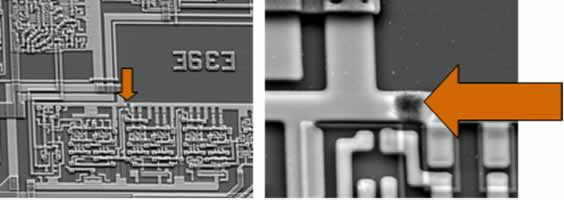
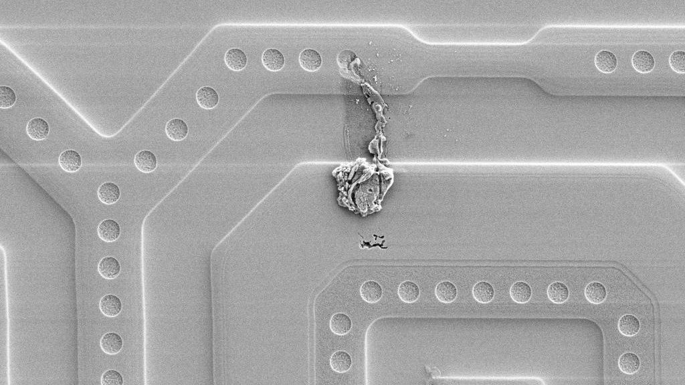

# Handling Hardware

Handling Hardware - ESD, Things To Not Break Stuff (1 hours)

## What is ESD and EOS

- **ESD** - Electrostatic Discharge
- **EOS** - Electrical Overstress

ESD occurs when the two objects (e.g. a human and a computer) come into contact with each other. If those two objects have a significant enough difference in potential electrical energy, ESD damage can occur in the circuit.

EOS is when a circuit is subjected to more power, amperage, or voltage than it was rated to handle over some period of time.

While ESD and EOS are sometimes used interchangeably, there is a subtle difference between the two. Here is a comparison between the two that I found on the _intertubes_:

> You can compare an ESD event with a knocked-over glass of water on a floor:
> you’ll get a small puddle but once all the water has spilt from the cup,
> it’s gone. There is no more water left and the damage is fairly limited.
>
> However, an EOS event can be compared to an open tap; there may be just a
> little drip in comparison but there is an unlimited amount of water
> available. After a while, the entire floor may be flooded and could cause
> some serious damage. As you can see, EOS events last several magnitudes
> longer than most ESD events. - [Desco Europe](https://www.rs-online.com/designspark/the-difference-between-eos-and-esd)

In summary, a device with ESD mitigation is not protected from EOS events. In the context of this course, knowing that EOS/ESD is a thing, unintended EOS and ESD events are bad and should be avoided in critical systems.

## For A Non Electrical Engineer

In the context of embedded systems, I'm what you might call a typical software developer. I know that there are analog physics involved with electronics and specific ways that these analog signals are calculated. I usually ignore all of these details and keep myself in the digital world. I never go lower in electronics than "this signal went high", "this other thing went low", "is there power?", and so forth (i.e. everything is boolean at the lowest level for me.)

With this clear demarcation, I usually fail to appreciate the darting looks I get from my Electrical Engineering peers with how I sometimes handle PCBs around the office.

- "Why are you walking around on the carpet while holding that PCB?", they'd say.
- "You're going to ruin that board if you don't put it in a ESD safe box or bag", they'd say.

Why the heck do they always do that? I've never had a board just stop working because I scooted across a rug with wool sockets without lifting my feet...

The reality is that, more often than not, the damage cause by ESD is slow and deteriorating (i.e. it doesn't just happen). It slowly damages a trace or adds some very small resistance across a circuit that has no immediate effect, but likely decreases the life span, performance, and accuracy of the device. When ESD damage occurs, its usually not visibly detectable until its too late. For example, an ESD shock could slowly wear at a trace on a board until it becomes a fuse of sorts. Then the moment its powered on, the trace becomes completely disconnected and the circuit no longer functions as designed. Even then, from a software perspective you may struggle to identify the issue because it'll occur in a part of the hardware that isn't often used (unless for some reason you've written unit tests for the hardware).

## Examples Of ESD/EOS Damage

Here are some images to visualize some of the damage that can be caused by ESD. To observe all of these example, the circuits have had to be irreversibly extracted from their packaging and put through an acid bath to get to the layers of the chip that required inspection. Additionally, the images have been captured at many thousands of times magnification through and electron microscope. In other words, this isn't a _you can do it in your garage_ kind of exercise:

- In the following image is a circuit that has ESD damage to a trace with 25000 times magnification: [[Image sourced from mclucernas/blogspot](http://mclucernas.blogspot.com/2012/04/safety-precautions-before-performing.html)]

  

- Here is another example where a trace is degraded (i.e. converted into a fuse), causing latent damage: [[Image sourced from Source Research LLC](http://www.sourceresearch.com/newsletter/ESD.cfm?emART)]

  

- This example includes a new connection between traces due to a liquification of above layers in the circuit. This particular damage was caused by an EOS event. [[Image sourced from Workbench Systems](https://blog.item24.com/en/workbenches/identifying-esd-damage-using-an-electron-microscope/)]

  

## Mitigating ESD/EOS

Put simply, the best way to protect your equipment from ESD damage is to provide grounding to everything that comes into contact with the device:

- For humans, this means wrist straps.
- For surfaces, this means ESD Static Mats.
- For other devices, this means ground lines.

## Accepting Risks

Now that we should know that ESD can wreck havoc over our device, the reality is that we live in a fast paced world and often don't have the benefit of the time, money, or patience to observe all of the guidelines. In these situations I'd like to offer some modest behaviors that should be observed, regardless of time and money:

- Don't do electrical work on a conductive surface (e.g. a metal top workbench).
- Ground yourself with a case or grounding wire before coming in contact with a PCB out of its case. In more simple terms, touch something conductive with a ground wire (like the metal part of a computer case) so that you can discharge any immediate static energy before handling more sensitive equipment.
- Don't walk on carpets (or ESD generating surfaces) with PCBs without a minimum of an ESD resistant box (e.g. [Protektive Pak](http://protektivepak.descoindustries.com/Catalog/2016-Protektive-Pak-Catalog.pdf)) or a static bag.
- If possible, an ESD mat is a good idea to prevent someone walking by the area from sending a charge through the device. I've once seen someone able to repeatably swivel in an ungrounded lab stool and cause enough static energy to reset devices on adjacent workbenches in the area. Our solution for this was to ground the stools themselves.
