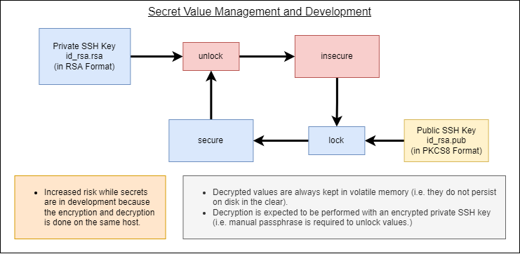
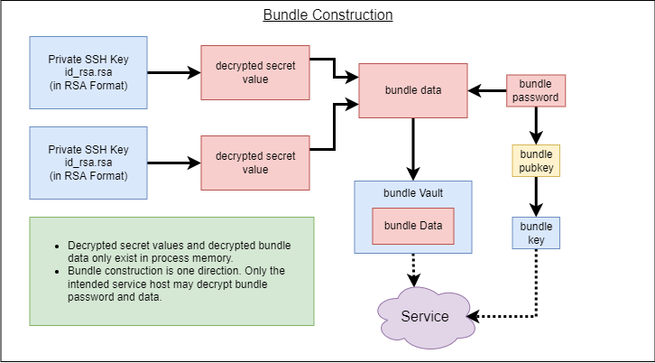
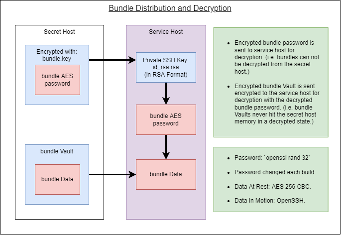

:::danger Incomplete

## Overview

`shsm` is a secret manager written to be extremely cheap and depend on only a few common utility (e.g. bash, openssl, and openssh).

Given that a secret manager should be able to store attribute value pairs in a secure fashion at rest and in motion, we should be able to achieve this with shell scripting, openssl and SSH. SSH is how we maintained confidentiality of data in motion. OpenSSL is how we maintain confidentiality at rest.

Since we're using SSH and we'd like our services to be able to start without up plugging in credentials manually, we assume that SSH keys (without passphrases) are used by all the relevant services to communicate with the secret host. With these SSH keys we can enable a protocol that allows a kind of asymmetric encryption scheme for the secret bundles delivered to services at startup. In other words, we can store secrets on the secret host in a way that the secret host has no way to decrypt them. Depending on your risk profile and security mitigation, you should even be able to check-in the encrypted secret bundles into services like github.

## Quick Start / Synopsis

Developer Machine Folder Structure:

```text
secrets/
  shsm.sh
  phases
    dev/
      insecure/
        USER
        PASSWORD
      keys/
      secure/
  bundles
    nginx/
      nginx_bundle.conf
      nginx.pub
```

File setup:
```
echo "user" > phases/dev/insecure/USER
echo "password" > phases/dev/insecure/PASSWORD
echo "dev/USER" > bundles/nginx/nginx_bundle.conf
echo "dev/PASSWORD" >> bundles/nginx/nginx_bundle.conf
# Copy the public key for the service to bundles/nginx/nginx.pub
```

Lock the phase:

```
./shsm.sh phase lock dev
```

Build bundle:

```
./shsm.sh bundle build nginx
```

Run service:

```
./shsm.sh run env | grep PASSWORD
```

## Assumptions & Constraints

`shsm` was primarily developed as a cheap (but secure) alternative to commercial services that facilitate environment variable injection into runtime processes like python and node. These runtime processes are garbage collected environments. This means that secrets are exposed in memory without significant hackery. Therefore:

- `shsm` does not attempt to hide sensitive information that is located in the process it is intended for.
  - Constraint: You can not allocate a string and then wipe it with any guarantees in pure node or pure python.
  - Mitigation: You may consider various _munge_ functionality (xor, base64, rc4, etc) to not have secrets stand out in a `strings` search.
  - Mitigation: You may consider using a platform/hardware specific security feature (e.g trusted infrastructure via TPMs).
- Values passed in the clear into a process's environment can be seen via `/proc/self/environ` or `/proc/$PID/environ`.
  - Constraint: node and python are too good at calling odd-ball syscalls without hackery.
  - Mitigation: Apply sufficient access control to the referenced pseudo files.
  - Mitigation: `prctl()` can allow you to change the environ pointer for the kernel. (Note: This is not robust.)
  - Mitigation: Pass secrets as a configuration file via command arguments. (Note: Files can be wiped after execution.)

## Workflows

There are 3 major workflows for `shsm`:

- Secret Value Management and Development - This is where we manage actual secret values.
- Bundle Construction - This is the process where we construct bundles for use by services.
- Bundle Distribution and Decryption - This is the process that services use to fetch and use secret values.

### Secret Value Management and Development



The value management workflow was designed with the developer ease of use in mind. Fundamentally it uses a single file to store variable values. Each of these files are stored into _phases_. The idea of the _phase_ comes from the different phases that a development cycle experiences. The user can choose whatever _phases_ make sense for their environment, but one recommended set is: dev, test, and prod.

Secret phases are either in locked state or unlocked state. The locked state means that all the insecure values have been encrypted into their `secure` folder and erased from `insecure`. The unlocked state means that all of the values in `secure` for the phase have been decrypted into a `insecure` symlinked folder that points at a volatile temporary folder in `/tmp`. This prevents the secrets from persisting on disk in an insecure manner.

Secret phases are encrypted with AES-256-CBC using a randomly generated password that is encrypted with the **developers** public SSH key. When its time to unlock the secret phase, the developer's private SSH key is used to decrypt the AES password which is inturn used to unlock all of the secret values from `secure` to `insecure`. 

Note: At present time, only the values stored in `secure` are acknowledged as authoritative for the construction of bundles.

### Bundle Construction



Bundles are the compilations of various secret value sets (across all phases). A bundle is described by a set of phases and variables. A bundle is then constructed with all of the relevant variables and secret values. It's intended to have a bundle for each service. Each bundle is encrypted with AES-256-CBC using a randomly generated password that is encrypted with the **service** public SSH key. The bundle data is also encrypted with AES-256-CBC using the same password that was generated. This means that each service given their private SSH key, the encrypted password, and the encrypted bundle data should be able to decrypt the data for their configuration without the sensitive values ever being exposed outside the service's process tree.

### Bundle Distribution and Decryption



Given a secret-host and a service-host, `shsm` is designed to deliver the encrypted password and the encrypted bundle vault to the service-host for decryption (using the service's private SSH key). The transfer is done over SSH to ensure data is protected in motion. The decryption of the password and bundle data is performed only in process memory (i.e. it never touches disk or non-volatile memory).