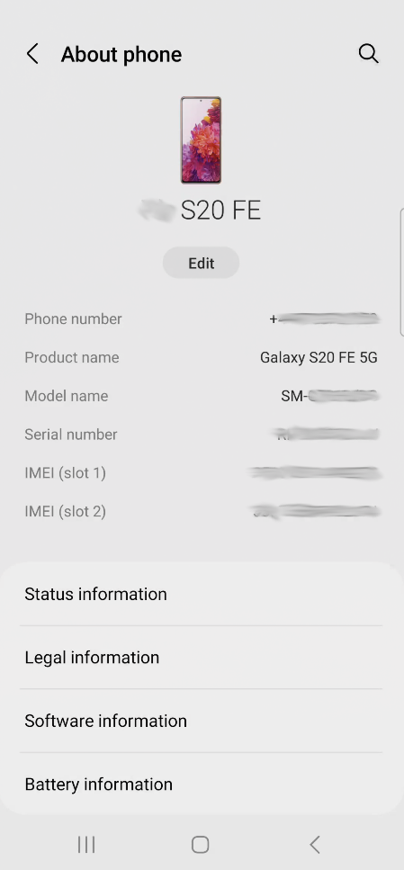
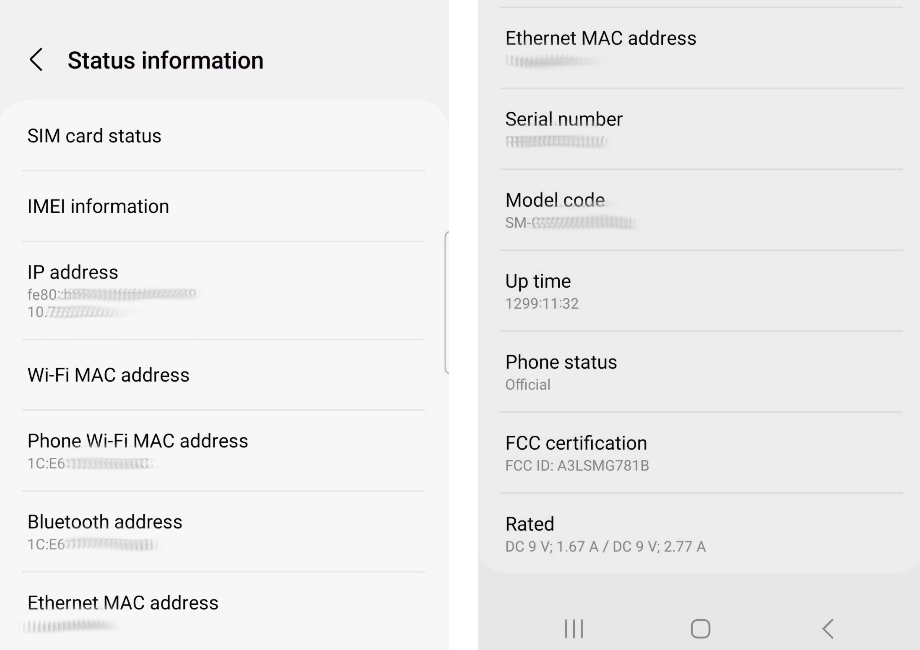
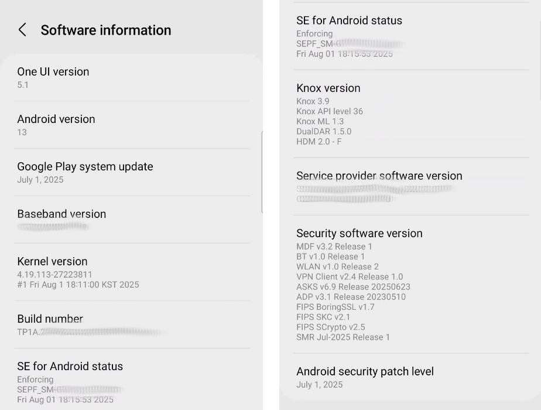
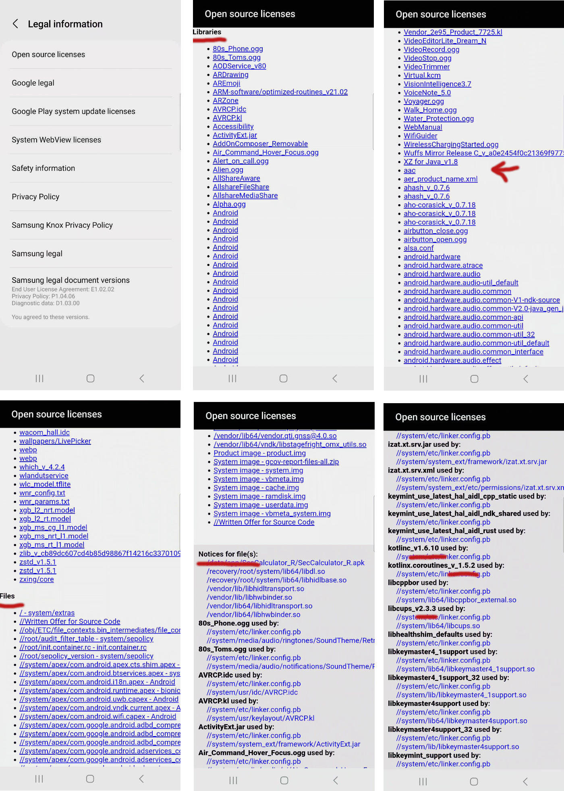

<!-- pagebreak -->

# Initial Platform Inspection

Inspection and discovery of details pertaining to the platform we'd like to run our target application from.

## Hardware Details

So far, we've been looking at studying the overt or end user functionality and attributes of an installed or target application. That application, for our purposes, will be running on a platform of some kind. We want to understand that platform as much as reasonable. For example, locating and writing down the following hardware information is key:

- Device Manufacturer
- Device Model
- Device Serial
- FCC ID Number
- MAC Addresses (Wifi, Ethernet, and Bluetooth)
- IMEI information

It can be different for different makes and models, but the following is a snap shot of "About Phone" from my Samsung:

For more identity based information, take a look at the "Status Information" screen:

Using the above information, you can then research technical specifications and look out for technical repair manuals or other hard to find information about the internals of the phone. Getting a look at the inside of any device in the US can often be achived by looking up the device in the [FCC-ID Database](https://www.fcc.gov/oet/ea/fccid). The database will often restrict the public from viewing proprietary information, but includes images of the inside of the phone, which is great because you then don't have to break your device to see the inside immediately.

The more identity specific information (MAC, IP, IMEI) is something that'll be critical to identifying the traffic to and from your phone when doing any network traffic analysis or looking for tracking of your device by an application.

## Software Platform Details

Our target application isn't just running on a hardware device, its running on a platform composed of a stack of software. That software may include Manufacturer user interface platform (e.g. One UI for Samsung). The platform will also have an Android Version, a baseband version, a kernel version, a build number, and depending on the device vendor, other information. Capture it all!

You can often find something similar to "Software Info" in the Android's system settings. Many vendors have different Settings menu's layout so you'll have to find what matches for you by experimentation or documentation. On my Samsung it looks like the following for the software information:

- The Android Version is what the vendor's system image is based on. Use this to determine general system compatibility and API support. That said, the Android version itself is independent of the Android SDK version.
- The baseband version is the version of the firmware used in the modem of the device to communicate with the local mobile or celluar network.
- Android is based on Linux, but it is a fork of Linux. The kernel version is Android's kernel version and generally we can use this to compare capabilities of the Linux kernel to capabilities in the Android kernel. Unfortunately, Google can choose to chage any configurations and change any aspect of the core kernel code that they like, so treat this as a hint in association with the vanilla Linux kernel.
- The build number is a good identifier to keep track of. More importantly, if you tap on this field a bunch of times, you'll unlock developer mode on the phone.

## Open Source License Information and Legal

As before with applications using open source software that requires vendors to list their usage, version, and licenses, Android uses an unbelievable amount of open source software and usually makes it available under the legal section of the settings menu. Also, I recommend having a bit of a look at the source of any or all of the legal information. In general, you'd want it coming from a trusted source, but sketchy or hard to identify sources can be considered for further analysis.

Above we've got a sort of idea of the level of information we can infer from the legal documentation. In the upper right, we've got a bunch of legal documents I'm not even going to mention here, but they all may indicate intent, versions, sources, and so forth. Lawyers love to make discovery annoying, and that's where we are with this flood of information.

In regards to the Open source licenses specifically, they list all of the files implementing or using an OSS license in the system. These can be see listed by library, file, and then as dependencies between files or components. Within this information, fact of the software can be useful and the associated version even more so. Keep in mind that the version may only be an indication of the API version and not the exact code used. The code that Google _actually_ builds in can be changed in ways they aren't always compelled or willing to offer. (But we're not here for truth, we're here to build patterns and a more clear picture of what is involved.)

## Developer Options

As is very well know in Android: `Open Settings -> Find Build Number -> Tap Until Developer Tools Unlocked`

Unlocking developer settings is not rooting the phone. This is a completely harmless task that allows application developers to do advanced analysis of thier applications for engineering and troubleshooting purposes. Once you've unlocked developer tools, there is an option to disable them again in the Developer Tools menu.

Note: Finding the build number to tap and the developer tools menu can be in very different locations (depending on device vendor). They are both somewhere under the Settings menu, but beyond that, you'll have to discover their exact location for yourself.

Assuming you now are in the Developer Tools menu, you'll want to visually inspect all of the options. Different Vendors and different Android versions will expose a different set of options. Those options themselves may even behave differently depending on any number of factors. But being aware of them can lead to some very powerful capabilities.

I'll describe a few here, but I leave it up to the reader to delve deeper into their intentions and capabilities where they believe they're relavant to your goals.

- **Stay awake** - I often have this enabled so that the phone will remain on while I have it plugged into my computer for debugging or remote access.
- **OEM unlocking** - The OEM unlocking toggle is responsible for enabling the ability to unlock the bootloader. Unlocking the bootloader permits a device owner to replace the entire Android system image with another. More on this later.
- **USB debugging** - Probably one of the most important switches. This allows the user to connect to the phone with the Android Debug Bridge (ADB). For those that do not know, ADB allows you to gain shell access directly in Android OS.
- **Revoke USB debugging authorizations** - Useful when you are done debugging or you want to switch debugging systems.
- **Wireless debugging** - Permits the same debug access as USB except its over the Wi-Fi interface. There is a bit more setup where you need to be able to confirm you are you by dialing in a code.
- **Select debug app** - A means to mark an application to be controlled by an external debugger. This is intended for debuggers like Android Studio's debugger and the Java Debugger (`jdb`). In reality, it can be used by any JDWP complicant debugger.
- **Wait for debugger** - If you've selected an application in "Select debug app" and "Wait for debugger" is enabled, the application will start for a short moment and then immediately halt until a debugger is attached and explicitly instructs the application to continue.
- **Show taps** - Shows a visual indicator of a tap on the screen.
- **Pointer location** - Shows in coordinates, the location of a pointer on the screen. Both this and the show taps are useful when attempting to inject events into an application. Sometimes you need to guess your way to the exact coordinates of a button you want clicked or some other GUI element you need to interact with. "Its all about little adjustments." - Pheneas Flinn.

There are tons of different options, but the above have often been a foundation for setting up a good developer loop that then opens up the flexibility and versatility to go deeper into other areas.

## Device Rooting Research

You may not be required to root your device to achieve your goals. But to gain a full understanding of the platform, you'll want at least a cursory idea of what the unlocking and rooting capbilities are and the procedure. While performing such research, keep an eye out for the specific analysts, developers, and hackers that are providing the information. They may have other writing, information, or source code that leads to other internal information not otherwise obtainable outside of our own analysis.

To start, I should state that not all devices are designed to be unlockable. Of course any device that you have physical access to can technically be reversed and dismanted. But depending on the tamper mechanisms implemented, the task can require a significant level of effort and require significant costs. Forgetting about hardware dismantling, some vendors sell phones that simply do not implement an unlock feature. Other vendors may release phones that can be unlocked, but they do not make this a publically accessible process. But lets be optimistic!

### Terminology

Terminology is a tricky one with phone rooting. There are several phases of the process and the naming or verbs associated can easily become conflated. Here are some definitions that I'll use:

- **Fastboot Mode** - Android devices are usually able to boot into a mode called "fastboot". This is a special operating mode for system maintenance and inspection below the operating system. When you are in "fastboot" mode, the operating system is not running and has not been loaded.

- **Unlock Authorization** - Android's "Developer Tools"/"OEM unlocking" feature enables the use of `fastboot oem unlock` command used later in the unlocking process. "OEM unlocking" is a safety to deter theives from gaining access to personal user data. In brief, you have to have access to the Android system (i.e. be the owner) to allow the bootloader to boot with a non-signed bootloader.

- **Bootloader Unlock** - When in Fastboot Mode, a user can (roughly) run `fastboot oem unlock` to unlock the bootloader. There are challenge questions that must be answered to allow this to occur. But when successful, the Bootloader Unlock (itself) skips signature verification of kernels and system images. This allows a complete replacement of the vendor provided Android with something else, or a patched version of the vendor provided system. 

Caution: The system image or the kernel (themselves) may do additional boot verification. When unlocking the bootloader, if the kernel or system-image are changed, you may need to ensure that the kernel and system-image don't prematurely fail because of those changes. For that reason, you should always attempt to get a rooted system image and kernel image, if for not other reason, "just in case". 

- **Boot.img Rooting** - When booting Android, a `boot.img` is the first non-ROM booted piece of software. This boot image contains the kernel code and the initramfs. Magisk is a common tool used to enable root access to the Android system. Magisk gains root access itself by embedding itself in the initramfs of the `boot.img`. By running from the initramfs, magisk is started with root access before the main Android system image is ever loaded.

### The Questions

Some example questions to assist with researching rooting an Android device:

- Is there a timeout for bootloader unlocking?
- What other constraints/conditions do we need to meet for OEM unlocking?
- Can the device bootloader be unlocked (with some evidence of proof)?
  - If yes, what is the expected procedure?
- Is there a vendor registration for unlocking the bootloader?
  - What agreements or conditions must be met?
- What capabilities (Magisk, TWRP, and so forth) support my device?
- Where can I find a replacement system image that matches my make and model (exactly)?
- Is there a way to relock the bootloader after unlocking? **(Unlikely!)**
- How long until system images are unlockable from past versions. For example, maybe my new "Device version X" phone isn't unlockable, but 3 versions back "Device version X-3" became unlockable a year after its release. In otherwords, there may not be a unlock procedure today, but you can reasonably estimate when one may show up.

### The Process

Please keep in mind that the process or procedure to root a device can change from device to device (even with the same vendor or make). Also, while I am writing instructions for the process here, these are not instructions to be followed. Do not unlock your bootloader or root Android without performing the proper research and developing your own plan and procedure based on your own research. 

A generic process may go as follows:

1. **Enable Developer Tools as soon as possible.** - The OEM unlocking can remain unusable for a number of days (usually 7-14 days). The system may require intermitent access to the internet and may require the phone be setup with an actual account. Remember, the whole idea here is to deter theives. The burn down timer is a grace period to allow a device owner to discover there phone is missing and take appropriate actions.

2. **Register the device with the vendor for unlocking (if applicable)** - Often you'll find that to unlock the device, even after "OEM unlocking" has been enabled, you need a special unlock code or codes. By registering your phone with the vendor, you are preparing yourself to receive the unlock code once your have the challenge from the unlock command.

3. **Enable OEM Unlocking** - After the burn down timer is complete and all other contraints are met, you should be able to enable OEM unlocking (i.e. authorize bootloader unlocking). 

4. **Boot Into Fastboot** - Boot into fastboot mode on the device. Often this can be forced with a (vendor specific) button combination on the device itself (e.g. Power Off, Hold Vol Down & Power On). You can also enable fastboot and trigger a reboot from the terminal if you have USB access to the device. Once in Fastboot Mode, you'll require USB access to fastboot from a workstation or laptop to perform the bootloader unlock. _More on using adb and fastboot from a terminal later._

5. **Unlock Bootloader** - Once you are in fastboot mode, a command like `fastboot oem unlock` will be run. You may be required to provide the vendor (via a web browser) a set of codes. The vendor will then provide a code in response that you'll use with the unlock command to perform the unlocking. These codes are asymmetrically calculated so you really do need to vendor's involvement. Once you have unlocked the bootloader, it is likely that the Android system image (for security reasons) will factory reset itself. In other words, you'll lose all the data that was on the phone.

6. **Patch boot.img** - Presuming you are using a systemless rootkit like Magisk, after the bootloader is presumed unlocked, you can patch the boot.img with your preferred rootkit. 

7. **(Optional) Replace system-image** - You can optionally replace the entire system image with a root friendly system image or maybe something other than Android entirely (e.g. GrapheneOS/LineageOS).

8. **Enable ADB Root** - Once the system is patched and rebooted, run `adb root` to enable root access to the on device Android.

Please consider some significant cautions:

- When you are in Fastboot Mode, you may have arbitrary access to read and write to flash. The system will let you shoot yourself in the foot by loading anything onto the flash. It doesn't actually enforce or check that your patches are good and correct until you reboot.

  - Don't attempt to patch boot.img until you are confident you'd unlocked the bootloader.
  - Don't flash the system-image until you are confident you've patched boot.img.

- Just because OEM unlocking is usable in the GUI, doesn't mean you can unlock the bootloader.

- Whenever unlocking the bootloader, this is considered an invasive action and Android will attempt a factory reset to protect the user on the next reboot. You will likely lose all information by changing any settings in the bootloader.

- Once you unlock the bootloader, you can not undo it. You've effectively disassociated the phone from any integrity the vendor may have been able to guarentee. (Note: There are rare cases this is not true, but never assume you can relock the bootloader.)

 

