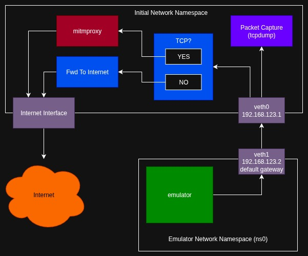
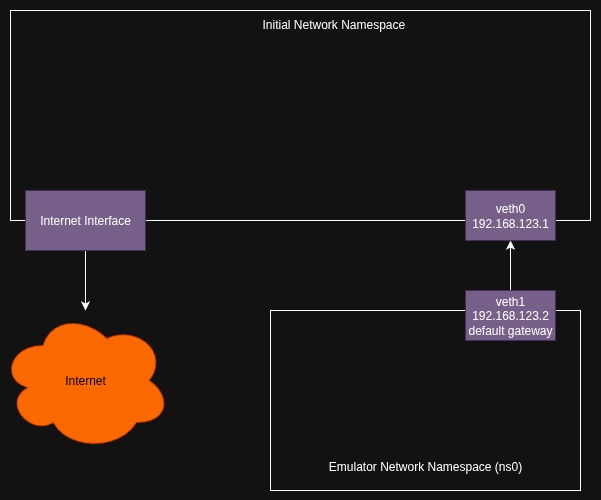
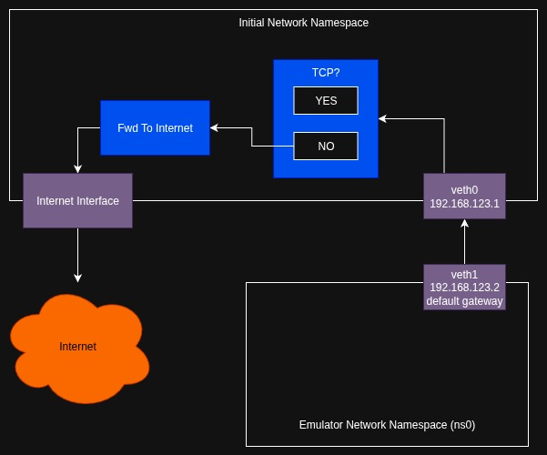
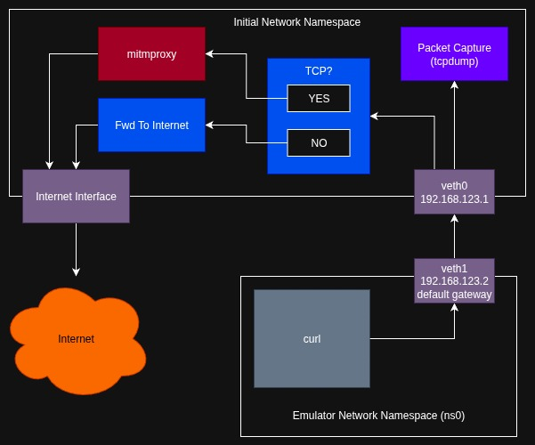

# Sniffing Application Traffic

When analyzing the behaviors of an application, one of the most obvious things to look at is the network traffic. Nearly all applications on the mobile platform are doing some kind of network transmissions. Even offline applications are known to regularly send out telemetry information. Whether or not you are aware this is happening as a normal end-user can sometimes be credited to the EU's GDPR. But in nearly all cases, the developer would rather not bother you with any of that. "These are not the packets you are looking for." ::: waves hands :::.

Naturally, getting the application data from the network traffic isn't as straight forward as it was in the 1990s. We not have this pesky thing called TLS (formerly SSL). These rascals attempt to provide a layer of confidentiality (i.e. encryption) around that sweet data. In this article, we'll discuss how to coerce an unsuspecting Android Emulator and application into providing all of the application data within the TLS encryption, and all without doing any reverse engineering of the applications!

## Android Emulator Networking

The Android Emulator, as we've mentioned before, is based on qemu and therefore uses the user-space qemu network backend. You can also wire it up with a kernel-based tun-tap interface, but the SLIRP backend is what is used by default so that is what we'll discuss here.

The internal network of the emulator has a number of pre-allocated addresses and roles for those endpoints. The important ones are:

- 10.0.2.2 - Gateway
- 10.0.2.3-6 - DNS1, DNS2, DNS3, DNS4 (as specified by the host.)
- 10.0.2.15 - Ethernet (802.3)
- 10.0.2.16 - Wifi (802.11)

### DNS Hijacking

You can explicitly override the DNS values by setting the `-dns-server` argument for the `emulator` when you start it. It is a comma separated list, so use it something like:

```sh
emulator -avd my-device -dns-server 9.9.9.9,1.1.1.1,8.8.8.8
```

This can be very handy for mocking out endpoints. Say for example an application was reaching out to an api at https://api.example.com. You could deploy a `dnsmasq` DNS service locally that defined that host so that it pointed to a service of your making. This is an easy way to trick the application into exposing its requests. Of course the draw back here is that you don't know what to respond with until you do a lot more reverse engineering.

### HTTP Proxy Sniffing

Another technique that can be used is to develop or deploy an http-proxy that logs all of the HTTP(S) requests. You can accomplish this be configuring the `emulator` with the `http-proxy` argument. The following is a synopsis of how to use the argument:

```sh
-http-proxy http://<username>:<password>@<machineName>:<port>
```

Note: Using `-debug-proxy` can assist with troubleshooting the setup of `-http-proxy`.

In this case, TCP traffic will be tunneled out through an HTTP(S) tunnel. The HTTP Proxy does have to follow a set of proxy conventions. The proxy itself usually only sees the encrypted data though. This is because the encryption starts inside the application at the SSL/TLS socket and isn't decrypted until it gets to the TLS terminator.

## Setting Up Machine In The Middle (MitM)

In the rest of this section, we'll be setting up an environment that facilitates a MitM configuration where we'll have a process that acts as if its the server (a TLS terminator) and decrypts all of the traffic that passes through it. Meanwhile, the MitM process will connect to the real server as if its the real client and the server will be none the wiser.

### OS Networking Is Hard

I want to caution anyone planning to proceed that this section has what I believe to be a crazy amount of network configuration. Unfortunately, working with networking is about as complicated as it gets. If you have Docker, Kubernetes, or other big networking based frameworks installed into your system, its highly likely they may interfere with the configuration I'm about to discuss. Other than starting from a clean install on a non-VM x86_64 system, my only advice is to be patient, systematic, and methodical with any troubleshooting you may need to do. I'll try my best to build up the environment we want in the same manner.

### The Design

Ok, so instead of giving a lesson on the ins and outs of Linux networking, I want to start with the design that I've come up with. Then I plan to slowly start from "nothing" and build towards the originally stated configuration one group of commands at a time. My hope is that you should be able to more sanely troubleshoot what is working or not working as we go and troubleshoot one things instead of 10 things at the same time. Right, onward!

- **A linux network namespace** - The Android Emulator doesn't really have a way to configure the interface or gateway that it should use for its internet connection. It (more or less) detects what your default gateway is, via the routing table, and uses that for the internet endpoint. Because of this, we want complete control over that routing table without effecting the rest of our system. Therefore, we'll be running the emulator in its own Linux network namespace. (Note: Linux network namespace is kind of like a container, but focused on networking and only requires iproute2, no container runtimes.)

- **Virtual ethernet peers** - For bridging between the "initial namespace" and the emulator's network namespace. The virtual ethernet interface in the emulator's namespace will be configured as the default gateway. Therefore we expect that all networked IP traffic leaving the emulator will pass through this device. Note: There are other channels via cell modem that we'll not be covering here.

- **Linux Network Address Translation (NAT)** - In more general terms, we'll be using the Linux netfilter and Linux network stack forwarding capabilities to allow packets to be forwarded through the "initial namespace" to either the MitM proxy or the internet. We'll be able to packet capture on both as well. The important thing to remember is that HTTP(S) isn't everything and we need to have a way to capture it.

In plain terms, the emulator runs in a network namespace where the only way out is through a network interface that channels TCP traffic toward `mitmproxy` and everything else to the real gateway. The traffic that is redirected to `mitmproxy` is forwarded to a specific port where `mitmproxy` waits transparently to accept.





```sh
# Create namespace and virtual ethernet peers.
sudo ip netns add ns0
sudo ip link add veth0 type veth peer name veth1
sudo ip link set veth1 netns ns0
sudo ip addr add 192.168.123.1/24 dev veth0
sudo ip link set veth0 up

# Configure emulator namespace networking.
sudo ip netns exec ns0 bash <<'EOF'
  ip addr add 192.168.123.2/24 dev veth1
  ip link set dev    lo up
  ip link set dev veth1 up
  ip route add default via 192.168.123.1
EOF
```



```sh
# enable kernel options for mitm caps
sudo sysctl -w net.ipv4.ip_forward=1
sudo sysctl -w net.ipv4.ip_nonlocal_bind=1
for i in all default veth0 wlo1; do
  sysctl -w net.ipv4.conf.$i.rp_filter=0
done

# **forward** acceptance
#sudo nft add table inet filter || true
# TODO: Try with our "inet filter forward" chain instead of DOCKER's "ip filter FORWARD" chain
sudo nft add rule ip filter FORWARD iif "veth0" oif "wlo1" accept
sudo nft add rule ip filter FORWARD iif "wlo1" oif "veth0" accept
sudo nft add rule ip filter FORWARD ct state established,related accept

# **postrouting** masquerade
sudo nft add chain ip nat postrouting { type nat hook postrouting priority 100 \; } || true
sudo nft add rule  ip nat postrouting oifname wlo1 masquerade
```




```sh
# **prerouting** marking
sudo nft add table ip nat || true
sudo nft add chain ip nat prerouting { type nat hook prerouting priority 0 \; } || true
sudo nft add rule  ip nat prerouting \
  iifname veth0 \
  meta l4proto tcp \
  meta mark set 1

# REDIRECT only packets that were marked
# - When TCP (this transport match required)
# - When marked with $FWMARK
# - Redirect to port 3129 (i.e. accept and redirect)
sudo nft add rule ip nat prerouting \
  meta l4proto tcp \
  meta mark 1 \
  redirect to :3129
```

**Start Proxy**:

```sh
sudo -E env \
  "PATH=$PATH:/usr/local/sbin:/usr/sbin:/sbin" \
  "SSLKEYLOGFILE=~/apks/pcaps/sslkeylog.txt" \
  mitmproxy --mode transparent --listen-port 3129 --listen-host 0.0.0.0
```


**Start Emulator**:

```sh
sudo ip netns exec ns0 sudo -u $USER bash
~/.android/env.sh
sudo -E env "PATH=$PATH:/usr/local/sbin:/usr/sbin:/sbin" ~/apks/playground/start-emulator.sh
```

Note: Can't `setcap` because it causes ld to ignore LD_LIBRARY_PATH which is used by the emulator.

**Test ADB**:

```sh
sudo ip netns exec ns0 sudo -u $USER bash
~/.android/env.sh
adb start-server
adb devices
adb shell ping 9.9.9.9
```


2. **`mitmproxy`** as the MitM process. This is a HTTP(S) proxy that has what we need to see decrypted application data in a number of way (HAR, JSON, TUI). It also supports SSLKEYLOGFILE for extraction of TLS secrets in the client to proxy communications.

3. **`tcpdump`/`tshark`** will be used to capture and generate packet capture (pcap) files. These files should have everything down to layer 2 traffic and will also contain all of the non-HTTP(S) traffic that the application uses. You _really_ want the pcap of the traffic to know about DNS requests, if there are other UDP protocols being used (e.g. QUIC) and if there are any proprietary transport mechanisms being used.


## Design Thoughts

Running emulator in network namespace forces its SLIRP to utilize a gateway of our making. This gateway is via the namespaced routing table. A flexible environment would have:

- A namespaced Bridge Device (br0)
- A namespaced Tap Device (tap0)
- A namespaced Peer Veth (veth1)
- A initns Peer Veth (veth0)


Make bridge act like a hub (w/STP):

```
bridge link set dev veth1 learning off
bridge link set dev tap0 learning off
```

- Configure default gateway to the `br0`.

- Optionally listen on `tap0` with a script for raw packet capture.

**Prepare Emulator's Namespace**:

```sh
sudo ip netns add ns0
sudo ip link add veth0 type veth peer name veth1
sudo ip link set veth1 netns ns0

# TODO: Consider a tap dev in initns as well?
sudo ip netns exec ns0 bash <<'EOF'
  ip link add name br0 type bridge
  ip tuntap add dev tap0 mode tap
  ip link set dev veth1 master br0
  ip link set dev tap0 master br0
  bridge link set dev veth1 learning off
  bridge link set dev tap0 learning off
  ip addr add 10.0.100.2/24 dev br0

  ip link set dev    lo up
  ip link set dev veth1 up
  ip link set dev  tap0 up
  ip link set dev   br0 up
  ip route add default via 10.0.100.1
EOF

sudo ip addr add 10.0.100.1/24 dev veth0
sudo ip link set veth0 up
```

Note: Flush addresses with `# ip -4 addr flush dev "$dev" 2>/dev/null || true`


**Prepare TPROXY setup:**:

```sh
export PROXY_PORT=3129
export FWMARK=1
export NFT_TABLE=mitm

# List tables: sudo nft list tables
# Show table : sudo nft list table ip filter
# Show chain : sudo nft list chain ip filter FORWARD

# enable kernel options for mitm caps
sudo sysctl -w net.ipv4.ip_forward=1
sudo sysctl -w net.ipv4.ip_nonlocal_bind=1
for i in all default veth0 wlo1; do
  sysctl -w net.ipv4.conf.$i.rp_filter=0
done

# **prerouting** marking
sudo nft add table ip nat || true
sudo nft add chain ip nat prerouting { type nat hook prerouting priority 0 \; } || true
sudo nft add rule  ip nat prerouting \
  iifname veth0 \
  meta l4proto tcp \
  meta mark set $FWMARK
# tcp dport != 3129
# counter

# REDIRECT only packets that were marked
# - When TCP (this transport match required)
# - When marked with $FWMARK
# - Redirect to port 3129 (i.e. accept and redirect)
sudo nft add rule ip nat prerouting \
  meta l4proto tcp \
  meta mark $FWMARK \
  redirect to :3129

# **forward** acceptance
#sudo nft add table inet filter || true
# TODO: Try with our "inet filter forward" chain instead of DOCKER's "ip filter FORWARD" chain
sudo nft add rule ip filter FORWARD iif "veth0" oif "wlo1" accept
sudo nft add rule ip filter FORWARD iif "wlo1" oif "veth0" accept
sudo nft add rule ip filter FORWARD ct state established,related accept

# **postrouting** masquerade
sudo nft add chain ip nat postrouting { type nat hook postrouting priority 100 \; } || true
sudo nft add rule  ip nat postrouting oifname wlo1 masquerade
```

**toolbox, toybox**

**Start Emulator**:

```sh
sudo ip netns exec ns0 sudo -u $USER bash
# sudo setcap cap_net_raw+ep ~/.android/emulator/emulator
~/.android/env.sh
sudo -E env "PATH=$PATH:/usr/local/sbin:/usr/sbin:/sbin" ~/apks/playground/start-emulator.sh
```

Note: Can't setcap because setcap causes ld to ignore LD_LIBRARY_PATH which is used by the emulator.

**Test ADB**:

```sh
sudo ip netns exec ns0 sudo -u $USER bash
~/.android/env.sh
adb start-server
adb devices
adb shell ping 9.9.9.9
```

**Start Proxy**:

mitmproxy - used for exploring flows
- save flows for HAR and JSON export
- using mitmproxy (transparently) with SSLKEYLOGFILE forces the TLS secrets out for us
  - with the key, we can do tcpdump in parallel and use wireshark + SSLKEYLOGFILE to decrypt pcaps
  - Note: cert pinning will block this

Net result:
- Pcaps with TLS traffic
- TLS secrets to get decrypted TLS streams
- mitmproxy flows
- decrypted HAR files
- decrypted JSON files
  
To decrypt from wireshark: Hamburger -> Edit -> Preferences -> Protocols -> TLS -> \
  "(Pre)-Master-Secret log filename" = $SSLKEYLOGFILE

```
sudo -E env "PATH=$PATH:/usr/local/sbin:/usr/sbin:/sbin" "SSLKEYLOGFILE=~/apks/pcaps/sslkeylog.txt"\
  mitmproxy --mode transparent --listen-port 3129 --listen-host 0.0.0.0
#mitmproxy --mode transparent --listen-port $PROXY_PORT --listen-host 0.0.0.0
# Consider: sudo setcap 'cap_net_bind_service,cap_net_admin,cap_net_raw+ep' "$(command -v mitmproxy)"
```

## Resources

https://developer.android.com/studio/run/emulator-networking
https://wiki.qemu.org/Documentation/Networking
https://developer.android.com/tools/adb#forwardports


<!-- 
- TODO: (5) Inspect application traffic:
  - Certificate injection
  - mitmproxy - VPN inspection, transparent capture
-->
