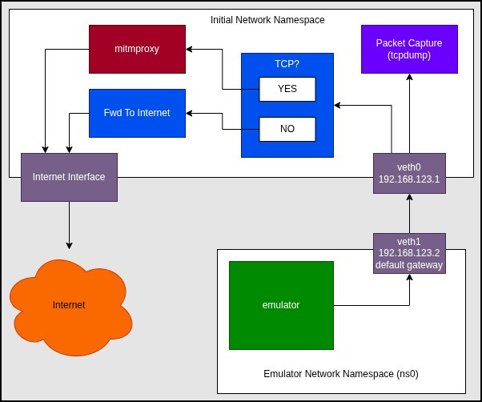
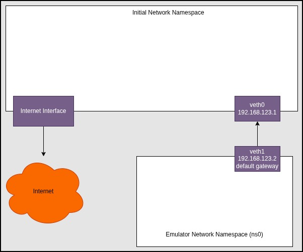
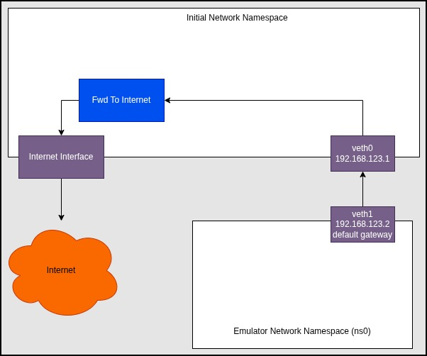
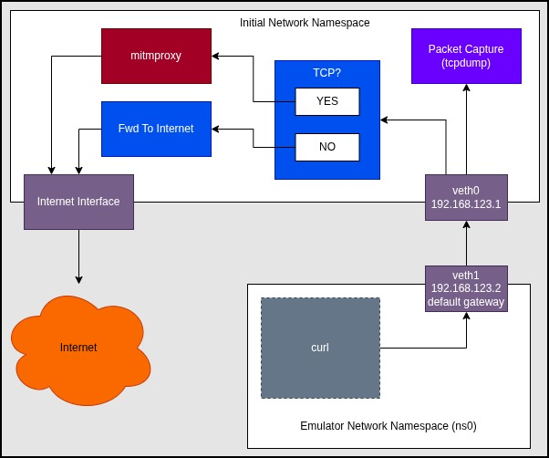

<!-- pagebreak -->

# Sniffing Application Traffic

When analyzing the behaviors of an application, one of the most obvious things to look at is the network traffic. Nearly all applications on the mobile platform are doing some kind of network transmissions. Even offline applications are known to regularly send out telemetry information. Whether or not you are aware this is happening as a normal end-user can sometimes be credited to the EU's GDPR. But in nearly all cases, the developer would rather not bother you with any of that. "These are not the packets you are looking for." ::: waves hands :::.

Naturally, getting the application data from the network traffic isn't as straight forward as it was in the 1990s. We now have this pesky thing called TLS (formerly SSL). These rascals attempt to provide a layer of confidentiality (i.e. encryption) around that sweet data. In this article, we'll discuss how to coerce an unsuspecting Android Emulator and application into providing all of the application data within the TLS encryption, and all without doing any reverse engineering of the applications!

## Android Emulator Networking

The Android Emulator, as we've mentioned before, is based on qemu and therefore uses the user-space qemu network backend. You can also wire it up with a kernel-based tun-tap interface, but the SLIRP backend is what is used by default so that is what we'll discuss here.

The internal network of the emulator has a number of pre-allocated addresses and roles for those endpoints. The important ones are:

- 10.0.2.2 - Gateway
- 10.0.2.3-6 - DNS1, DNS2, DNS3, DNS4 (as specified by the host.)
- 10.0.2.15 - Ethernet (802.3)
- 10.0.2.16 - Wifi (802.11)

### DNS Hijacking

You can explicitly override the DNS addresses used by the Android system by setting the `-dns-server` argument for the `emulator` when you start it. It is a comma separated list, so use it something like:

```sh
emulator -avd my-device -dns-server 9.9.9.9,1.1.1.1,8.8.8.8
```

This can be very handy for mocking out endpoints. Say for example an application was reaching out to a remote API at `https://api.example.com`. You could deploy a `dnsmasq` DNS service locally that defined that host so that it pointed to a service of your making. This is an easy way to trick the application into exposing its requests. Of course the draw back here is that you don't know what to respond with until you do a lot more reverse engineering.

### HTTP Proxy Sniffing

Another technique that can be used is to develop or deploy an http-proxy that logs all of the HTTP(S) requests. You can accomplish this by configuring the `emulator` with the `-http-proxy` argument. The following is a synopsis of how to use the argument:

```sh
-http-proxy http://<username>:<password>@<machineName>:<port>
```

Note: Using `-debug-proxy` can assist with troubleshooting the setup of `-http-proxy`.

In this case, TCP traffic will be tunneled out through an HTTP(S) tunnel. (Normally useful in corporate environments where the only port they allow internet traffic through is 443.) The HTTP Proxy does have to follow a set of proxy conventions. The proxy itself usually only sees the encrypted data, unless its spoofing as the remote service (e.g. a TLS terminator).

Note: It is not uncommon for a company to have a TLS terminator on the publically accessible internet gateway and then perform operations internally without TLS. For example, your web service is a TLS terminator with reverse proxies setup to unencypted node or python services. Even if they are encrypted, they don't require publically signed server certificates.

**`mitmproxy`** is a MitM process that can act as both an HTTP proxy or a transparent proxy. `mitmproxy` is able to do a large number of operations that meet our needs. It spoofs as remote services, breaks connections up into managable flows, provides mechanisms for filtering flows so we only see what we want and only proxy what we need. And last but not lease, `mitmproxy` provides the bodies of the HTTP requests and responses completely decrypted. These traffic decrypts can also be exported as JSON or HAR files for use in other tools.

## Transparent Proxy

Instead of going the way of the HTTP proxy and potentially limiting what is monitored, we'll look into using the transparent proxy. Transparent proxies are more complicated to setup, but it postures us to have more assurance that we are capturing all of the traffic, we're able to get the highest affinity possible, all while we avoid getting in the way of the network traffic as much as feasible.

<!-- It also supports SSLKEYLOGFILE for extraction of TLS secrets in the client to proxy communications. -->

## Setting Up Machine In The Middle (MitM)

We'll now be setting up an environment that facilitates a MitM configuration where we'll have a process that acts as if its the server (a TLS terminator) and decrypts all of the traffic that passes through it. Meanwhile, the MitM process will connect to the real server as if its the real client and the server will be none the wiser.

### OS Networking Is Hard

Please be advised that tools like Docker and Kubernetes inject configurations into your network stack, including firewall rules, routing tables, interface tables, and network namespaces. All of these could possible prevent the following procedures from working as intended.

Additionally, it is recommended to not utilize a VM (or container) to isolate the changes we'll be going through. The way that the network flow operates is sensitive to the relative position of the different components.

When you encounter issues, I suggest taking a large dose of patience and methodically thinking through how to troubleshoot the environment. I'll attempt to add in some troublehooting tips as I go.

### The Design

In brief, the following diagram shows the design of our network setup. We're executing the Android Emulator in a network namespace to force the emulator into thinking that the virtual interface is the internet gateway. Then in our "normal" network namespace, we're going to utilize the Linux Firewall (netfilter/nftables) to redirect TCP traffic to the `mitmproxy` transparent proxy service. All other traffic (non-TCP traffic) will be forwarded to the real gateway. All traffic that comes from the Android Emulator network namespace will do so through the virtual ethernet interface. This virtual ethernet interface is the perfect place to listen and record all network traffic coming from and travelling toward the emulator.



### Creating And Connecting The Namespace

In the previous diagram, we had the whole picture. To simplify the process, I've created the following diagram to show only what we're aiming to achieve in this section. We're aiming to create a namespace and have the ability to network between the two (via virtual ethernet interface pairs).



Run the following code:

```sh
# Create namespace and virtual ethernet peers.
sudo ip netns add ns0
sudo ip link add veth0 type veth peer name veth1
sudo ip link set veth1 netns ns0
sudo ip addr add 192.168.123.1/24 dev veth0
sudo ip link set veth0 up

# Configure emulator namespace networking.
sudo ip netns exec ns0 bash <<'EOF'
  ip addr add 192.168.123.2/24 dev veth1
  ip link set dev    lo up
  ip link set dev veth1 up
  ip route add default via 192.168.123.1
EOF
```

You should now be able to ping the `ns0`'s `veth1` interface with:

```sh
ping 192.168.123.2
```

You should also be able to ping `veth0` from the `ns0` namespace with:

```sh
sudo ip netns exec ns0 ping 192.168.123.1
```

### Forwarding `ns0` Packets

Now that we know there is at least an IPv4 connection between the two network namespaces, lets permit `ns0` to have access to the internet by transforming the "initial" namespace into an actual gateway. In the following example, the internet interface is assumed to be `wlo1`. This may be something completely different for you (e.g. `eth0`). 

Once you've identified the internet interface for your system, replace `wlo1` with your interface name. One technique for identifying your internet interface name is to use the following command:

```sh
ip -j route show default | jq -r '.[0].dev'
```

When setting up the following NAT environment, we'll configure the Linux kernel to permit network traffic forwarding, configure the firewall/netfilter to automatically forward all packets from `veth0` to `wlo1` (and visa versa), and finally all outgoing packets will be NATed.



To accomplish the NAT setup, please run the following commands:

```sh
# enable kernel options for masquerade caps
sudo sysctl -w net.ipv4.ip_forward=1

# **forward** acceptance
#sudo nft add table inet filter || true
# TODO: Try with our "inet filter forward" chain instead of DOCKER's "ip filter FORWARD" chain
sudo nft add rule ip filter FORWARD iif "veth0" oif "wlo1" accept
sudo nft add rule ip filter FORWARD iif "wlo1" oif "veth0" accept
sudo nft add rule ip filter FORWARD ct state established,related accept

# **postrouting** masquerade
sudo nft add chain ip nat postrouting { type nat hook postrouting priority 100 \; } || true
sudo nft add rule  ip nat postrouting oifname wlo1 masquerade
```

To test the setup, run commands similar to the following:

```sh
sudo ip netns exec ns0 ping 9.9.9.9
# Expected: wikipedia.org @ 185.15.59.224
sudo ip netns exec ns0 dig @9.9.9.9 wikipedia.org
# Note: Any HTML content from the curl is a success.
sudo ip netns exec ns0 curl -k https://wikipedia.org
```

### Redirecting `ns0`'s TCP Packets

Now that we have `ns0` effectively connected to the internet, we want to carve off the TCP packets from the stream and redirect those packets to a port that we'll later listen on from `mitmproxy`. The way we accomplish this is by marking all IPv4/TCP packets with a number in the packet's kernel metadata. In a subsequent firewall rule, we'll _redirect_ all packets marked with the special number to a specific TCP port.

Its worth noting that the above pattern of mark and route can be reused for many different scenarios. For example, maybe you want to carve off packets that have a specific destination and then redirect them to a different port and therefore a different `mitmproxy` instance. Or maybe you've written some special python script that will do the capture or proxy operations in a new way. All you do is mark packets on your filter (e.g. UDP packets with destination IP of A.B.C.D) with a new special number and then redirect all packets with that number.



To get our environment to operate as I've shown in the diagram, run the following:

```sh
# enable kernel options for mitm caps
sudo sysctl -w net.ipv4.ip_nonlocal_bind=1
for i in all default veth0 wlo1; do
  sysctl -w net.ipv4.conf.$i.rp_filter=0
done

# **prerouting** marking
sudo nft add table ip nat || true
sudo nft add chain ip nat prerouting { type nat hook prerouting priority 0 \; } || true
sudo nft add rule  ip nat prerouting \
  iifname veth0 \
  meta l4proto tcp \
  meta mark set 1

# REDIRECT only packets that were marked
# - When TCP (this transport match required)
# - When marked with $FWMARK
# - Redirect to port 3129 (i.e. accept and redirect)
sudo nft add rule ip nat prerouting \
  meta l4proto tcp \
  meta mark 1 \
  redirect to :3129
```

At this point, we have the network stack configured the way we want it, but there is no proxy listening to TCP packets yet. Now is a good time to test that all non-TCP traffic is still flowing and TCP traffic is not flowing.

To test the setup, run commands similar to the following:

```sh
# should succeed
sudo ip netns exec ns0 ping 9.9.9.9
# Expected: wikipedia.org @ 185.15.59.224
sudo ip netns exec ns0 dig @9.9.9.9 wikipedia.org
# This **should** fail. It uses TCP.
sudo ip netns exec ns0 curl -k https://wikipedia.org
```

### Starting Proxy And Packet Capture

Assuming that everything is still on track, we now can start our `mitmproxy` service. The next set of commands have a lot going on. We're going to use `sudo` to start the proxy so that it has access to the required Linux capabilities to do what it needs to do. We'll also be injecting our current environment (via `-E`) the run with standard `root` paths appended. We add our own environment because if you are using the `env.sh`, `mitmproxy` runs from the user's Python virtual environment. Switching to root would cause that to become inaccessible without the `-E`. Finally, we've added SSLKEYLOGFILE environment variable to our run. Setting this variable causes `mitmproxy` to dump all of the TLS secrets between itself and the client connections. The output of the file pointed to by SSLKEYLOGFILE is critical for the decryption of the packet capture:

**Start Proxy**:

```sh
sudo -E env \
  "PATH=$PATH:/usr/local/sbin:/usr/sbin:/sbin" \
  "SSLKEYLOGFILE=~/apks/pcaps/sslkeylog.txt" \
  mitmproxy --mode transparent --listen-port 3129 --listen-host 0.0.0.0
```

Once you've started `mitmproxy`, a Terminal user interface will popup. You can monitor the flows that `mitmproxy` is sniffing from this interface. You can also set filters for finding flows and managing passthroughs. But I'll leave all of those details to the `mitmproxy` documentation. The important thing for us right now is that we can watch the flows happening and we get the SSLKEYLOGFILE output.

After the `mitmproxy` is up and running, in another terminal in the "initial" network namespace, fire up a `tcpdump` to start recording all of the packets coming from the `ns0` namespace.

**Start Packet Capture**:

```sh
sudo tcpdump -i veth0 -w capture.pcap
```

We're almost there! Let's now verify that `mitmproxy` is working, `tcpdump` is working, and we can see decrypt in the packet capture. To run a test, simply do the following:

```sh
sudo ip netns exec ns0 curl -k https://wikipedia.org
```

You should immediately see a DNS request in the `tcpdump` window and a new flow pop up in the `mitmproxy` window. At this point, I recommend stopping the `tcpdump` so we can test our SSLKEYLOGFILE with the PCAP. The easiest (albiet manual) way to decrypt the PCAP is via Wireshark. Open Wireshark and open the `capture.pcap`.

<!-- TODO: Do we need to stop tcpdump to open the PCAP? -->

From inside Wireshark:

1. Open Edit Menu
2. Select Preferences
3. Expand Protocols in left sidebar
4. Select TLS
5. Populate "(Pre)-Master-Secret log filename" with whatever the value of $SSLKEYLOGFILE is. 

Once you click Apply and OK in the bottom right of the configuration dialog, you should see the TLS entries in the PCAP become HTTP* entries. On closer inspection, the packets are still TLS, but they now have decrypted HTTP data within the TLS packets. You can Follow the stream to see the whole request and response bodies.

Hopefully you've made it this far without too much hastle! Two more important steps before we win.

### Start Emulator In `ns0`

Lets get to the full network design.


To start the emulator in the network namespace, open a new terminal. From there, we're going to generate a new shell that runs completely inside the network namespace. Up until now, we've always prefixed network namespace commands with `sudo ip netns exec ns0`. Once we're up and running with the new shell, we'll not need to use that prefix. Everything within the shell will implicitly know its in `ns0`.

Weirdly, we'll be running our `ns0` shell as `$USER` so we maintain access to our `env.sh` settings, but we'll be running the emulator itself with `sudo`. This is because there are different Linux capabilities applied within the network namespace and `sudo` is the easy button to work around that complexity. 

**Start Emulator**:

```sh
# Drop into the `ns0` shell
sudo ip netns exec ns0 sudo -u $USER bash
# Initialize our usual Android environment.
~/.android/env.sh
# Start the emulator in ns0 with all the capabilities.
sudo -E env "PATH=$PATH:/usr/local/sbin:/usr/sbin:/sbin" ~/apks/playground/start-emulator.sh
```

Note: Can't `setcap` because it causes ld to ignore LD_LIBRARY_PATH which is used by the emulator.

Lets ensure we have access to the emulator by opening a new terminal and running the following (Note: I think we're up to 4 terminal windows at this point):

```sh
# Drop into the `ns0` shell
sudo ip netns exec ns0 sudo -u $USER bash
# Initialize our usual Android environment.
~/.android/env.sh
# Start the adb-server in `ns0`
adb start-server
# Make sure we see the emaultor device.
adb devices
# Make sure we can ping the interface from the emulator device.
adb shell ping 9.9.9.9
```

### Injecting `mitmproxy` Certificate Into Emulator

Last and certainly one of the biggest pains in the butt is adding the `mitmproxy` public CA certificate as a _system_ root CA in the Android system. If you poke around in the Android OS, you'll notice that there is a place where you can add user defined CA certificates. You can also add user defined certificates into various network interfaces within Androids GUI. Neither of these will work for our purposes. At this point you are required to get the emulator into root mode with system read/write access. To accomplish this, run the following from the `ns0` terminal window you tested ADB with:

```sh
adb root
adb remount
```

<!-- TODO: Talk about why it worked for curl (`-k`) and not emualtor. -->

<!-- TODO: Document the process for injecting the CA certificate. -->

<!-- TODO: Ensure `tcpdump` is running since we may have killed it during our last test. -->

<!-- TODO: Document triggering the WebView intent to test that the connection works. -->

<!-- TODO: Observe the decrypted flows in mitmproxy and tcpdump. -->

<!-- Note: Flush addresses with `# ip -4 addr flush dev "$dev" 2>/dev/null || true` -->

<!-- **toolbox, toybox** -->

<!-- TODO: Discuss UDP and QUIC -->


## Resources

https://developer.android.com/studio/run/emulator-networking
https://wiki.qemu.org/Documentation/Networking
https://developer.android.com/tools/adb#forwardports

